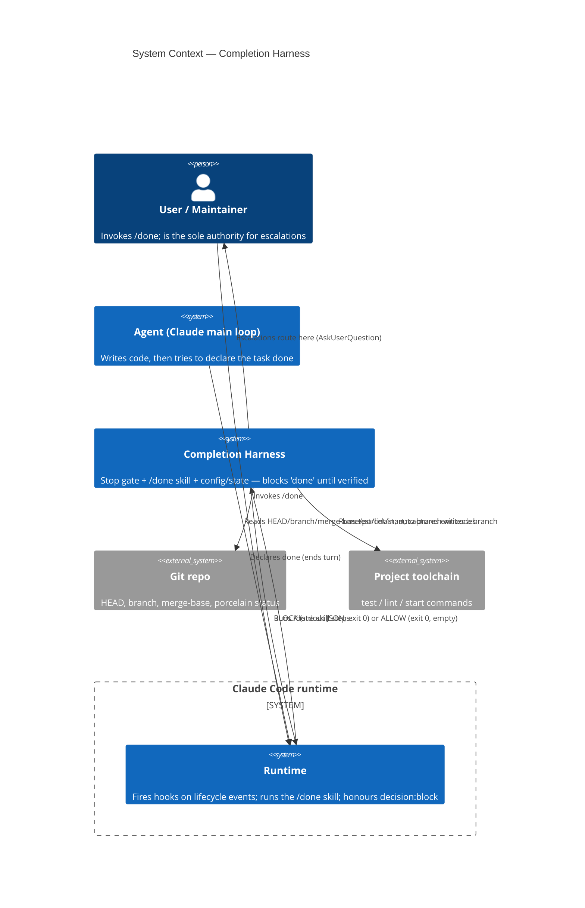
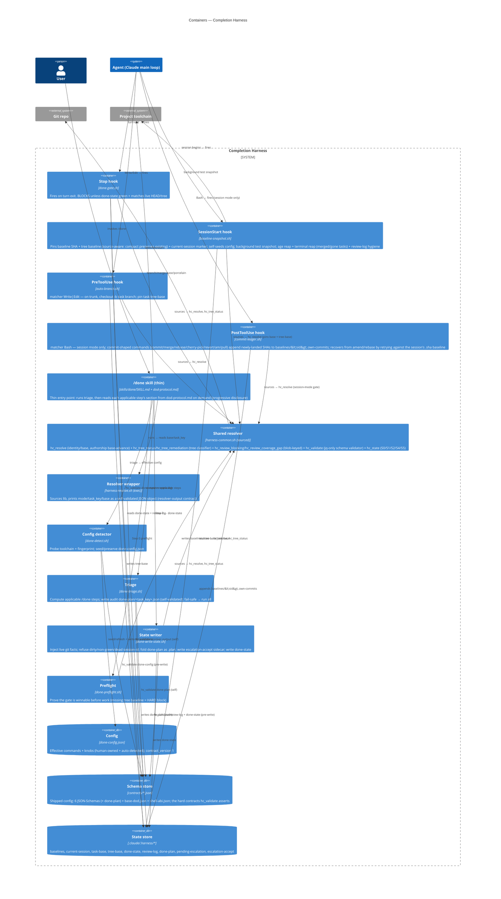
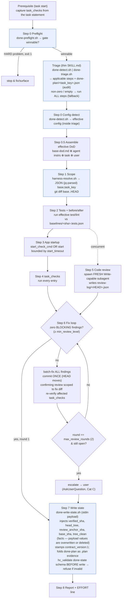
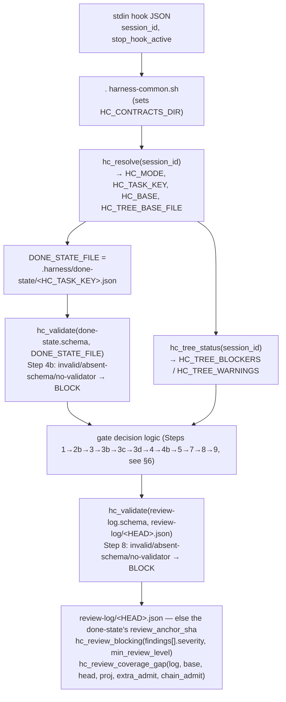
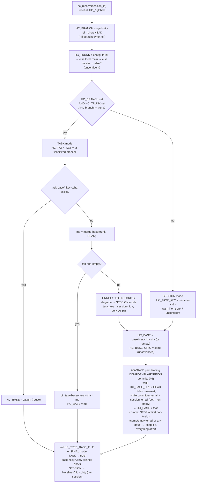
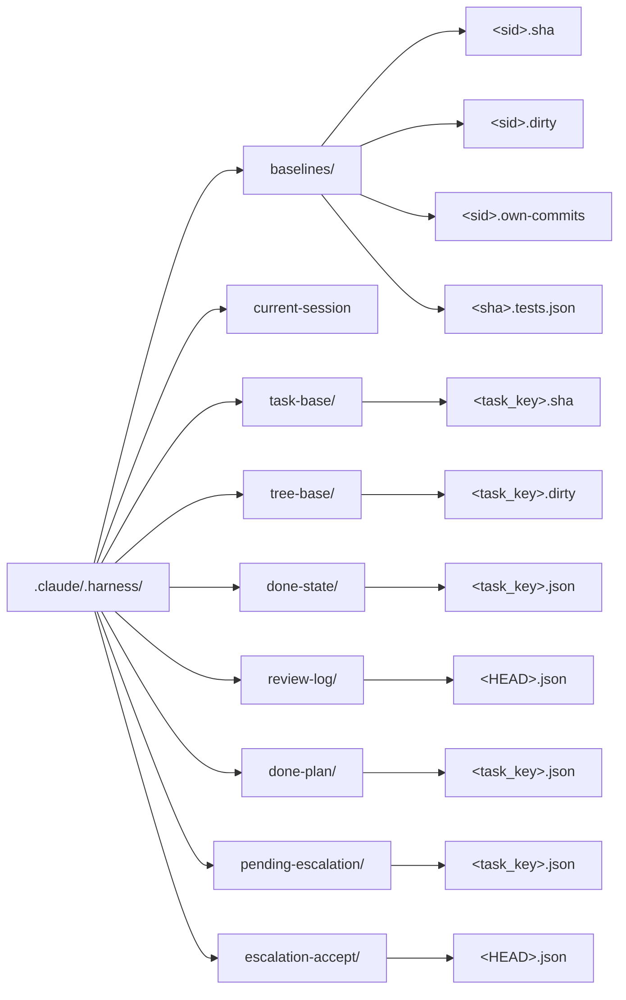

# Completion Harness — Architecture Map

> A navigable, graphical map of the bash "completion harness": Claude Code hooks
> + a `/done` skill that force an AI agent to actually **verify** a task (tests,
> app start, task-specific checks, independent code review) before it may declare
> the task "done".
>
> **Source of truth is the CODE.** Every diagram below was derived by reading the
> scripts, not the prose design doc. The companion rationale/spec is
> [`design.md`](design.md); the historical origin prompt is
> [`design-brief.md`](design-brief.md). Design doc and code are in sync as of
> 2026-07-28 (see §14); if they ever diverge, trust the code.

---

## 1. TL;DR / mental model

An AI coding agent reliably anchors on "implementation done" — it writes the
code, the code compiles, and it stops there, silently skipping tests, app
startup, review, and the task's own stated checks. The harness makes the
Definition of Done a **structural forcing function** rather than advisory text
it read once and forgot. The mechanism has three parts, none sufficient alone:
(a) a **Stop hook** (`done-gate.sh`) that fires on *every* turn exit and blocks
the stop unless a valid, green, HEAD-matching done-state exists; (b) the
**`/done` skill** that does the judgment work a hook cannot — run tests, boot the
app, run task checks, spawn a fresh independent reviewer, then write the
done-state; and (c) **config + state** (`done-config.json` + `.claude/.harness/*`)
that make it portable and let a task's verification survive across sessions,
keyed to the git branch. The gate trusts only deterministic evidence: command
exit codes it re-reads live, and an independent review-log artifact keyed to the
exact HEAD. Two invariants hold everywhere: **(1) never weaken the
anti-forgery** (facts are injected live — SHA from `git rev-parse`, tree state
from a shared classifier — never hand-written); **(2) never make the gate easier
to pass** (every ambiguous/degraded path fails *toward* BLOCK, never toward a
silent allow).

**Hard contracts (versioned + fail-closed).** Every JSON artifact the harness
produces or consumes carries a `contract_version` (const **`1`**) and has a
declared JSON-Schema in `contracts/` (done-state, review-log, done-config,
resolver-output, base-dod, done-plan). Machine producers **stamp** the version
(`done-write-state.sh`, `done-detect.sh`, `harness-resolve.sh`, `done-triage.sh`
all write `contract_version: 1`); consumers **assert** it by validating against
the schema via `hc_validate` before trusting a single field. This is invariant
(2) applied to *shape*: a schema failure (malformed artifact, a missing required
field, or even a missing schema file / absent validator = broken install) fails
**toward BLOCK/refuse**, never toward a silent allow. `hc_validate` is a jq-only
JSON-Schema-**subset** validator (no node/ajv runtime) that is **fail-closed on
unsupported keywords** (#2): the enforced subset is `type` / `required` /
`properties` / `items` / `enum` / `const` / `minLength` / `oneOf` / `not` /
`additionalProperties` (boolean form only) — any other keyword (`pattern`,
`minimum`, `anyOf`, `$ref`, …) or `additionalProperties` written as a *subschema*
is **rejected** at the node where it appears, so an author can never believe a
constraint is enforced when it is not. It prints `OK`/returns 0 when valid,
prints `ERR: …`/returns 1 on any invalidity or error. The
shell-function ABI is itself a declared, **test-enforced** contract
(`contracts/shell-abi.json` + `completion-harness/tests/test-abi.sh`); the validator and
schemas are covered by `completion-harness/tests/test-contracts.sh`.

---

## 2. C4 Level 1 — System Context

The harness sits between the **Agent** (Claude's main loop) and the moment it
tries to end its turn. The **Claude Code runtime** is the machine that fires
hooks and runs skills; it is what actually enforces the block. The harness reads
the **Git repo** for identity/changeset facts and drives the **project
toolchain** (test/lint/start commands) for green/red evidence. The **User**
invokes `/done` and is the sole authority for escalations.



**How to read this / key decisions.** The harness never talks to the agent
directly — it emits a `decision:block` JSON that the *runtime* honours. The
agent experiences the block as "you cannot stop yet." The only signals the
harness treats as zero-trust are the toolchain's deterministic exit codes and
git facts; everything the agent *says* is trust-but-falsifiable.

---

## 3. C4 Level 2 — Containers

The harness is four hooks + one skill + one sourced library + config + a state
store. Each hook fires on a different runtime event. The **shared resolver
library** (`harness-common.sh`) is *sourced* by every script that needs identity
or tree classification — never reimplemented — so the gate, the writer, and the
preflight can never disagree.



**How to read this / key decisions.**
- **Hook timing:** SessionStart runs once at session begin (before any edit) →
  it is the *only* reliable place to pin a clean tree baseline. PreToolUse fires
  before *every* Write/Edit (cheap off-trunk fast-path). PostToolUse fires
  after *every* Bash call (session mode only) — a commit-shaped command appends
  the SHAs it just landed to the session's own-commits ledger, feeding
  base-advance's ledger-first predicate (§10, §12). Stop fires on *every*
  turn exit — the structurally unavoidable enforcement point.
- **Sourced, not shelled:** the gate/writer/preflight `. harness-common.sh` and
  call `hc_resolve`/`hc_tree_status`/`hc_validate` as shell functions. The skill
  instead runs `harness-resolve.sh` (an executable wrapper) because a skill can
  only shell out, not source — and the wrapper now emits a self-validated JSON
  object (parse with `jq`), no longer `key=value`.
- **Schema store (`contracts/`) is shipped config, not runtime state.** It is
  copied into the target (`install.sh` copies `contracts/` → `.claude/contracts/`);
  `harness-common.sh` resolves it into `HC_CONTRACTS_DIR` (default: sibling of
  `scripts/`). `hc_validate <schema> <json>` is the one shared validator every
  producer/consumer calls, so the gate, the writer, and the detector can never
  disagree on what "valid" means.
- **Two distribution modes (same files):**
  - **Plugin** (`hooks/hooks.json`, `.claude-plugin/plugin.json`): hook commands
    resolve scripts via `${CLAUDE_PLUGIN_ROOT}/scripts/...`; the `/done` skill
    reads `base-dod.md` and helper scripts under `${CLAUDE_PLUGIN_ROOT}`. Enabling
    the plugin *is* the install.
  - **`install.sh` mirror**: copies the bundle into the target's `.claude/`
    (including `contracts/` → `.claude/contracts/`, the schema store `hc_validate`
    reads, and `agents/` → `.claude/agents/`, so Step 5's reviewer resolves bare as
    `dod-reviewer` instead of `completion-harness:dod-reviewer`), wires **only**
    Stop + SessionStart + PreToolUse into
    `settings.local.json` via a `jq` merge (PostToolUse/`commit-ledger.sh` is
    plugin-only — see §12's edge-case matrix), and
    `sed`-rewrites `${CLAUDE_PLUGIN_ROOT}` → `$CLAUDE_PROJECT_DIR/.claude` in the
    copied `SKILL.md`. State refs (`$CLAUDE_PROJECT_DIR/.claude/.harness/...`) are
    untouched. `install.sh` copies `dod/base-dod.md` → **`.claude/dod/base-dod.md`**
    (⚠ doc drift — design says `.claude/harness/base-dod.md`; see §14).

---

## 4. C4 Level 3 — Components of the two hot paths

Two paths carry all the enforcement weight: the **`/done` executor** (does the
work + writes the proof) and the **Stop gate** (re-verifies the proof against
live git). Both bottom out on the same sourced predicates.

### 4a. Inside `/done` (the executor)

The `/done` skill itself is **split for progressive disclosure (#7)**: a thin
`SKILL.md` entry point runs the deterministic triage
(`done-detect.sh | done-triage.sh`) — which computes exactly which DoD steps
apply to this changeset and prints them as `[id] <intent> → dod-protocol.md#<anchor>`
lines — and the agent reads each step's section from the sibling reference
`dod-protocol.md` **on demand**. Triage also writes the full ordered plan
(applicable **and** excluded, each with a reason) to `done-plan/<task_key>.json`
as an **audit artifact** (Step 7 folds it into done-state as a `.plan` field; the
gate gains no precondition on it). If triage exits non-zero or prints nothing
usable, the SKILL fallback runs **all** steps — a wrongly-excluded step is the
one unacceptable outcome.



**How to read this.** Boxes tinted blue delegate mechanical work to scripts
(`done-preflight.sh`, `done-detect.sh`, `harness-resolve.sh`,
`done-write-state.sh`); the rest is agent judgment. Two of these now enforce the
hard contracts: `harness-resolve.sh` emits a **self-validated JSON** resolver
object (Step 1 parses it with `jq`, not `key=value`), and `done-write-state.sh`
**stamps** `contract_version: 1` and **validates the assembled done-state against
its schema before writing** — an invalid state is refused, never reaches disk. Any failing step means "fix
it, return to Step 2, re-verify" (SKILL global rule). Steps 2/3/5 have no data
dependency and may run **concurrently** (lint ∥ tests; app-probe ∥ review); the
Step-4 task_checks confirm the task is **complete and working** before the final
code-solidity review (Step 5). The **zero-findings short-circuit** at Step 6 is the
common path: a clean changeset costs exactly **one** review.

### 4b. Inside the Stop gate (`done-gate.sh`) — the shared predicates it sources



**How to read this.** The gate itself contains no identity or tree logic — it
`source`s the library and calls its functions. `hc_resolve` decides *which*
done-state file to read (keyed by `HC_TASK_KEY`); `hc_tree_status` decides
whether the working tree carries the agent's own uncommitted work; `hc_validate`
asserts the two artifacts are structurally valid before any of their fields are
trusted. That is why the writer and preflight, which source the same functions,
can never diverge from the gate. **Contract gates:** the done-state is validated
at **Step 4b** (right after "done-state exists", before the `verified_sha`/outcome
fields are read) and the review-log at **Step 8** (right after "log exists",
before the severity/coverage checks). Both fail closed — an invalid artifact, a
missing schema file, or an unavailable validator all → BLOCK.

---

## 5. Lifecycle sequence

One task, one branch, from a clean SessionStart through a blocked "done", a
`/done` run, and finally an allowed stop. Lanes: the runtime/hooks, the agent,
the `/done` executor, git, and the state store.

```mermaid
sequenceDiagram
  autonumber
  participant RT as Runtime/Hooks
  participant AG as Agent
  participant DN as /done executor
  participant GIT as Git
  participant ST as State store

  RT->>ST: SessionStart (baseline-snapshot.sh)<br/>pin baselines/&lt;sid&gt;.sha + tree baseline (compact-preserving) + current-session marker<br/>reap +14d; terminal reap merged/gone br-* tasks (skip if trunk unconfident); review-log hygiene
  Note over RT,ST: hc_resolve; if task mode pin task-base/tree-base
  AG->>GIT: edits code (Write/Edit)
  RT->>GIT: PreToolUse (auto-branch.sh)<br/>on trunk → checkout -b task/&lt;ts&gt;; pin tree-base
  AG->>GIT: git commit
  RT->>ST: PostToolUse (commit-ledger.sh)<br/>session mode + commit-shaped command → append landed SHA(s) to baselines/&lt;sid&gt;.own-commits
  AG-->>RT: ends turn ("done")
  RT->>ST: Stop (done-gate.sh) reads done-state/&lt;task_key&gt;
  ST-->>RT: absent
  RT-->>AG: BLOCK "Run /done"
  AG->>DN: invokes /done
  DN->>GIT: diff base..HEAD; run tests/app
  DN->>ST: Step 5 subagent writes review-log/&lt;HEAD&gt;.json (zero blocking findings)
  DN->>GIT: rev-parse HEAD, rev-parse HEAD^{tree}, status --porcelain (live facts)
  DN->>ST: Step 7 writes done-state/&lt;task_key&gt;.json (verified_sha=HEAD, head_tree, review_anchor_sha, base_sha)
  AG-->>RT: ends turn
  RT->>ST: Stop (done-gate.sh) re-reads state + review-log
  Note over RT,ST: hc_validate both artifacts (4b, 8); verified_sha == HEAD (or head_tree matches), no tree blockers, all green
  RT-->>AG: ALLOW (exit 0, empty stdout)
```

**How to read this / key decisions.** Nothing the agent *says* is trusted — the
gate re-derives HEAD and tree state live on the second Stop. The review-log is
written by an **independent subagent**, not the main agent. Because the log is
keyed to HEAD, any commit after `/done` that **changes content** moves HEAD to a
different tree, invalidates both the done-state (Step 5) and the review-log, and
forces `/done` to re-run. A HEAD move that leaves the tree byte-identical (a
reworded commit, a replaying rebase) **carries** instead — see §6, Step 5.

---

## 6. The Stop-gate decision tree (`done-gate.sh`)

Faithful encoding of the script. It emits **exit 0 always**; BLOCK vs ALLOW is
distinguished only by whether a `{"decision":"block","reason":...}` JSON is
printed to stdout. The global posture is fail-**safe** (unexpected → allow),
with one deliberate inversion at Step 8.

**The current step order (exact labels from the script):** Step 1 loop-guard →
Step 2 not-a-git-repo → **Step 2a-0 marker-baseline anchor recovery** →
**Step 2a changeset-anchor recovery** → **Step 2b
pending-escalation one-shot** → Step 3 HEAD==base && clean quiet-exit → **Step 3b
introduced-dirty tree block** → **Step 3c empty-changeset short-circuit**
→ **Step 3d escalation-accept sidecar
(cross-session)** → Step 4 done-state missing → Step 4b schema-invalid → Step 5
`verified_sha != HEAD` **unless the tree is identical** →
Step 7 escalation-in-done-state → Step 8 outcome aggregation → Step 9 allow.
Note the **tree check (3b) now runs BEFORE the done-state checks (4/4b/5)** —
an introduced-dirty tree blocks with the S1 "finish the slice" reason without
ever looking at done-state.

```mermaid
flowchart TD
  A["jq present?"] -->|no| ALLOW0["exit 0 (allow) — can't reason"]
  A -->|yes| B["Step 1: stop_hook_active == true?"]
  B -->|yes| ALLOW1["exit 0 (loop guard)"]
  B -->|no| C["Step 2: git rev-parse HEAD ok?"]
  C -->|no HEAD| ALLOW2["exit 0 (non-git)"]
  C -->|HEAD_SHA| D["source lib; hc_resolve<br/>DONE_STATE = done-state/&lt;task_key&gt;.json<br/>PENDING = pending-escalation/&lt;task_key&gt;.json"]
  D --> P2A0["Step 2a-0: HC_BASE empty AND session mode?<br/>adopt baselines/&lt;marker_id&gt;.sha as HC_BASE<br/>(SessionStart-written, must be an ANCESTOR of HEAD)<br/>fixes the session-id disagreement"]
  P2A0 --> P2A["Step 2a: HC_BASE empty?<br/>recover base_sha from our done-state,<br/>else from the current-session marker's state<br/>→ HC_BASE_RECOVERED (never HC_BASE)<br/>feeds coverage + summary ONLY"]
  P2A --> P2B{"Step 2b: pending-escalation/&lt;task_key&gt;.json exists?"}
  P2B -->|yes| ALLOW2b["rm the file; exit 0 (ONE-SHOT pass)<br/>lets an AskUserQuestion turn reach the user"]
  P2B -->|no| E{"Step 3: HC_BASE set AND<br/>HC_BASE == HEAD?"}
  E -->|no| I
  E -->|yes| F{"working tree clean?<br/>(git status --porcelain empty)"}
  F -->|clean| ALLOW3["exit 0 (nothing happened)"]
  F -->|dirty| I{"Step 3b: hc_tree_status<br/>HC_TREE_BLOCKERS non-empty?"}
  I -->|blockers| BLK3b["BLOCK: finish the slice (commit/stash introduced changes)"]
  I -->|none| EMPTY{"Step 3c: git diff --quiet HC_BASE HEAD?<br/>(committed range empty?)"}
  EMPTY -->|empty range| ALLOW3c["exit 0 (empty changeset — nothing to verify)"]
  EMPTY -->|non-empty| SIDE{"Step 3d: escalation-accept/&lt;HEAD&gt;.json exists?<br/>(SHA-keyed sidecar, cross-session)"}
  SIDE -->|yes| ALLOW3d["exit 0 (accepted escalation survives across sessions, per-HEAD)"]
  SIDE -->|no| G["build S2_REASON:<br/>hc_changeset_summary(HC_BASE_ORIG, HEAD)"]
  G --> G4["Step 4: done-state file exists?"]
  G4 -->|missing| BLK4["BLOCK: S2_REASON (run /done)"]
  G4 -->|exists| G4b{"Step 4b: hc_validate(done-state.schema)?<br/>(invalid / no schema / no validator → BLOCK)"}
  G4b -->|invalid| BLK4b["BLOCK: done-state fails contract"]
  G4b -->|valid| H{"Step 5: verified_sha == HEAD?"}
  H -->|no| HT{"head_tree (recorded, else recomputed<br/>from verified_sha) == HEAD^{tree}?<br/>empty / unobtainable / mismatch → BLOCK"}
  HT -->|no| BLK5["BLOCK: changes committed since /done"]
  HT -->|yes, CARRY=1| J
  H -->|yes| J{"Step 7: .escalation present & != null?"}
  J -->|yes| ALLOW7["exit 0 (escape hatch, per-HEAD)"]
  J -->|no| K["Step 8: recorded outcomes (INVERTED: fail → BLOCK)"]
  K --> K0{"tests.status == 'not_run'?"}
  K0 -->|yes| BLK8z["BLOCK: tests not run & no escalation"]
  K0 -->|no| K1{"tests.exit_code == '0'?<br/>(absent → 'MISSING')"}
  K1 -->|no| BLK8a["BLOCK: tests not green"]
  K1 -->|yes| K1e{"tests.command AND tests.output_tail non-empty?"}
  K1e -->|no| BLK8ev["BLOCK: green tests must carry evidence"]
  K1e -->|yes| K2{".lint present? if so exit_code=='0'?"}
  K2 -->|present & !=0| BLK8b["BLOCK: lint not green"]
  K2 -->|absent or 0| K3{"admissible review-log exists?<br/>EXACTLY 2 harness-derived paths, never a dir listing:<br/>review-log/&lt;HEAD&gt;.json, else/plus the done-state's<br/>review_anchor_sha (must be a raw object id)"}
  K3 -->|no| BLK8c["BLOCK: no independent review for HEAD"]
  K3 -->|yes| K3v{"hc_validate(review-log.schema)?<br/>(invalid / no schema / no validator → BLOCK)"}
  K3v -->|invalid| BLK8v["BLOCK: review-log fails contract"]
  K3v -->|valid| K4{"hc_review_blocking(log, min_review_level) == '0'?<br/>(structural: rank(severity) >= rank(min); default high;<br/>unknown/missing severity or jq-fail → block)"}
  K4 -->|no| BLK8d["BLOCK: N blocking (≥ min) findings"]
  K4 -->|yes| KC{"hc_review_coverage_gap(log, base, HEAD, proj, extra_admit, chain_admit) empty or 'SKIP'?<br/>(structural, BLOB-keyed across the review-log chain;<br/>chain basenames must be 40/64 lowercase hex;<br/>base = HC_BASE, else the Step-2a recovered anchor;<br/>SKIP = no base → no coverage block; error w/ changeset → block)"}
  KC -->|no (gap)| BLK8cov["BLOCK: review did not cover changed files"]
  KC -->|yes| K5{"task_checks: all status=='passed'?"}
  K5 -->|no| BLK8e["BLOCK: task_checks not all passed"]
  K5 -->|yes| ALLOW9["Step 9: exit 0 (ALLOW)"]

  classDef block fill:#ffe0e0,stroke:#c00;
  classDef allow fill:#e0ffe0,stroke:#0a0;
  class BLK3b,BLK4,BLK4b,BLK5,BLK8z,BLK8a,BLK8ev,BLK8b,BLK8c,BLK8v,BLK8d,BLK8cov,BLK8e block;
  class ALLOW0,ALLOW1,ALLOW2,ALLOW2b,ALLOW3,ALLOW3s,ALLOW3c,ALLOW3d,ALLOW7,ALLOW9 allow;
```

**How to read this / key decisions.**
- **Block contract:** BLOCK = print the decision JSON to stdout **and `exit 0`**.
  Exit 2 is deliberately *not* used — on exit 2 the runtime reads stderr and
  discards the stdout JSON reason. A stderr line is written too, but only as a
  human log.
- **Step 2a-0 — marker-baseline anchor recovery.** The commonest empty-`HC_BASE`
  cause is the **session-id disagreement**: SessionStart wrote
  `baselines/<its id>.sha`, the gate looks up `baselines/<its own stdin id>.sha`.
  A session that changed nothing then blocks with the no-anchor reason instead of
  taking the Step-3 quiet exit. So the gate adopts `baselines/<marker_id>.sha`
  **into `HC_BASE`** — safe precisely because that file's producer is SessionStart
  alone, writing live HEAD before any edit, i.e. the same fact the resolver
  missed, not a mid-task artefact. Bounded by: raw object id, live commit,
  **ancestor of HEAD**, and **session mode only**.
- **Step 2a — changeset-anchor recovery.** When the resolver found no anchor
  (`HC_BASE` empty — no `baselines/<sid>.sha`, a zero-length baseline, or an empty
  task pin), the gate recovers one from **writer-stamped facts, never agent
  payload**: the `base_sha` in our own key's done-state, or — when our key has no
  state at all — the state named by the `current-session` marker (the
  session-id-disagreement case; adopted only if it also supplies a usable
  `base_sha`). Exactly two harness-derived paths, never a directory listing. The
  recovered value lives in **`HC_BASE_RECOVERED` and is never assigned to
  `HC_BASE`**, because `HC_BASE` drives the only two steps that *grant* a pass
  (Step 3's quiet-exit, Step 3c's empty-changeset allow) — a recovered base equal to
  HEAD would make a whole unverified session look like "nothing to verify". It feeds
  only the checks that make the gate **stricter**: coverage and the summary. With no
  anchor at all the gate still **blocks**; at **Step 4 only** (no anchor *and* no
  done-state) the reason names the missing `baselines/<sid>.sha`, how it goes
  missing, and the one repair — restart the session. Steps 4b/5/8 keep the generic
  reason, because an anchorless done-state is the normal shape of a legacy state and
  blaming it on the baseline would misdiagnose.
- **Step 5 — tree-identical carry.** A sha mismatch falls back to comparing
  **trees**, and carries the verification when they are equal. Sources in order: the
  done-state's recorded `head_tree`, else the tree recomputed live from
  `verified_sha` (legacy states), plus a cross-check of `verified_sha`'s own tree
  when it still resolves. Empty HEAD tree, unobtainable recorded tree, or any
  mismatch → BLOCK. Deliberately not ancestry — ancestry also admits content
  changes. What still blocks is any change to a **tree entry**: one byte in one
  tracked file, a file mode flip, a changed symlink target, a submodule pointer bump.
- **Step 2b — pending-escalation one-shot (#6).** When `/done` needs to
  `AskUserQuestion` for a Category-C / `user_halt` escalation, it first writes
  `pending-escalation/<task_key>.json`. That question turn ends with a Stop the
  gate would otherwise BLOCK (no green done-state yet) — trapping the very
  question meant for the user. So if the pending file exists the gate **consumes
  it (`rm`) and allows exactly once**; the next Stop finds no file and re-gates
  normally. One file → one allow — it cannot indefinitely disarm the gate.
- **Tree-check moved ahead of done-state (P4).** Step 3b runs the shared
  `hc_tree_status` classifier and blocks on `HC_TREE_BLOCKERS` **before** Steps
  4/4b/5 — aligned with `hc_state`, which evaluates the introduced-dirty guard
  (S1) first. An introduced-dirty tree therefore blocks with "finish the slice"
  rather than the done-state "run /done" reason.
- **Step 3c empty-changeset short-circuit (#6).** Reaching here means no
  introduced tree blockers. If `git diff --quiet HC_BASE HEAD` (the committed
  range is genuinely empty — e.g. after authorship base-advance left HEAD atop
  an identical tree), there is nothing to verify → allow. `git diff --quiet`
  exits 0 only on a truly empty diff; any git failure falls through to the gate.
- **Step 3d escalation-accept sidecar (cross-session, #6).** An accepted
  escalation is also persisted as `escalation-accept/<HEAD>.json`, keyed to the
  exact committed HEAD. A *different* session (fresh `session-<id>` key) has no
  done-state for the task, so honoring the sidecar HERE — after the tree/empty
  checks but **before** the Step-4 done-state checks — lets an accepted
  escalation survive across sessions on an unchanged trunk HEAD. Keyed to the
  exact sha: any new/amended commit → different sha → no sidecar → re-block.
- **The block message says WHAT is gated (P1-a, #6).** Before Steps 4/4b/5 the
  gate builds `S2_REASON` by prepending a one-shot `hc_changeset_summary` — file/
  commit counts and how many commits were authored **this session** (computed
  from `HC_BASE_ORIG`, the *unadvanced* base, so it honestly reads "0 authored
  this session" when every commit is foreign). If the helper is unavailable the
  reason degrades to the bare "run /done" string.
- **Contract gates fail closed.** Before any of a done-state's fields are read,
  **Step 4b** runs `hc_validate(done-state.schema, DONE_STATE_FILE)`; before the
  review-log's `findings[]`/`files_reviewed` are read, **Step 8** runs
  `hc_validate(review-log.schema, review-log/<HEAD>.json)`. A schema failure, a
  missing schema file (broken install), or an unavailable `hc_validate` (library
  didn't source) all → BLOCK. This is the shape-level tier of invariant (2): a
  malformed or forged-but-invalid artifact can't reach the trust-bearing checks.
- **Ordering is load-bearing.** SHA (5) and tree (3b) checks run **before**
  escalation (7 / the 3d sidecar). So an escalation disarms *only* the exact
  committed changeset it was recorded against — any new commit moves HEAD, Step 5
  blocks first, and a stale escalation can no longer disarm the gate for the rest
  of the session.
- **Step 8 inverts the fail direction.** Everywhere else "unexpected → allow."
  Here a missing/null/malformed outcome (or a `jq` crash) is treated as **NOT
  green → BLOCK**. All comparisons are *string* compares against a sentinel
  (`// "MISSING"`) so an empty `jq` result can never accidentally pass a numeric
  test. `.lint` is conditional: absent → skip; present-but-nonzero → block.
- **Tests: `not_run` + evidence-backed green (P1-c, #6).** Escalation already
  short-circuited at Step 7, so a `tests.status == "not_run"` reaching Step 8 is
  an unverified green claim → BLOCK ("tests were not run and there is no
  escalation"). A green result is **un-forgeable**: it must carry
  `exit_code == 0` **AND** a non-empty `command` **AND** a non-empty
  `output_tail`; a bare `{"exit_code":0}` is blocked ("green tests must carry
  evidence"). A `not_run` tests object is accepted **only** when an escalation is
  present (Step 7 having exited first).
- **The review check is severity-gated, computed structurally.** The gate does
  **not** trust the log's self-reported `open_findings`; it calls the shared
  `hc_review_blocking(log, min_review_level)` (in `harness-common.sh`), which
  counts findings whose severity rank `>= rank(min_review_level)` (default
  `high`; ranks `low=0 medium=1 high=2 critical=3`). Findings below the threshold
  are **advisory** (never gate) — this is the "good enough" state that stops
  nits/style findings causing endless fix→re-review churn. An unknown/missing
  severity ranks as blocking, and a missing/malformed log or a jq failure returns
  `ERR` → block (fail toward block). When the `findings` key is **present** it is
  authoritative and must be an array — a present-but-non-array `findings` (object,
  string, etc.) is treated as malformed and returns `ERR` → block, and the
  self-reported `open_findings` is **never** consulted in that case (anti-forgery).
  An **empty** `findings: []` legitimately counts zero → allow. The `open_findings`
  integer is a backward-compat fallback used **only when the `findings` key is
  entirely absent** (old-style logs; missing → 1 → block). `done-write-state.sh`
  mirrors this exactly via the same function.
- **The review is COVERAGE-gated, structurally — BLOB-keyed across the chain
  (#1 / P5).** After the severity check the gate calls
  `hc_review_coverage_gap(log, HC_BASE, HEAD)`: it computes the changed set from
  `git diff --name-only HC_BASE..HEAD`, then decides coverage **per-(file, blob)**
  rather than per-log-at-HEAD. A changed file is COVERED iff **some** review-log
  in the task's *chain* attested it **at its current blob** (its content at
  HEAD). Unlike the two-path candidate set above, the chain **is** derived by
  iterating the log's directory: every `review-log/<sha>.json` whose `<sha>` is an
  ancestor of HEAD but not of the base (task-side, up to and including HEAD).
  Chain membership therefore requires the basename to be a **raw object id** — 40
  or 64 lowercase hex chars — checked *before* the two `merge-base` calls; a
  symbolic basename (`HEAD.json`, `main.json`) would otherwise be trivially an
  ancestor of HEAD and resolve its blobs against the *current* tree, i.e.
  self-validate forever. The attested blob is recomputed live from each log's
  `reviewed_sha` (`git rev-parse <reviewed_sha>:<path>`) and compared to the
  current blob (`<HEAD>:<path>`). Consequence: a follow-up commit only needs
  re-attestation of the files whose **blobs it changed**; files whose blob is
  unchanged carry their earlier attestation forward for free — this is what ends
  the "re-review the whole changeset on every HEAD move" churn. A deleted file
  (no blob at HEAD) is covered by simple path-attestation in some chain-log. A
  non-empty gap → BLOCK; a missing/non-array `files_reviewed`, a jq error, or a
  rebase/gc that makes an old `reviewed_sha` unreachable all leave the file in
  the gap → block (fail-toward-block; prefer an unnecessary re-review to trusting
  an attestation whose commit no longer exists). When neither `HC_BASE` nor the
  Step-2a recovered anchor resolves (or the diff fails) the function returns `SKIP`
  and the gate does **not** block on coverage — a no-regression degrade.
  `done-write-state.sh` mirrors this via the same function.
- **The anchor's two admission modes (`extra_admit` / `chain_admit`).** A rewritten
  anchor's sha cannot satisfy the chain's ancestry test, so the gate admits it by
  name — via one of two 6-arg parameters that differ **only** in the rev its
  attested blobs resolve against. Gate and writer pick between them on the same
  discriminator, so they resolve an identical candidate set: **no HEAD-exact log** →
  the anchor *is* this verification's log and Step 5 proved tree equality →
  `extra_admit`, blobs resolve at `<head>` (byte-identical, and gc-robust);
  **a HEAD-exact log exists** → a later real commit moved the tree on, so the anchor
  is an **orphan** → `chain_admit`, blobs resolve at the **anchor's own sha** so it
  cannot self-validate and a file that commit actually changed is genuinely
  uncovered. An anchor lost to gc contributes nothing and its files fall into the
  gap. Both sit after the hex-basename guard. This is what keeps an orphaned anchor
  useful past the next real commit — the full safety argument lives in
  [`design.md`](design.md) (Stop-hook Step 8) and in `hc_review_coverage_gap`'s header.

---

## 7. Identity resolution (`hc_resolve`)

`hc_resolve` decides whether verification state is keyed to the **task (branch)**
or to the **session**, and pins the changeset base + tree baseline accordingly.
It is offline and conservative — it never consults `origin/HEAD` (repos may have
no remote) and degrades to session mode on any doubt.

**Output format (changed).** `hc_resolve` internals are unchanged (it still sets
`HC_*` globals). What changed is the **wrapper**: `harness-resolve.sh` now
serialises those globals into a single JSON object conforming to
`contracts/resolver-output.schema.json` (`contract_version`, `mode`, `task_key`,
`base`, `trunk`, `branch`, `warn`) and **self-validates** it with `hc_validate`
before printing — on validation failure it prints nothing and exits nonzero
rather than emit a malformed object. The skill parses this with `jq`, not the old
`key=value` grep.



**How to read this / key decisions.**
- **Authorship-scoped base advance (SESSION mode, #6).** After reading the
  SessionStart baseline, `hc__resolve_session_base` walks `HC_BASE_ORIG..HEAD`
  oldest→newest and advances `HC_BASE` past each **CONFIDENTLY-FOREIGN** leading
  commit — one whose committer email is non-empty and *provably differs* from the
  session's `git config user.email` (also non-empty). It **STOPS** at the first
  commit that is not confidently foreign (same email, either email empty, or any
  git error) and keeps that commit and everything after it in the changeset. This
  is **fail-safe**: any uncertainty keeps the commit in the gate; we never advance
  past a commit that might be the session's. The email-only predicate deliberately
  dropped the old mutable `committer_date >= mtime(baseline.sha)` signal (a
  touch/clock-skew could misclassify a real session commit as foreign → false
  PASS). `HC_BASE_ORIG` retains the *unadvanced* baseline so `hc_changeset_summary`
  can honestly report "0 authored this session". **Task mode never advances** — the
  pinned fork point is the anchor, so `HC_BASE_ORIG` always mirrors `HC_BASE`.
- **Interior foreign commit — set scope, not point (SESSION mode).** Base-advance
  only skips the *contiguous leading* run; an interior peer commit
  (`base → A → X → B`) stays in `HC_BASE_ORIG..HEAD`. So the DoD review and
  `hc_review_coverage_gap` scope to the session-authored **SET** within
  `HC_BASE_ORIG..HEAD` (`hc_session_changeset_commits` / `hc_session_changeset_files`,
  reusing `hc__commit_session_authored`), not the `<base>..HEAD` range —
  non-contiguous foreign commits fall out, disjoint from the peer session's own
  ledger-scoped `/done`. Computed from `HC_BASE_ORIG` (not the advanced `HC_BASE`)
  so an interior own-commit below the advanced base is still covered, and the
  coverage-gap chain-walk shares that lower bound. Empty output → not engaged →
  point-base path unchanged. See the edge-case matrix row "Interior foreign commit".
- `HC_TREE_BASE_FILE` is set **after** `hc__resolve_task_base` runs, because that
  function can degrade task→session on unrelated histories — the tree-base path
  must follow the *final* mode.
- **Auto-branch flips trunk→task mid-session** (§12): a session that started on
  trunk (SESSION mode) becomes TASK mode after the first edit. `hc_resolve` is
  idempotent and re-pins nothing already pinned, so this flip is safe.
- `HC_WARN` is set only when the fallback was *caused by trunk* (on trunk, or
  unconfident trunk) — SessionStart surfaces that as guidance; a plain detached
  HEAD produces no warning.
- **Session-id agreement (SESSION mode).** In SESSION mode `HC_TASK_KEY =
  session-<id>`, so the skill, the writer, and the gate must all resolve the same
  `<id>`. The gate takes it from its Stop-hook stdin; SessionStart records the same
  id to the `current-session` marker; the skill prefers the marker, falling back to
  the `ls -t` heuristic only as a last resort (`$CLAUDE_CODE_SESSION_ID` is
  deliberately **not** used — it leaks a *child*-session id into subagent shells).
  As a backstop, `done-write-state.sh` **rejects** a session-mode id with
  no `baselines/<id>.sha` (exit nonzero, lists valid ids) — otherwise a mismatched
  id keys a done-state the gate never reads → a silent forever-block.

---

## 8. The tree-state classifier (`hc_tree_status`)

The single predicate that answers: "is this working-tree change the **agent's
own new work** (block it) or **pre-existing dirt** that was already there at the
baseline (ignore it)?" It is baseline-relative and compares whole `git status
--porcelain` lines by exact equality.

```mermaid
flowchart TD
  ST["hc_tree_status(session_id)<br/>reset HC_TREE_BLOCKERS / HC_TREE_WARNINGS"] --> CUR["current = git status --porcelain"]
  CUR --> EMPTY{"current empty?"}
  EMPTY -->|yes| RET["return (no blockers)"]
  EMPTY -->|no| POL["policy = config .untracked_policy (default 'baseline')"]
  POL --> LOOP["for each porcelain line"]
  LOOP --> UNT{"policy=='strict'<br/>AND line is '??' (untracked)?"}
  UNT -->|yes| BLK["→ BLOCKER"]
  UNT -->|no| INB{"line ∈ baseline set?<br/>(grep -Fxq HC_TREE_BASE_FILE)"}
  INB -->|yes (present at baseline)| WARN["→ WARNING (pre-existing, NOT surfaced)"]
  INB -->|no (introduced)| BLK

  BLK --> NEXT["next line"]
  WARN --> NEXT
  NEXT --> LOOP
```

**Worked example.** Baseline `.dirty` pinned at fork contains one line:
`?? notes.txt`. Agent then creates `src/new.rs` and edits a tracked file.
Current porcelain:

| porcelain line | in baseline? | policy=baseline | policy=strict |
|---|---|---|---|
| `?? notes.txt` | yes | WARNING (ignored) | BLOCKER (any untracked) |
| `?? src/new.rs` | no | **BLOCKER** | **BLOCKER** |
| ` M src/lib.rs` | no | **BLOCKER** | **BLOCKER** |

**Why this design.** Membership is by *exact whole-line* equality, so a file the
agent introduces (`src/new.rs`) is by construction **not** in the fork-point
baseline → it blocks. A file that was already dirty at the fork (`notes.txt`) is
in the baseline → it is warned only. This simultaneously (1) breaks the
pre-existing-dirt **deadlock** (an agent could never reach "done" on a repo that
happened to have unrelated untracked files) and (2) preserves the invariant that
**the agent's own new/uncommitted file still blocks**. A **missing**
`HC_TREE_BASE_FILE` (resolver not run, or nothing pinned) → the baseline set is
empty → *everything* is "introduced" → everything blocks (safe direction). Note
`hc_tree_remediation` names **only** the blockers; pre-existing warnings are
never surfaced.

**Missing baseline: same verdict, honest claim.** The classifier also exports
`HC_TREE_BASELINE_MISSING` (1 when there is no baseline file; always set, even on a
clean tree, since it is assigned before the clean-tree early return). The verdict is
unchanged — still strict, still blocks. Only the wording changes: `hc_tree_remediation`
drops "commit or stash these changes **you introduced**" (a claim the harness cannot
support — a two-month-old worktree would be blamed on this session) for "no session
baseline is recorded, so authorship cannot be determined — these changes MAY predate
this session … restart the session (SessionStart rewrites the baseline)". All four
callers inherit it: the two gate block sites, the preflight problem line, and the
writer's refusal. A **0-byte** `.dirty` is *not* missing — it is the legitimate
"clean tree at SessionStart" snapshot, and since `fbf79e6` the capture is atomic, so
0 bytes can only mean that (§10, `baselines/<sid>.dirty`).

**Accepted gap — what a porcelain-only view cannot see.** The classifier's only input
is plain `git status --porcelain`: no `--ignored`, no `git ls-files -v` cross-check.
Gitignored files, `git update-index --assume-unchanged` / `--skip-worktree` on a
*tracked* file, and `.git/info/exclude` all decouple on-disk content from the tree
while still reading as CLEAN here. "Clean tree" means "git reports nothing", not "the
working directory matches HEAD". Documented, deliberately not fixed — full statement in
`hc_tree_status`'s header and in [`design.md`](design.md) (identity/tree-classifier
section).

---

## 9. The review loop (SKILL Steps 5-6)

Step 5 spawns the **shipped `dod-reviewer` agent** (`agents/dod-reviewer.md`) —
`completion-harness:dod-reviewer` on the plugin path, bare `dod-reviewer` on the
`install.sh` path. If neither resolves, Step 5 **stops and escalates (Category A)**
instead of substituting another agent: the reviewer ships in the same bundle as the
skill, so its definition is on disk and only the running session's registration of it is
missing — restart the session, reinstall if that doesn't help. A blocked gate beats a
review by a substitute that writes a schema-valid log and passes.
The executor passes **facts only**: `<base>`, `<head>`, `min_review_level`, and the
mode (round-1 full changeset / round-2 delta pass). It does **not** author the
prompt — that is the point. A prompt the executor writes carries the
executor's suspicions, and a reviewer told "check X" finds X and stops there; the
methodology living in a shipped agent keeps that authorship out of the loop.

The agent runs `git diff --name-only <base> <head>` itself for the authoritative
file list, reviews the **real diff** of every file, is **exhaustive**, tags every
finding with a `severity`, records what it reviewed in `files_reviewed`, and is told
**deterministic-first**: don't re-report what Step-2 tests/lint/type-check already
catch (formatting, style, unused vars, type errors); spend judgment on logic,
blast-radius, missing test coverage, invariants, security. Its blast-radius question
set includes **declared ≠ executed** — walk each trigger→job, event→handler,
hook→script link against the platform's documented semantics, with WebSearch/WebFetch
granted for exactly that (the canonical trap: a tag pushed with the default
`GITHUB_TOKEN` does not start the `push` workflow run you expect). Its deliverable
*is* a file it writes: `review-log/<HEAD>.json`. Two gates apply to that log:
**severity** (blocking count via `hc_review_blocking`) and **coverage**
(`files_reviewed ⊇ changed files` via `hc_review_coverage_gap` — structural, so a
too-narrow review can't pass as done). Step 6 is a bounded fix loop that exploits the
HEAD-keying to make re-review free, and gates only on findings **at/above
`min_review_level`**.

```mermaid
flowchart TD
  S4["Step 5: spawn SHIPPED dod-reviewer agent<br/>completion-harness:dod-reviewer → dod-reviewer<br/>neither resolves → STOP, escalate (Cat A), no log<br/>pass FACTS ONLY: base, head, min_review_level, mode<br/>agent runs git diff itself; EXHAUSTIVE, tags severity,<br/>answers blast-radius Q-set; writes review-log/&lt;HEAD&gt;.json"] --> R1{"round 1: zero BLOCKING findings?<br/>(rank(severity) >= rank(min_review_level))"}
  R1 -->|yes| DONE1["DONE — ONE review.<br/>HEAD unmoved, log already satisfies gate<br/>(advisory findings may remain)"]
  R1 -->|no| BATCH["batch ALL blocking findings → fix in one pass<br/>(per-item up to max_fix_attempts=3)<br/>trivial advisory fixes only in the SAME commit"]
  BATCH --> COMMIT["commit ONCE → HEAD moves once<br/>old log (prev HEAD) now stale"]
  COMMIT --> R2["confirming review (round 2)<br/>scoped to the FIX diff only<br/>+ 'did a fix introduce a NEW issue?'<br/>writes review-log/&lt;new HEAD&gt;.json"]
  R2 --> CAP{"still BLOCKING findings?"}
  CAP -->|no| DONE2["DONE — two reviews"]
  CAP -->|yes, round==max_review_rounds (2)| ESC["STOP — do NOT start round 3<br/>escalate via AskUserQuestion (Cat C)<br/>record user decision in escalation"]
```

**How to read this / key decisions.** `max_review_rounds` (default 2) is a
**prompt-level** cap the agent obeys — no script counts rounds. The HEAD-keyed
log is the whole trick: committing a fix moves HEAD, so the previous log no
longer matches the gate's `review-log/<HEAD>.json` lookup → **re-review is forced
for free**, with no `findings == addressed` bookkeeping to trust. Two deliberate
relaxations keep that from over-firing: a HEAD move that leaves the **tree
identical** is not a fix and carries the existing log (§6, Step 5), and the
done-state's recorded `review_anchor_sha` stays admissible afterwards so the next
*real* commit only re-demands review of the files it actually changed. The **blocking
count is recomputed structurally** by the gate/writer from `findings[].severity` +
`min_review_level` (via `hc_review_blocking`), so a miscounted `open_findings`
cannot dodge the gate; findings below the threshold are **advisory** and never
force a round (the "good enough" state). Round-1 handing the reviewer the real
diff + the exhaustiveness instruction is what prevents findings trickling out one
round at a time. `open_findings`/`advisory_findings`/`review_rounds` are
informational only; the gate trusts the structural recompute.

---

## 10. State store & keying (`.claude/.harness/*`)



| Dir / file | Holds | Keyed by | Written by | Pinned once vs rewritten | Cleanup |
|---|---|---|---|---|---|
| `baselines/<sid>.sha` | HEAD at SessionStart (session base) | **session id** | baseline-snapshot | rewritten each session (**not** on `source=compact` if present) | age 14d |
| `current-session` | authoritative session id (from SessionStart hook stdin) | — (single file) | baseline-snapshot | rewritten each SessionStart (all sources incl. compact) | age 14d |
| `baselines/<sid>.dirty` | fork-point porcelain (session mode tree baseline); 0 bytes = genuinely clean at SessionStart | **session id** | baseline-snapshot | rewritten each session (**not** on `source=compact` if present); **atomic** temp+`mv`, and on a failed `git status` **no file is left** — a stale one is removed too | age 14d |
| `baselines/<sid>.own-commits` | commit ledger: SHAs landed via THIS session's own Bash tool calls, one per line | **session id** | commit-ledger.sh (PostToolUse Bash, session mode only) | **append-only**; created (empty) on first Bash call, appended to only on commit-shaped commands; presence alone (even empty) means the hook has run — the primary signal `hc__resolve_session_base` checks before falling back to email | age 14d |
| `baselines/<sha>.tests.json` | background test snapshot (or `{status:inert}`) | **SHA** (shared across sessions) | baseline-snapshot (bg) | written once per SHA (atomic temp+mv) | age 14d |
| `task-base/<task_key>.sha` | merge-base(trunk, HEAD) — the changeset anchor | **task_key** (branch) | hc_resolve (lazy) | **pinned once** at fork | age-**excluded**; **terminal reap** on merge/gone |
| `tree-base/<task_key>.dirty` | fork-point porcelain (task mode tree baseline) | **task_key** (branch) | baseline-snapshot / auto-branch | **pinned once**, never re-seeded; same atomic capture / no-file-on-failure rule | age-**excluded**; **terminal reap** on merge/gone |
| `done-state/<task_key>.json` | tests, lint, task_checks, dod, escalation + the writer-injected facts `verified_sha`, `head_tree`, `review_anchor_sha`, `base_sha`, `tree_clean` (never agent-supplied) | **task_key** (branch) | done-write-state | rewritten each `/done` | age 14d; `br-*` keys also **terminal reap** on merge/gone |
| `review-log/<HEAD>.json` | reviewed_sha, min_review_level, files_reviewed[], findings[{severity,…}], open_findings, advisory_findings | **HEAD SHA** | Step-5 subagent | one per reviewed SHA; the basename **must** be 40/64 lowercase hex to count in the coverage chain | age-**excluded**; **hygiene reap** when sha is outside the keep-set: current HEAD, every branch tip, every live task chain's commits, and every done-state's `verified_sha` + `review_anchor_sha` (the last keeps a carried anchor alive after its sha became unreachable) |
| `done-plan/<task_key>.json` | audit plan: applicable + excluded /done steps (id/title/status/ref/reason), `contract_version` 1 | **task_key** (branch) | done-triage | rewritten each `/done` (best-effort; audit only, gate has NO precondition) | age 14d |
| `pending-escalation/<task_key>.json` | one-shot marker so an AskUserQuestion turn's Stop is allowed once | **task_key** (branch) | `/done` (before AskUserQuestion) | consumed (`rm`) by gate Step 2b on next Stop | age 14d |
| `escalation-accept/<HEAD>.json` | SHA-keyed accepted-escalation sidecar (cross-session disarm at this exact HEAD) | **HEAD SHA** | done-write-state (on non-null escalation) | one per accepted HEAD | age 14d |
| `../done-config.json` | effective commands + knobs (`contract_version` 1) | **project** | done-detect / install | seed once; detected block refreshed on fingerprint change; auto-upgraded to v1 in place | n/a (outside `.harness/`) |
| `../contracts/*.json` | the 6 JSON-Schemas (incl. `done-plan`) + `base-dod.json` + `shell-abi.json` | **artifact** (one schema per artifact) | install / plugin (shipped) | ship-time; **not runtime state** | n/a (shipped config, never reaped) |

**How to read this / key decisions.** Three cleanups run at SessionStart, all guarded, honouring
the **HARD SAFETY INVARIANT: never delete in-progress-task state, the current HEAD's review-log,
or a live task's done-state/pins; when in doubt KEEP; skip terminal reap when trunk is unconfident.**
(1) **Age reap (14d)** — `task-base/` and `tree-base/` are **age-excluded** because their pins
must live as long as the branch (reaping `task-base` would silently re-pin at a *later*
merge-base if trunk moved; reaping `tree-base` would re-seed "pre-existing" from live porcelain
and whitelist the agent's own uncommitted work). `review-log/` is age-excluded too: blob-keyed
coverage walks a live task's whole chain, so an intermediate log can be load-bearing long after
14 days — its lifetime is governed solely by the ancestry keep-set. Session-scoped
`baselines/*` are ephemeral and may be age-reaped — this is the ONLY reap that touches
SESSION-mode state. (2) **Terminal reap** —
for `br-*` task keys only, once the branch is **merged into trunk** or **gone**, its
`task-base`/`tree-base`/`done-state` are reaped (keep-set via `hc_live_task_keys`; the current
branch is always kept; collision-safe; **skipped when trunk unconfident**). (3) **Review-log
hygiene** — a `review-log/<sha>.json` is kept only if `<sha>` is a live branch tip or the current
HEAD (keep-set via `hc_live_review_shas`); the current HEAD's log is never deleted. Done-state is
keyed by **task_key**, not session id, which is what lets a resumed session on the same branch
inherit the prior verification. **`contracts/` is shipped config, not runtime state** — it
lives *outside* `.harness/`, is keyed by artifact (one schema per artifact), is copied in at
install time (or provided by the plugin), and is never reaped; `hc_validate` reads it via
`HC_CONTRACTS_DIR`.

---

## 11. Escalation taxonomy

The escape hatch is not a self-asserted boolean. There are four shapes; only the
gate-visible fact is "`escalation` field present and non-null" (Step 7 → exit 0
for the current HEAD).

| Type | Trigger | Required evidence | How the gate honours it | Why not a silent waiver |
|---|---|---|---|---|
| **A — environment** | Check physically cannot run (Docker down, sudo, no net, missing hardware) | `captured_error` + `exit_code` from actually running the command | non-null `escalation` → Step 7 exit 0, **only for this HEAD** | Faking = fabricating an error string, visible in transcript; echoed in Step 8 |
| **B — pre-existing failure** | Test already red at baseline, out of scope | Only escalates to C after `max_fix_attempts` (boyscout: fix first) | (routes into C) | Not an automatic escape — before/after checkpoint proves attribution |
| **C — stuck / out of scope** | Genuinely unfixable after `max_fix_attempts` | **Actual user exchange** via AskUserQuestion + recorded `attempts` + `user_decision` | non-null → Step 7 exit 0, per-HEAD | Routes to the **user**, never the agent's own call; C with no user turn is a detectable lie |
| **`user_halt`** | User spontaneously stops mid-work, before gate is green | Verbatim user statement + `completed`/`remaining` | Same path (non-null → per-HEAD) | Requires a real user statement in transcript; echoed Step 8 |

**How to read this.** All four disarm **only the exact committed changeset** they
were recorded against: because Step 7 runs *after* the Step-5 SHA check, any new
commit moves HEAD and Step 5 blocks again → `/done` must re-run. `done-write-state.sh`
lets a payload with a non-null `escalation` bypass its own green-outcome refusals
(mirroring the gate), so the escape hatch works end-to-end.

---

## 12. Edge-case matrix

| Case | What happens | Code path |
|---|---|---|
| **On trunk** | SESSION fallback + `HC_WARN`; SessionStart surfaces a systemMessage. Auto-branching is **opt-in** (`auto_branch`, default `false`): with it on, the first Write/Edit to a CODE path moves the session to task mode; off (the default), the session stays on trunk | `hc_resolve` (branch==trunk → session); `baseline-snapshot.sh` HC_WARN block; `auto-branch.sh` |
| **Detached HEAD** | `HC_BRANCH` empty → SESSION mode, **no** warning; auto-branch no-ops (no `symbolic-ref`) | `hc_resolve`; `auto-branch.sh` detached guard |
| **Unrelated histories** | `merge-base` empty → degrade task→session, `HC_WARN="unrelated histories"`, base **not** pinned | `hc__resolve_task_base` empty-mb branch |
| **Pre-existing dirty tree** | Lines present at baseline → WARNING (ignored) → gate does NOT block on them (deadlock broken) | `hc_tree_status` in-baseline branch; gate Step 3b |
| **Pre-existing untracked** | `?? x` in baseline → WARNING under `baseline` policy; BLOCKER under `strict` | `hc_tree_status` untracked handling |
| **Agent's own new file** | Not in baseline → BLOCKER → gate Step 3b BLOCK; writer refuses | `hc_tree_status` else-branch (both policies) |
| **Missing tree baseline (`.dirty`)** | SessionStart records it on every git-repo start (0 bytes when the tree is clean, session-scoped fallback if the resolver failed) — but the capture is atomic, so a failed `git status` leaves **no** file (and removes a stale one) rather than a misleading empty one. If absent, `hc_tree_status` sets `HC_TREE_BASELINE_MISSING=1` and degrades to STRICT (every pre-existing entry blocks → deadlock), with wording that **hedges on authorship** instead of claiming the session introduced those paths; preflight raises a **HARD problem** (NOT WINNABLE), not a warning | `baseline-snapshot.sh` `pin_tree_baseline` (temp+`mv`); `hc_tree_status` / `hc_tree_remediation`; `done-preflight.sh` Check 3 (blocking) |
| **Tree-identical HEAD move** | `commit --amend -m` / `reset --soft` + recommit / a `pull --rebase` that replays the same patches → Step 5 falls back from sha to **tree** equality and carries the verification; `hc_state` applies the same test so SessionStart does not steer "run /done" at a HEAD the gate just allowed. Any tree-entry change (one byte, a mode flip, a symlink target, a gitlink bump) still blocks | `done-gate.sh` Step 5 `CARRY`; `hc_state` S2-vs-S5 boundary; `hc_done_state_blocked` two-path candidate set |
| **Orphaned review anchor** | After such an amend the reviewed sha is rewritten and drops out of the coverage chain. The done-state's `review_anchor_sha` is re-admitted by name — resolved at **its own sha** (`chain_admit`), so it cannot self-validate — and the reaper keeps its log alive. The next real commit only re-demands review of the files it actually touched | `done-gate.sh`/`done-write-state.sh` Step 8 admission split; `hc_review_coverage_gap` `chain_admit`; `hc_live_review_shas` |
| **Session-id disagreement (gate id ≠ SessionStart id)** | Gate Step 2a-0 adopts `baselines/<marker_id>.sha` **as `HC_BASE`** — same producer (SessionStart, live HEAD, pre-edit) as the anchor it replaces, so it restores the Step-3 quiet exit for a session that changed nothing. Bounded: raw object id, live commit, **ancestor of HEAD**, session mode only, marker contents untrusted as a filename | `done-gate.sh` Step 2a-0; `tests/test-anchor-recovery.sh` I1–I3 |
| **Prose-only edit on trunk** | The `PreToolUse` branch hook does not look at the edited path at all: every edit is in scope, so a docs-only task branches exactly like a code task and is then gated exactly like one | `auto-branch.sh`; `tests/test-autobranch.sh` cases 6–7 |
| **User instruction that contradicts the config** ("work only on main") | Hooks run as static commands, so chat cannot reach them — the instruction is recorded in `.claude/.harness/session-config.json`, the top layer of `hc_cfg` (over `done-config.json`, over the built-in). SessionStart injects the file's existence into the **agent-visible** `additionalContext` when starting on trunk with `auto_branch` on, and drops the file on the next `startup`/`clear` so it governs one task only | `hc_cfg`; `baseline-snapshot.sh` (ADDL_CTX + fresh-context drop); `tests/test-autobranch.sh` cases 8–9 |
| **Missing changeset anchor (`baselines/<sid>.sha`)** | Gate Step 2a recovers a base from the done-state's writer-stamped `base_sha`, or from the state the `current-session` marker names when our key has none. Recovered into `HC_BASE_RECOVERED` **only** — never `HC_BASE` — so it can feed coverage and the summary but never Step 3/3c's pass-granting exits. With no recovery the gate still BLOCKS, and at Step 4 (no anchor *and* no done-state) says so honestly instead of demanding an impossible `/done` | `done-gate.sh` Step 2a + `S2_NO_ANCHOR`; `hc__recover_base_from_state`; `done-write-state.sh` carries `base_sha` forward |
| **Non-hex review-log basename** | A `review-log/HEAD.json` / `main.json` / `HEAD@{0}.json` is **skipped** by the coverage chain before the `merge-base` calls. Otherwise it resolved as a git rev, was trivially an ancestor of HEAD, and blob-checked against the *current* tree — a log that self-validates and never expires | `hc__is_object_id` guard in `hc_review_coverage_gap`'s chain loop |
| **Dead session id (SESSION mode)** | `session_id` with no `baselines/<id>.sha` → writer **refuses** (exit nonzero, lists valid ids + `current-session` marker); otherwise the done-state keys `session-<id>` the gate never reads → silent forever-block | `done-write-state.sh` dead-id backstop; skill prefers the `current-session` marker |
| **Multi-session task resume** | Same branch → same `task_key` → inherits done-state + pinned base/tree-base | `hc_resolve` task mode reads existing pins |
| **Parallel same-branch (same dir)** | Shares `task_key` — **unsupported**; use worktrees (different branch → different key) | keying by `task_key`; SKILL "parallel work must use worktrees" |
| **No test command** | `baseline_snapshot` on but no cmd → self-run `done-detect.sh`; still none → write `{status:inert}` marker + systemMessage; preflight raises HARD problem | `baseline-snapshot.sh` inert branch; `done-preflight.sh` Check 4 |
| **jq missing** | Gate exits 0 (allow — fails open); preflight warns; detect emits best-effort; writer errors (jq required) | `done-gate.sh` line 33; `done-preflight.sh` Check 2; `done-write-state.sh` guard |
| **Non-git repo** | Gate Step 2 exit 0 (allow); SessionStart writes `no-git` baseline; preflight "harness inactive"; auto-branch no-ops | `done-gate.sh` Step 2; `baseline-snapshot.sh`; `done-preflight.sh` Check 1; `auto-branch.sh` `is-inside-work-tree` |
| **Stop-hook loop guard** | `stop_hook_active==true` → exit 0 immediately (a block never traps forever) | `done-gate.sh` Step 1 |
| **HEAD==base & clean** | Quiet exit 0 (nothing happened this session); but HEAD==base & **dirty** falls through → Step 3b tree-check | `done-gate.sh` Step 3 |
| **Empty committed changeset** | No introduced tree blockers AND `git diff --quiet HC_BASE HEAD` (range empty — e.g. after authorship base-advance left HEAD atop an identical tree) → exit 0 (nothing to verify) | `done-gate.sh` Step 3c; `git diff --quiet` |
| **Leading foreign commits (session mode)** | `hc_resolve` advances HC_BASE past a leading run of NOT-this-session's commits; `HC_BASE_ORIG` keeps the unadvanced base for honest "N authored this session" reporting. Two-tier predicate, ledger first: if `baselines/<sid>.own-commits` EXISTS (the PostToolUse(Bash) ledger hook has fired this session), foreign = NOT a line in it — directly observed, immune to a human committing under the session's own git identity from a terminal. If the ledger is ABSENT (zero Bash calls this session, or the `install.sh` distribution mode, which never wires PostToolUse — see §3 — and so runs this fallback permanently, not as a transitional case), degrade to the original email-only predicate: foreign iff committer email is non-empty and provably differs from the session's. Fail-safe both ways: any doubt → keep the commit in the changeset | `hc__resolve_session_base`; `hc__commit_in_ledger`; `hc__commit_confidently_foreign`; `hc_changeset_summary`; `commit-ledger.sh` |
| **Interior foreign commit (session mode)** | Base-advance only skips a *contiguous leading* run of foreign commits — an interior peer commit (`base → A → X → B`, `X` written by another session sharing the git identity) stays inside `HC_BASE_ORIG..HEAD`. When the ledger is engaged the DoD review scope is therefore the **session-authored commit SET** within `HC_BASE_ORIG..HEAD` (per-commit diff, unioned), not the `<base>..HEAD` range: `hc_session_changeset_commits` emits the SHAs `hc__commit_session_authored` accepts, `hc_session_changeset_files` unions their changed paths, and `hc_review_coverage_gap` demands coverage of that union. Non-contiguous foreign commits fall out; the peer's own `/done` scopes against its ledger — disjoint sets, no coordination. Empty output → ledger not engaged → point-base path unchanged. Session mode only (task mode never advances past foreign commits) | `hc_session_changeset_commits`; `hc_session_changeset_files`; `hc__commit_session_authored`; `hc_review_coverage_gap` (7th `[orig_base]` arg) |
| **Cross-turn escalation question** | `/done` writes `pending-escalation/<task_key>.json` before AskUserQuestion; the gate consumes it and allows **exactly once** so the question reaches the user; next Stop re-gates | `done-gate.sh` Step 2b; `dod-protocol.md` escalation rules |
| **Cross-session accepted escalation** | Accepted escalation persisted as `escalation-accept/<HEAD>.json`; a fresh session with no done-state still passes at that exact HEAD via Step 3d; any new commit → new sha → re-block | `done-gate.sh` Step 3d; `done-write-state.sh` sidecar write |
| **Tests could not run** | `tests:{status:"not_run", reason}` accepted **only** with an escalation; without one → BLOCK ("tests were not run and there is no escalation") | `done-gate.sh` Step 8 `not_run` guard; `done-write-state.sh` refusal |
| **Green tests without evidence** | A green `tests` object lacking a non-empty `command` or `output_tail` → BLOCK ("green tests must carry evidence"); un-forgeable green | `done-gate.sh` Step 8 evidence guard; `done-state.schema.json` tests `oneOf` |
| **Triage unavailable / errors** | `done-triage.sh` exits non-zero or prints nothing → SKILL fallback runs ALL steps (a wrongly-excluded step is the one unacceptable outcome); the audit plan is best-effort and the gate has NO precondition on it | `done-triage.sh` fail-safe; thin `SKILL.md` fallback |
| **Prose-only changeset** | No special case: the harness snapshots git state at SessionStart and reviews **everything** that changed at Stop. A docs-only changeset lands in S1/S2 and is gated like any other — there is no file classification anywhere in the harness, because every classify-and-skip feature historically ended up disarming the gate | `hc_state`; `done-gate.sh` Steps 3b/3c; `done-triage.sh` (no scope short-circuit) |
| **Auto-branch fallback (empty pin)** | Branch created but no clean SessionStart `.dirty` snapshot → pin **empty** tree-base → everything blocks (safe) | `auto-branch.sh` `: > HC_TREE_BASE_FILE` |
| **Mid-rebase/merge** | Auto-branch no-ops (MERGE_HEAD / rebase-apply / rebase-merge present) | `auto-branch.sh` git-dir guard |
| **14-day reap** | SessionStart deletes `.harness/*` files older than 14d, **excluding** `task-base/*` and `tree-base/*` | `baseline-snapshot.sh` `find -mtime +14 -delete -not -path` |
| **Mid-task compact** | `source=="compact"` (manual `/compact` or auto-compaction) fires mid-task with a dirty tree. SessionStart **preserves** an existing `baselines/<sid>.{sha,dirty}` (writes only if absent) so the agent's own WIP is not captured as "pre-existing"; `current-session` marker still written. Other sources (startup/resume/clear/fork/empty) refresh as before | `baseline-snapshot.sh` `IS_COMPACT` guard on the `.sha` write and the session-mode `.dirty` write |
| **Merged/gone task (terminal reap)** | A `br-*` task whose branch is merged into trunk or gone → its `task-base`/`tree-base`/`done-state` reaped; an **unmerged (in-progress)** branch's state is KEPT; the **current branch is always kept**; **skipped entirely when trunk is unconfident** (never guess "merged") | `baseline-snapshot.sh` terminal-reap block; `hc_live_task_keys` keep-set + `hc__detect_trunk` |
| **Superseded review-log** | `review-log/<sha>.json` deleted when `<sha>` is neither a local branch tip nor the current HEAD; **current HEAD's log never deleted**; all kept if keep-set uncomputable | `baseline-snapshot.sh` review-log hygiene block; `hc_live_review_shas` |
| **Headless / CI** | Plugins load from `enabledPlugins` in `-p` mode; **`--bare` skips hook/skill discovery entirely** → harness inert. PreToolUse firing + block-honouring in `-p` are undocumented → verify empirically | distribution (design §"Headless/CI"); no code path — runtime behaviour |

---

## 13. Threat model & non-goals

**Defends against drift, not malice.** The real adversary is the *drifting*
agent that anchors on "implementation done" and silently omits steps. Against
omission, requiring an artifact bound to the current HEAD is effective — not
because it is hard to forge, but because *producing it means doing the step*, and
a non-adversarial agent nudged to do the step does it.

**Zero-trust signals (structural enforcement):** only deterministic command
outcomes and live git facts — `tests`/`lint` exit codes, `git rev-parse HEAD`,
`git status --porcelain` — re-read by the gate and injected live by the writer
(never hand-written). A `decision:block`/`exit 0` contract makes the block itself
unavoidable.

**Trust-but-falsifiable (prompt-level enforcement):** the review's *quality*, the
blast-radius answers, `task_checks` semantics, `max_review_rounds`/`max_fix_attempts`
caps, escalation honesty. These live in `dod-protocol.md` and `agents/dod-reviewer.md`
prose and are obeyed by a cooperative agent; the transcript makes a lie *detectable*
(an escalation with no user turn, a fabricated error string) but the shell cannot
*prove* them.

**A malicious agent can always defeat a local shell gate** — fabricate the
review-log, hardcode `open_findings:0`, record a false `exit_code:0`. No local
machinery changes that; malice is **out of scope by construction**.

**Non-goals.**
- No enforcement on conversational (non-changeset) turns — the SHA/base quiet-exit.
- No enforcement in non-git repos (no changeset baseline possible).
- Does not guarantee the deploy environment was exercised — only that the agent
  must *state* whether it was.
- Does not arbitrate two agents committing to one tree — use worktrees.
- Does not stop a determined forger (see above).

---

## 14. Code ↔ design-doc reconciliation

Every diagram above follows the **code**, which is the source of truth. Four
points where `design.md` had drifted from the code were reconciled in the design
doc (2026-07-28): the `hc_tree_remediation` message no longer claims it surfaces
pre-existing entries (blockers only); the base-DoD install path is
`.claude/dod/base-dod.md`; the non-existent `build` → `build:server` rename claim
was removed; and the `~/.claude/...` prose paths were corrected to
`$CLAUDE_PROJECT_DIR/.claude/...` / `${CLAUDE_PLUGIN_ROOT}`. Design and code are
in sync as of that date. If they diverge again, trust the code and re-sync the doc.

**Severity-gated review (added 2026-07-28).** The review check is now structural:
findings are `severity`-tagged and the gate/writer compute the blocking count via
`hc_review_blocking` (in `harness-common.sh`) from `findings[].severity` + the new
`min_review_level` config key (default `high`); below-threshold findings are
advisory and never gate. Round-1 review is handed the real `git diff <base> HEAD`
and told to be exhaustive (fixing the trickle). `open_findings`/`advisory_findings`
in the log are informational; old-style logs (no `findings[]`) fall back to
`open_findings`. Design (§Step 5/6, Config, Stop-hook Step 8) and code are in sync.

**Hard contracts (added 2026-07-28).** Every JSON artifact now carries
`contract_version` (const `1`) and has a JSON-Schema under `contracts/`
(done-state, review-log, done-config, resolver-output, base-dod). A new jq-only
validator `hc_validate <schema> <json>` (in `harness-common.sh`; sets
`HC_CONTRACTS_DIR`) enforces a keyword subset (`type`/`required`/`properties`/
`items`/`enum`/`const`/`additionalProperties`) and **fails closed** (invalid,
missing schema, or unavailable validator → nonzero). Producers stamp the version
and validate before writing: `done-write-state.sh` (done-state, refuse-on-invalid),
`done-detect.sh` (config; stamps + **auto-upgrades** old configs in place, never
destroying existing fields), `harness-resolve.sh` (emits self-validated JSON, no
longer `key=value`). Consumers assert it: `done-gate.sh` validates the done-state
at **Step 4b** and the review-log at **Step 8** before trusting their fields — both
BLOCK on failure. `install.sh` copies `contracts/` → `.claude/contracts/`. The
shell-function ABI is itself a declared, **test-enforced** contract
(`contracts/shell-abi.json` + `completion-harness/tests/test-abi.sh`); the validator + schemas
are covered by `completion-harness/tests/test-contracts.sh` (both run by the repo's
`run-tests.sh`). Design (§Mechanism, Step 1/5/7, Stop-hook, Config, Files) and code
are in sync.

**Gate reorder, blob coverage, authorship base, cross-turn
escalation, triage/plan, fail-closed validator (added 2026-07-29).** This re-sync
brought the docs back to the current code:
- **Gate step order + new steps.** The gate is now Step 1 → 2 → **2b
  pending-escalation one-shot** → 3 → **3b introduced-dirty
  (moved BEFORE the done-state checks)** → **3c empty-changeset short-circuit** →
  **3d escalation-accept sidecar (cross-session)** → 4 → 4b → 5 → 7 → 8 → 9. §6's
  decision tree and the edge-case matrix were rewritten to match; the tree-check
  is no longer labelled "Step 6".
- **FSM states.** `hc_state` classifies into **S0 / S1 / S2 / S4 / S5**.
- **Blob-keyed review coverage (#1/P5).** `hc_review_coverage_gap` is per-(file,
  blob) across the task's review-log chain — follow-up commits re-attest only
  changed blobs; unchanged files carry attestation forward.
- **Authorship-scoped changeset (#6).** In session mode `hc_resolve` advances the
  base past leading FOREIGN commits (committer-email, fail-safe) and keeps
  `HC_BASE_ORIG` for honest reporting; the block message prepends
  `hc_changeset_summary`.
- **Escalation across turns/sessions (#6).** `pending-escalation/<task_key>.json`
  one-shot pass (Step 2b); SHA-keyed `escalation-accept/<HEAD>.json` sidecar (Step
  3d + written by `done-write-state.sh`); `tests.status:"not_run"` valid only with
  an escalation; green tests must carry `command` + `output_tail`.
- **Computed /done plan + progressive disclosure (#7).** The `/done` skill is
  split (thin `SKILL.md` → `dod-protocol.md`); `done-triage.sh` computes the
  applicable steps and writes the audit `done-plan/<task_key>.json`; done-state
  gained an optional `.plan` field. The **primary value is deterministic
  applicability + an auditable plan**; token savings are secondary.
- **`hc_validate` fail-closed (#2).** The validator rejects unsupported schema
  keywords and `additionalProperties`-as-subschema (correcting the earlier
  keyword-subset note above, which predated `minLength`/`oneOf`/`not` and the
  fail-closed lint).
Every claim above was derived from re-reading the scripts; design and code are in
sync as of this entry.

**Tree-carry, anchor recovery, honest block reasons (added 2026-07-31).** Fifteen
commits moved the gate ahead of the docs; this re-sync brought them back:
- **Tree-identical carry (Step 5).** A sha mismatch now falls back to comparing
  `head_tree`; equal trees carry the verification. `hc_state` classifies the
  S2-vs-S5 boundary by the same test from the same sources, and
  `hc_done_state_blocked` resolves the same two-path review-log candidate set, so
  the Stop gate and the next SessionStart can no longer contradict each other. Any
  tree-entry change still blocks. Docs that said "a HEAD move invalidates
  verification" were qualified everywhere they appear.
- **Writer-injected facts.** `head_tree`, `review_anchor_sha` and `base_sha` are
  stamped by `done-write-state.sh` and `del()`'d when empty — never agent-supplied,
  properties-only in the schema (no `required` additions, so legacy states still
  validate). The done-state field lists in §5, §10 and `design.md` now name them.
- **Anchor recovery (new Step 2a).** `HC_BASE_RECOVERED`, never `HC_BASE`. The gate
  decision tree, the step-order list and the edge-case matrix gained it.
- **Coverage-chain hardening.** Non-hex basenames are skipped; `extra_admit` (5th)
  and `chain_admit` (6th) are documented with the resolution-rev safety argument in
  `design.md` and referenced, not duplicated, here. `contracts/shell-abi.json`
  already declares the 6-arg signature.
- **Honest block reasons.** `HC_TREE_BASELINE_MISSING` (verdict unchanged, claim
  hedged) and the Step-4-only no-anchor reason replaced two false claims the docs
  still repeated. The tree baseline is captured atomically, so a failed capture
  leaves no file — and removes a stale one — instead of a 0-byte "clean" baseline.
- **Accepted gap.** `hc_tree_status`'s porcelain-only blind spots (gitignored files,
  `--assume-unchanged` / `--skip-worktree`, `.git/info/exclude`) are now summarised
  once in `design.md` and cross-referenced from §8, rather than left implicit behind
  unqualified "clean tree" claims.
- **Pre-existing drift also corrected:** the base-DoD install path in
  `completion-harness/DOD.md` (`.claude/harness/` → `.claude/dod/`); the §7 claim
  that the skill prefers `$CLAUDE_CODE_SESSION_ID` (it deliberately does not); the
  §10 claim that `review-log/` is age-reaped (it is age-excluded); and §8's stale
  "⚠ doc drift" note about surfaced warnings, which `design.md` no longer contains.

**PostToolUse commit ledger (added 2026-08-11).** Commit `9f79286` added the
`PostToolUse(Bash)` hook `commit-ledger.sh` and a ledger-first base-advance
predicate ahead of the docs; this re-sync brought §2/§3's container/context
diagrams, the lifecycle sequence, §10's state-store table and §12's edge-case
matrix in line. Also disambiguated: §3's "wires the three hooks" line is
`install.sh`-mirror-specific (that mirror's jq merge only ever wires
Stop/SessionStart/PreToolUse, never PostToolUse) and now says so explicitly,
since it previously sat right next to §3's new "the harness is four hooks"
opener with nothing reconciling the two counts. The edge-case matrix's
"email-only fallback" row previously called the no-ledger case an
"older/unwired install," implying a transitional state; it does not apply to
`install.sh` installs at all, which run email-only permanently since that
distribution mode never wires PostToolUse. `design.md`'s matching predicate
description was corrected the same way.

---

## Appendix — file → responsibility index

| File | Responsibility |
|---|---|
| `scripts/harness-common.sh` | Sourced lib: `hc_resolve` (identity/base/tree-base + authorship base-advance in session mode, `HC_BASE_ORIG`), `hc_tree_status` (tree classifier), `hc_tree_remediation`, `hc_review_blocking` (severity-gated review count), `hc_review_coverage_gap` (BLOB-keyed coverage across the log chain; 7 args — `extra_admit`/`chain_admit` anchor admission, trailing `[orig_base]` engages the ledger-set scope: changed-set = `hc_session_changeset_files` union when a session id is live and `orig_base` non-empty, else the `<base>..HEAD` range diff; the chain-walk filter shares `orig_base` as its lower bound), `hc_session_changeset_commits` / `hc_session_changeset_files` (emit / union the session-authored SHAs in `orig_base..HEAD` — the DoD scope set when the ledger is engaged, dropping interior foreign commits), `hc_changeset_summary` (block-message summary), `hc_live_task_keys` (terminal-reap keep-set), `hc_live_review_shas` (review-log hygiene keep-set), `hc_validate` (jq-only JSON-Schema-subset validator, fail-closed on unsupported keywords; sets `HC_CONTRACTS_DIR`), `hc_done_state_blocked` + `hc_state` (composed operator state S0/S1/S2/S4/S5) |
| `scripts/harness-resolve.sh` | Executable wrapper — sources lib, prints resolver output as a **self-validated JSON object** (resolver-output contract), `jq`-parsed by the skill (no longer key=value) |
| `contracts/*.json` | Hard-contract schema store: `done-state.schema.json`, `review-log.schema.json`, `done-config.schema.json`, `resolver-output.schema.json`, `base-dod.schema.json`, `done-plan.schema.json` (the 6 JSON-Schemas `hc_validate` asserts), plus `base-dod.json` (the seed DoD) and `shell-abi.json` (the declared, test-enforced shell-function ABI) |
| `scripts/done-gate.sh` | Stop hook — the gate (Steps 1→2→2a→2b→3/3b/3c/3d→4/4b→5→7→8→9); `hc_validate`s done-state (4b) + review-log (8) before trusting fields |
| `scripts/baseline-snapshot.sh` | SessionStart — pin baselines, tree-base, test snapshot, reap |
| `scripts/auto-branch.sh` | PreToolUse(Write\|Edit) — trunk→task branch, pin task tree-base |
| `scripts/done-detect.sh` | Config detect/seed/preserve + fingerprint; stamps `contract_version:1`, auto-upgrades old configs, validates before writing |
| `scripts/done-preflight.sh` | `/done` Step 0 — prove the gate is winnable |
| `scripts/worktree-detect.sh` | Worktree provisioning probe — `install_cmd` from the lockfile, `link` from the filtered gitignored-config set, `setup_candidates` (never a runnable `setup_cmd`); writes the `worktree` block of `done-config.json`, preserving `worktree.overrides` |
| `scripts/new-worktree.sh` | Provision a task worktree from `origin/<trunk>`: create branch + worktree, symlink local config (never overwriting), install, report everything it did **not** do |
| `scripts/finish-worktree.sh` | Verified teardown — clean tree → green+fresh done-state (`hc_tree_status`, `hc_done_state_blocked`, `hc_verification_state`) → rebase onto `origin/<trunk>` → trunk `--ff-only` → remove worktree + branch. **Never pushes** |
| `scripts/done-triage.sh` | `/done` triage — compute applicable steps, write self-validated audit plan `done-plan/<task_key>.json`, print applicable steps; fail-safe → SKILL runs all steps |
| `scripts/done-write-state.sh` | `/done` Step 7 — inject live facts (`verified_sha`, `head_tree`, `review_anchor_sha`, `base_sha`, `tree_clean`; payload values overwritten or deleted), stamp `contract_version:1`, refuse dirty/non-green (incl. `not_run` tests without escalation + evidence-less green), fold `done-plan` as `.plan`, write `escalation-accept/<HEAD>.json` sidecar, validate done-state (+ review-log) against schema before writing (refuse if invalid) |
| `skills/done/SKILL.md` | Thin `/done` entry point — runs triage, routes to `dod-protocol.md` per applicable step (progressive disclosure) |
| `skills/done/dod-protocol.md` | Full `/done` protocol reference — every step section (anchors) + escalation rules |
| `agents/dod-reviewer.md` | Shipped Step-5 review subagent — carries the review methodology so the executor never authors the prompt; writes `review-log/<HEAD>.json` |
| `dod/base-dod.md` | Base DoD folded into the effective DoD (Step 0.5) |
| `hooks/hooks.json` | Plugin hook wiring (`${CLAUDE_PLUGIN_ROOT}`) |
| `.claude-plugin/plugin.json` | Plugin manifest |
| `install.sh` | Non-plugin installer (mirror into `.claude/`, `jq`-merge hooks) |
