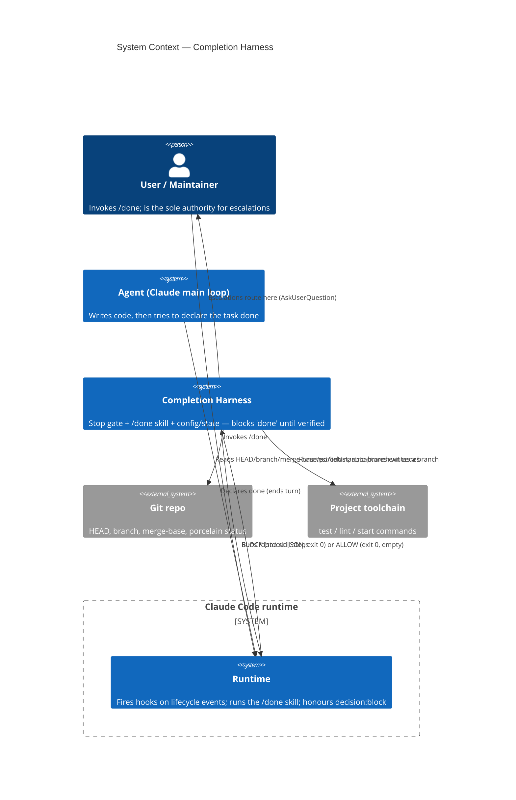
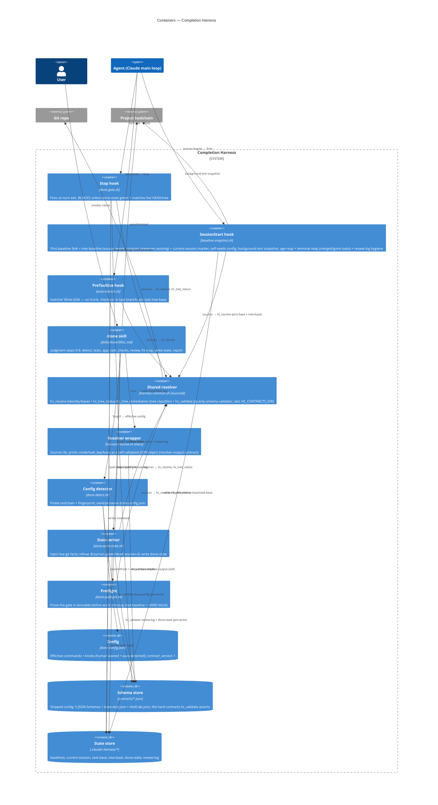
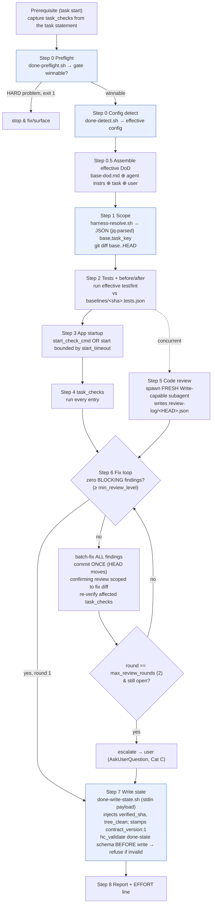
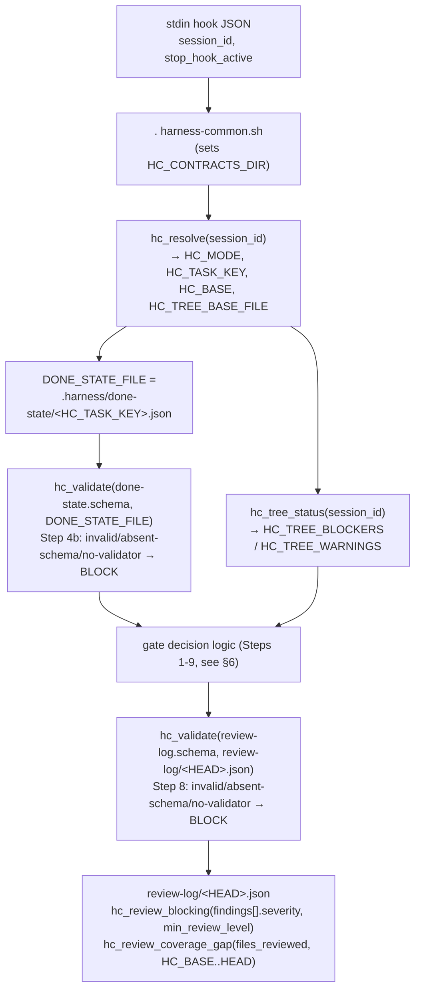
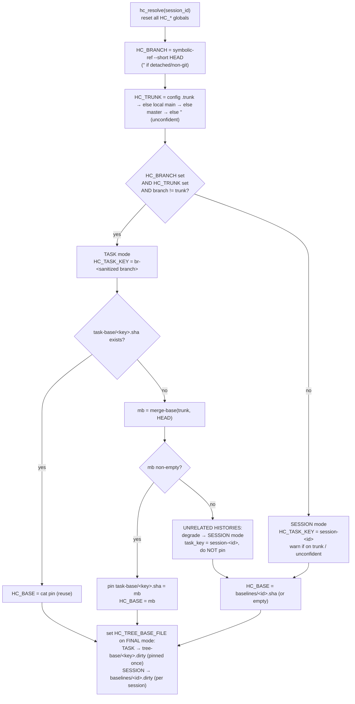
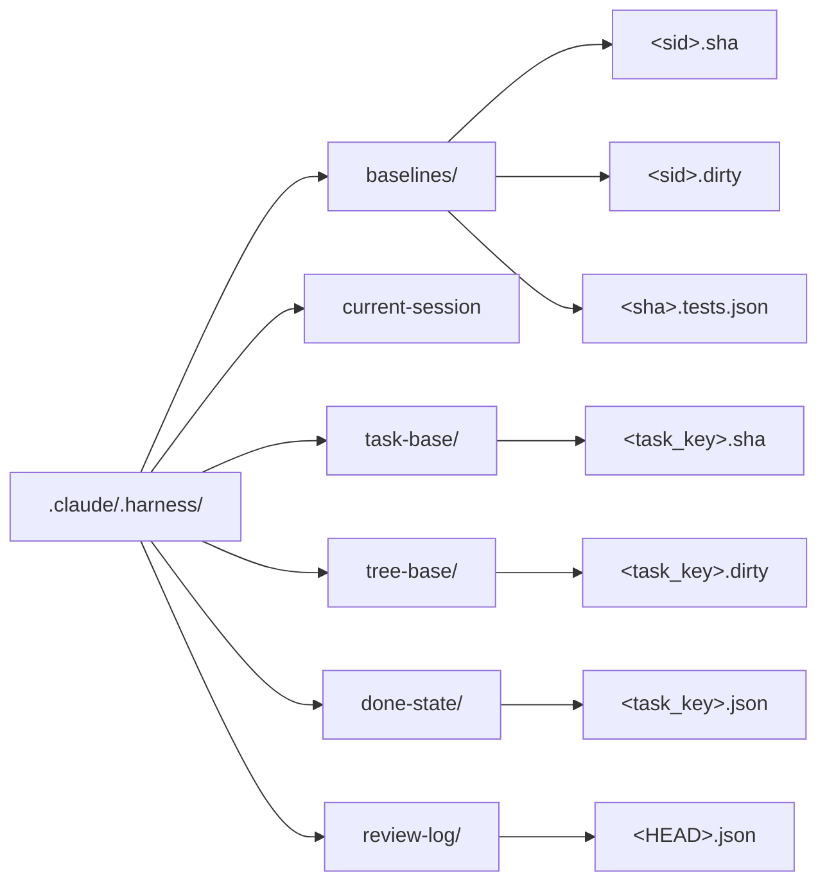

# Completion Harness — Architecture Map

> A navigable, graphical map of the bash "completion harness": Claude Code hooks
> + a `/done` skill that force an AI agent to actually **verify** a task (tests,
> app start, task-specific checks, independent code review) before it may declare
> the task "done".
>
> **Source of truth is the CODE.** Every diagram below was derived by reading the
> scripts, not the prose design doc. The companion rationale/spec is
> [`design.md`](design.md); the historical origin prompt is
> [`design-brief.md`](design-brief.md). Design doc and code are in sync as of
> 2026-07-28 (see §14); if they ever diverge, trust the code.

---

## 1. TL;DR / mental model

An AI coding agent reliably anchors on "implementation done" — it writes the
code, the code compiles, and it stops there, silently skipping tests, app
startup, review, and the task's own stated checks. The harness makes the
Definition of Done a **structural forcing function** rather than advisory text
it read once and forgot. The mechanism has three parts, none sufficient alone:
(a) a **Stop hook** (`done-gate.sh`) that fires on *every* turn exit and blocks
the stop unless a valid, green, HEAD-matching done-state exists; (b) the
**`/done` skill** that does the judgment work a hook cannot — run tests, boot the
app, run task checks, spawn a fresh independent reviewer, then write the
done-state; and (c) **config + state** (`done-config.json` + `.claude/.harness/*`)
that make it portable and let a task's verification survive across sessions,
keyed to the git branch. The gate trusts only deterministic evidence: command
exit codes it re-reads live, and an independent review-log artifact keyed to the
exact HEAD. Two invariants hold everywhere: **(1) never weaken the
anti-forgery** (facts are injected live — SHA from `git rev-parse`, tree state
from a shared classifier — never hand-written); **(2) never make the gate easier
to pass** (every ambiguous/degraded path fails *toward* BLOCK, never toward a
silent allow).

**Hard contracts (versioned + fail-closed).** Every JSON artifact the harness
produces or consumes carries a `contract_version` (const **`1`**) and has a
declared JSON-Schema in `contracts/` (done-state, review-log, done-config,
resolver-output, base-dod). Machine producers **stamp** the version
(`done-write-state.sh`, `done-detect.sh`, `harness-resolve.sh` all write
`contract_version: 1`); consumers **assert** it by validating against the schema
via `hc_validate` before trusting a single field. This is invariant (2) applied
to *shape*: a schema failure (malformed artifact, a missing required field, or
even a missing schema file / absent validator = broken install) fails **toward
BLOCK/refuse**, never toward a silent allow. `hc_validate` is a jq-only
JSON-Schema-**subset** validator (no node/ajv runtime); it prints `OK`/returns 0
when valid, prints `ERR: …`/returns 1 on any invalidity or error. The
shell-function ABI is itself a declared, **test-enforced** contract
(`contracts/shell-abi.json` + `harness-trial/test-abi.sh`); the validator and
schemas are covered by `harness-trial/test-contracts.sh`.

---

## 2. C4 Level 1 — System Context

The harness sits between the **Agent** (Claude's main loop) and the moment it
tries to end its turn. The **Claude Code runtime** is the machine that fires
hooks and runs skills; it is what actually enforces the block. The harness reads
the **Git repo** for identity/changeset facts and drives the **project
toolchain** (test/lint/start commands) for green/red evidence. The **User**
invokes `/done` and is the sole authority for escalations.



**How to read this / key decisions.** The harness never talks to the agent
directly — it emits a `decision:block` JSON that the *runtime* honours. The
agent experiences the block as "you cannot stop yet." The only signals the
harness treats as zero-trust are the toolchain's deterministic exit codes and
git facts; everything the agent *says* is trust-but-falsifiable.

---

## 3. C4 Level 2 — Containers

The harness is three hooks + one skill + one sourced library + config + a state
store. Each hook fires on a different runtime event. The **shared resolver
library** (`harness-common.sh`) is *sourced* by every script that needs identity
or tree classification — never reimplemented — so the gate, the writer, and the
preflight can never disagree.



**How to read this / key decisions.**
- **Hook timing:** SessionStart runs once at session begin (before any edit) →
  it is the *only* reliable place to pin a clean tree baseline. PreToolUse fires
  before *every* Write/Edit (cheap off-trunk fast-path). Stop fires on *every*
  turn exit — the structurally unavoidable enforcement point.
- **Sourced, not shelled:** the gate/writer/preflight `. harness-common.sh` and
  call `hc_resolve`/`hc_tree_status`/`hc_validate` as shell functions. The skill
  instead runs `harness-resolve.sh` (an executable wrapper) because a skill can
  only shell out, not source — and the wrapper now emits a self-validated JSON
  object (parse with `jq`), no longer `key=value`.
- **Schema store (`contracts/`) is shipped config, not runtime state.** It is
  copied into the target (`install.sh` copies `contracts/` → `.claude/contracts/`);
  `harness-common.sh` resolves it into `HC_CONTRACTS_DIR` (default: sibling of
  `scripts/`). `hc_validate <schema> <json>` is the one shared validator every
  producer/consumer calls, so the gate, the writer, and the detector can never
  disagree on what "valid" means.
- **Two distribution modes (same files):**
  - **Plugin** (`hooks/hooks.json`, `.claude-plugin/plugin.json`): hook commands
    resolve scripts via `${CLAUDE_PLUGIN_ROOT}/scripts/...`; the `/done` skill
    reads `base-dod.md` and helper scripts under `${CLAUDE_PLUGIN_ROOT}`. Enabling
    the plugin *is* the install.
  - **`install.sh` mirror**: copies the bundle into the target's `.claude/`
    (including `contracts/` → `.claude/contracts/`, the schema store `hc_validate`
    reads), wires the three hooks into `settings.local.json` via a `jq` merge, and
    `sed`-rewrites `${CLAUDE_PLUGIN_ROOT}` → `$CLAUDE_PROJECT_DIR/.claude` in the
    copied `SKILL.md`. State refs (`$CLAUDE_PROJECT_DIR/.claude/.harness/...`) are
    untouched. `install.sh` copies `dod/base-dod.md` → **`.claude/dod/base-dod.md`**
    (⚠ doc drift — design says `.claude/harness/base-dod.md`; see §14).

---

## 4. C4 Level 3 — Components of the two hot paths

Two paths carry all the enforcement weight: the **`/done` executor** (does the
work + writes the proof) and the **Stop gate** (re-verifies the proof against
live git). Both bottom out on the same sourced predicates.

### 4a. Inside `/done` (the executor)



**How to read this.** Boxes tinted blue delegate mechanical work to scripts
(`done-preflight.sh`, `done-detect.sh`, `harness-resolve.sh`,
`done-write-state.sh`); the rest is agent judgment. Two of these now enforce the
hard contracts: `harness-resolve.sh` emits a **self-validated JSON** resolver
object (Step 1 parses it with `jq`, not `key=value`), and `done-write-state.sh`
**stamps** `contract_version: 1` and **validates the assembled done-state against
its schema before writing** — an invalid state is refused, never reaches disk. Any failing step means "fix
it, return to Step 2, re-verify" (SKILL global rule). Steps 2/3/5 have no data
dependency and may run **concurrently** (lint ∥ tests; app-probe ∥ review); the
Step-4 task_checks confirm the task is **complete and working** before the final
code-solidity review (Step 5). The **zero-findings short-circuit** at Step 6 is the
common path: a clean changeset costs exactly **one** review.

### 4b. Inside the Stop gate (`done-gate.sh`) — the shared predicates it sources



**How to read this.** The gate itself contains no identity or tree logic — it
`source`s the library and calls its functions. `hc_resolve` decides *which*
done-state file to read (keyed by `HC_TASK_KEY`); `hc_tree_status` decides
whether the working tree carries the agent's own uncommitted work; `hc_validate`
asserts the two artifacts are structurally valid before any of their fields are
trusted. That is why the writer and preflight, which source the same functions,
can never diverge from the gate. **Contract gates:** the done-state is validated
at **Step 4b** (right after "done-state exists", before the `verified_sha`/outcome
fields are read) and the review-log at **Step 8** (right after "log exists",
before the severity/coverage checks). Both fail closed — an invalid artifact, a
missing schema file, or an unavailable validator all → BLOCK.

---

## 5. Lifecycle sequence

One task, one branch, from a clean SessionStart through a blocked "done", a
`/done` run, and finally an allowed stop. Lanes: the runtime/hooks, the agent,
the `/done` executor, git, and the state store.

```mermaid
sequenceDiagram
  autonumber
  participant RT as Runtime/Hooks
  participant AG as Agent
  participant DN as /done executor
  participant GIT as Git
  participant ST as State store

  RT->>ST: SessionStart (baseline-snapshot.sh)<br/>pin baselines/&lt;sid&gt;.sha + tree baseline (compact-preserving) + current-session marker<br/>reap +14d; terminal reap merged/gone br-* tasks (skip if trunk unconfident); review-log hygiene
  Note over RT,ST: hc_resolve; if task mode pin task-base/tree-base
  AG->>GIT: edits code (Write/Edit)
  RT->>GIT: PreToolUse (auto-branch.sh)<br/>on trunk → checkout -b task/&lt;ts&gt;; pin tree-base
  AG->>GIT: git commit
  AG-->>RT: ends turn ("done")
  RT->>ST: Stop (done-gate.sh) reads done-state/&lt;task_key&gt;
  ST-->>RT: absent
  RT-->>AG: BLOCK "Run /done"
  AG->>DN: invokes /done
  DN->>GIT: diff base..HEAD; run tests/app
  DN->>ST: Step 5 subagent writes review-log/&lt;HEAD&gt;.json (open_findings 0)
  DN->>GIT: rev-parse HEAD, status --porcelain (live facts)
  DN->>ST: Step 7 writes done-state/&lt;task_key&gt;.json (verified_sha=HEAD)
  AG-->>RT: ends turn
  RT->>ST: Stop (done-gate.sh) re-reads state + review-log
  Note over RT,ST: hc_validate both artifacts (4b, 8); verified_sha == HEAD, no tree blockers, all green
  RT-->>AG: ALLOW (exit 0, empty stdout)
```

**How to read this / key decisions.** Nothing the agent *says* is trusted — the
gate re-derives HEAD and tree state live on the second Stop. The review-log is
written by an **independent subagent**, not the main agent. Because the log is
keyed to HEAD, any commit after `/done` moves HEAD, invalidates both the
done-state (Step 5 SHA check) and the review-log, and forces `/done` to re-run.

---

## 6. The Stop-gate decision tree (`done-gate.sh`, Steps 1-9)

Faithful encoding of the script. It emits **exit 0 always**; BLOCK vs ALLOW is
distinguished only by whether a `{"decision":"block","reason":...}` JSON is
printed to stdout. The global posture is fail-**safe** (unexpected → allow),
with one deliberate inversion at Step 8.

```mermaid
flowchart TD
  A["jq present?"] -->|no| ALLOW0["exit 0 (allow) — can't reason"]
  A -->|yes| B["Step 1: stop_hook_active == true?"]
  B -->|yes| ALLOW1["exit 0 (loop guard)"]
  B -->|no| C["Step 2: git rev-parse HEAD ok?"]
  C -->|no HEAD| ALLOW2["exit 0 (non-git)"]
  C -->|HEAD_SHA| D["source lib; hc_resolve<br/>DONE_STATE = done-state/&lt;task_key&gt;.json"]
  D --> E{"Step 3: HC_BASE set AND<br/>HC_BASE == HEAD?"}
  E -->|no| G
  E -->|yes| F{"working tree clean?<br/>(git status --porcelain empty)"}
  F -->|clean| ALLOW3["exit 0 (nothing happened)"]
  F -->|dirty| G["Step 4: done-state file exists?"]
  G -->|missing| BLK4["BLOCK: run /done"]
  G -->|exists| G4b{"Step 4b: hc_validate(done-state.schema)?<br/>(invalid / no schema / no validator → BLOCK)"}
  G4b -->|invalid| BLK4b["BLOCK: done-state fails contract"]
  G4b -->|valid| H{"Step 5: verified_sha == HEAD?"}
  H -->|no| BLK5["BLOCK: changes committed since /done"]
  H -->|yes| I{"Step 6: hc_tree_status<br/>HC_TREE_BLOCKERS non-empty?"}
  I -->|blockers| BLK6["BLOCK: uncommitted introduced changes"]
  I -->|none| J{"Step 7: escalation present & != null?"}
  J -->|yes| ALLOW7["exit 0 (escape hatch, per-HEAD)"]
  J -->|no| K["Step 8: recorded outcomes (INVERTED: fail → BLOCK)"]
  K --> K1{"tests.exit_code == '0'?<br/>(absent → 'MISSING')"}
  K1 -->|no| BLK8a["BLOCK: tests not green"]
  K1 -->|yes| K2{".lint present? if so exit_code=='0'?"}
  K2 -->|present & !=0| BLK8b["BLOCK: lint not green"]
  K2 -->|absent or 0| K3{"review-log/&lt;HEAD&gt;.json exists?"}
  K3 -->|no| BLK8c["BLOCK: no independent review for HEAD"]
  K3 -->|yes| K3v{"Step 8: hc_validate(review-log.schema)?<br/>(invalid / no schema / no validator → BLOCK)"}
  K3v -->|invalid| BLK8v["BLOCK: review-log fails contract"]
  K3v -->|valid| K4{"hc_review_blocking(log, min_review_level) == '0'?<br/>(structural: rank(severity) >= rank(min); default high;<br/>unknown/missing severity or jq-fail → block)"}
  K4 -->|no| BLK8d["BLOCK: N blocking (≥ min) findings"]
  K4 -->|yes| KC{"hc_review_coverage_gap(log, HC_BASE, HEAD) empty or 'SKIP'?<br/>(structural: files_reviewed ⊇ changed files in HC_BASE..HEAD;<br/>SKIP = no base → no coverage block; error w/ changeset → block)"}
  KC -->|no (gap)| BLK8cov["BLOCK: review did not cover changed files"]
  KC -->|yes| K5{"task_checks: all status=='passed'?"}
  K5 -->|no| BLK8e["BLOCK: task_checks not all passed"]
  K5 -->|yes| ALLOW9["Step 9: exit 0 (ALLOW)"]

  classDef block fill:#ffe0e0,stroke:#c00;
  classDef allow fill:#e0ffe0,stroke:#0a0;
  class BLK4,BLK4b,BLK5,BLK6,BLK8a,BLK8b,BLK8c,BLK8v,BLK8d,BLK8cov,BLK8e block;
  class ALLOW0,ALLOW1,ALLOW2,ALLOW3,ALLOW7,ALLOW9 allow;
```

**How to read this / key decisions.**
- **Block contract:** BLOCK = print the decision JSON to stdout **and `exit 0`**.
  Exit 2 is deliberately *not* used — on exit 2 the runtime reads stderr and
  discards the stdout JSON reason. A stderr line is written too, but only as a
  human log.
- **Contract gates fail closed.** Before any of a done-state's fields are read,
  **Step 4b** runs `hc_validate(done-state.schema, DONE_STATE_FILE)`; before the
  review-log's `findings[]`/`files_reviewed` are read, **Step 8** runs
  `hc_validate(review-log.schema, review-log/<HEAD>.json)`. A schema failure, a
  missing schema file (broken install), or an unavailable `hc_validate` (library
  didn't source) all → BLOCK. This is the shape-level tier of invariant (2): a
  malformed or forged-but-invalid artifact can't reach the trust-bearing checks.
- **Ordering is load-bearing.** SHA (5) and tree (6) checks run **before**
  escalation (7). So an escalation disarms *only* the exact committed changeset
  it was recorded against — any new commit moves HEAD, Step 5 blocks first, and
  a stale escalation can no longer disarm the gate for the rest of the session.
- **Step 8 inverts the fail direction.** Everywhere else "unexpected → allow."
  Here a missing/null/malformed outcome (or a `jq` crash) is treated as **NOT
  green → BLOCK**. All comparisons are *string* compares against a sentinel
  (`// "MISSING"`) so an empty `jq` result can never accidentally pass a numeric
  test. `.lint` is conditional: absent → skip; present-but-nonzero → block.
- **The review check is severity-gated, computed structurally.** The gate does
  **not** trust the log's self-reported `open_findings`; it calls the shared
  `hc_review_blocking(log, min_review_level)` (in `harness-common.sh`), which
  counts findings whose severity rank `>= rank(min_review_level)` (default
  `high`; ranks `low=0 medium=1 high=2 critical=3`). Findings below the threshold
  are **advisory** (never gate) — this is the "good enough" state that stops
  nits/style findings causing endless fix→re-review churn. An unknown/missing
  severity ranks as blocking, and a missing/malformed log or a jq failure returns
  `ERR` → block (fail toward block). When the `findings` key is **present** it is
  authoritative and must be an array — a present-but-non-array `findings` (object,
  string, etc.) is treated as malformed and returns `ERR` → block, and the
  self-reported `open_findings` is **never** consulted in that case (anti-forgery).
  An **empty** `findings: []` legitimately counts zero → allow. The `open_findings`
  integer is a backward-compat fallback used **only when the `findings` key is
  entirely absent** (old-style logs; missing → 1 → block). `done-write-state.sh`
  mirrors this exactly via the same function.
- **The review is COVERAGE-gated, structurally.** After the severity check the
  gate calls `hc_review_coverage_gap(log, HC_BASE, HEAD)`: it computes the changed
  set from `git diff --name-only HC_BASE..HEAD` and subtracts the log's
  `files_reviewed` array (whole-line, space-safe). A non-empty gap (a changed file
  the reviewer did **not** attest) → BLOCK — making "the review covered the whole
  changeset" a structural check instead of prose hope. A missing/non-array
  `files_reviewed` with a real changeset → gap = all changed files → block, which
  **forces** the attestation. When `HC_BASE` is empty/unresolvable (or the diff
  fails) the function returns `SKIP` and the gate does **not** block on coverage — a
  no-regression degrade (there was no coverage check before). Any other error with a
  real changeset returns the full changed set (block), never `SKIP`.
  `done-write-state.sh` mirrors this via the same function.

---

## 7. Identity resolution (`hc_resolve`)

`hc_resolve` decides whether verification state is keyed to the **task (branch)**
or to the **session**, and pins the changeset base + tree baseline accordingly.
It is offline and conservative — it never consults `origin/HEAD` (repos may have
no remote) and degrades to session mode on any doubt.

**Output format (changed).** `hc_resolve` internals are unchanged (it still sets
`HC_*` globals). What changed is the **wrapper**: `harness-resolve.sh` now
serialises those globals into a single JSON object conforming to
`contracts/resolver-output.schema.json` (`contract_version`, `mode`, `task_key`,
`base`, `trunk`, `branch`, `warn`) and **self-validates** it with `hc_validate`
before printing — on validation failure it prints nothing and exits nonzero
rather than emit a malformed object. The skill parses this with `jq`, not the old
`key=value` grep.



**How to read this / key decisions.**
- `HC_TREE_BASE_FILE` is set **after** `hc__resolve_task_base` runs, because that
  function can degrade task→session on unrelated histories — the tree-base path
  must follow the *final* mode.
- **Auto-branch flips trunk→task mid-session** (§12): a session that started on
  trunk (SESSION mode) becomes TASK mode after the first edit. `hc_resolve` is
  idempotent and re-pins nothing already pinned, so this flip is safe.
- `HC_WARN` is set only when the fallback was *caused by trunk* (on trunk, or
  unconfident trunk) — SessionStart surfaces that as guidance; a plain detached
  HEAD produces no warning.
- **Session-id agreement (SESSION mode).** In SESSION mode `HC_TASK_KEY =
  session-<id>`, so the skill, the writer, and the gate must all resolve the same
  `<id>`. The gate takes it from its Stop-hook stdin; SessionStart records the same
  id to the `current-session` marker; the skill prefers env var → marker → `ls -t`
  heuristic. As a backstop, `done-write-state.sh` **rejects** a session-mode id with
  no `baselines/<id>.sha` (exit nonzero, lists valid ids) — otherwise a mismatched
  id keys a done-state the gate never reads → a silent forever-block.

---

## 8. The tree-state classifier (`hc_tree_status`)

The single predicate that answers: "is this working-tree change the **agent's
own new work** (block it) or **pre-existing dirt** that was already there at the
baseline (ignore it)?" It is baseline-relative and compares whole `git status
--porcelain` lines by exact equality.

```mermaid
flowchart TD
  ST["hc_tree_status(session_id)<br/>reset HC_TREE_BLOCKERS / HC_TREE_WARNINGS"] --> CUR["current = git status --porcelain"]
  CUR --> EMPTY{"current empty?"}
  EMPTY -->|yes| RET["return (no blockers)"]
  EMPTY -->|no| POL["policy = config .untracked_policy (default 'baseline')"]
  POL --> LOOP["for each porcelain line"]
  LOOP --> UNT{"policy=='strict'<br/>AND line is '??' (untracked)?"}
  UNT -->|yes| BLK["→ BLOCKER"]
  UNT -->|no| INB{"line ∈ baseline set?<br/>(grep -Fxq HC_TREE_BASE_FILE)"}
  INB -->|yes (present at baseline)| WARN["→ WARNING (pre-existing, NOT surfaced)"]
  INB -->|no (introduced)| BLK

  BLK --> NEXT["next line"]
  WARN --> NEXT
  NEXT --> LOOP
```

**Worked example.** Baseline `.dirty` pinned at fork contains one line:
`?? notes.txt`. Agent then creates `src/new.rs` and edits a tracked file.
Current porcelain:

| porcelain line | in baseline? | policy=baseline | policy=strict |
|---|---|---|---|
| `?? notes.txt` | yes | WARNING (ignored) | BLOCKER (any untracked) |
| `?? src/new.rs` | no | **BLOCKER** | **BLOCKER** |
| ` M src/lib.rs` | no | **BLOCKER** | **BLOCKER** |

**Why this design.** Membership is by *exact whole-line* equality, so a file the
agent introduces (`src/new.rs`) is by construction **not** in the fork-point
baseline → it blocks. A file that was already dirty at the fork (`notes.txt`) is
in the baseline → it is warned only. This simultaneously (1) breaks the
pre-existing-dirt **deadlock** (an agent could never reach "done" on a repo that
happened to have unrelated untracked files) and (2) preserves the invariant that
**the agent's own new/uncommitted file still blocks**. A **missing**
`HC_TREE_BASE_FILE` (resolver not run, or nothing pinned) → the baseline set is
empty → *everything* is "introduced" → everything blocks (safe direction). Note
`hc_tree_remediation` names **only** the blockers; pre-existing warnings are
never surfaced (⚠ doc drift — design shows them surfaced; §14).

---

## 9. The review loop (SKILL Steps 5-6)

Step 5 spawns a fresh, **Write-capable**, independent subagent handed the **real
diff** (it runs `git diff --name-only <base> HEAD` itself for the authoritative
changed-file list, then reviews the **full changeset**), instructed to be
**exhaustive**, tag every finding with a `severity`, and record the files it
examined in `files_reviewed`; its deliverable *is* a file it writes:
`review-log/<HEAD>.json`. Two gates apply to that log: **severity** (blocking count
via `hc_review_blocking`) and **coverage** (`files_reviewed ⊇ changed files` via
`hc_review_coverage_gap` — structural, so a too-narrow review can't pass as done).
The reviewer is also told **deterministic-first**: don't re-report what Step-2
tests/lint/type-check already catch (formatting, style, unused vars, type errors);
spend judgment on logic, blast-radius, missing test coverage, invariants, security —
prompt-level economy that keeps each review cheap. Step 6 is a bounded fix loop that
exploits the HEAD-keying to make re-review free, and gates only on findings
**at/above `min_review_level`**.

```mermaid
flowchart TD
  S4["Step 5: spawn FRESH Write-capable reviewer<br/>(general-purpose / claude — NOT a review-only type w/o Write)<br/>hand REAL diff (base SHA + file list); run git diff itself<br/>EXHAUSTIVE, tag severity; answer blast-radius Q-set<br/>write review-log/&lt;HEAD&gt;.json"] --> R1{"round 1: zero BLOCKING findings?<br/>(rank(severity) >= rank(min_review_level))"}
  R1 -->|yes| DONE1["DONE — ONE review.<br/>HEAD unmoved, log already satisfies gate<br/>(advisory findings may remain)"]
  R1 -->|no| BATCH["batch ALL blocking findings → fix in one pass<br/>(per-item up to max_fix_attempts=3)<br/>trivial advisory fixes only in the SAME commit"]
  BATCH --> COMMIT["commit ONCE → HEAD moves once<br/>old log (prev HEAD) now stale"]
  COMMIT --> R2["confirming review (round 2)<br/>scoped to the FIX diff only<br/>+ 'did a fix introduce a NEW issue?'<br/>writes review-log/&lt;new HEAD&gt;.json"]
  R2 --> CAP{"still BLOCKING findings?"}
  CAP -->|no| DONE2["DONE — two reviews"]
  CAP -->|yes, round==max_review_rounds (2)| ESC["STOP — do NOT start round 3<br/>escalate via AskUserQuestion (Cat C)<br/>record user decision in escalation"]
```

**How to read this / key decisions.** `max_review_rounds` (default 2) is a
**prompt-level** cap the agent obeys — no script counts rounds. The HEAD-keyed
log is the whole trick: committing a fix moves HEAD, so the previous log no
longer matches the gate's `review-log/<HEAD>.json` lookup → **re-review is forced
for free**, with no `findings == addressed` bookkeeping to trust. The **blocking
count is recomputed structurally** by the gate/writer from `findings[].severity` +
`min_review_level` (via `hc_review_blocking`), so a miscounted `open_findings`
cannot dodge the gate; findings below the threshold are **advisory** and never
force a round (the "good enough" state). Round-1 handing the reviewer the real
diff + the exhaustiveness instruction is what prevents findings trickling out one
round at a time. `open_findings`/`advisory_findings`/`review_rounds` are
informational only; the gate trusts the structural recompute.

---

## 10. State store & keying (`.claude/.harness/*`)



| Dir / file | Holds | Keyed by | Written by | Pinned once vs rewritten | Cleanup |
|---|---|---|---|---|---|
| `baselines/<sid>.sha` | HEAD at SessionStart (session base) | **session id** | baseline-snapshot | rewritten each session (**not** on `source=compact` if present) | age 14d |
| `current-session` | authoritative session id (from SessionStart hook stdin) | — (single file) | baseline-snapshot | rewritten each SessionStart (all sources incl. compact) | age 14d |
| `baselines/<sid>.dirty` | fork-point porcelain (session mode tree baseline) | **session id** | baseline-snapshot | rewritten each session (**not** on `source=compact` if present) | age 14d |
| `baselines/<sha>.tests.json` | background test snapshot (or `{status:inert}`) | **SHA** (shared across sessions) | baseline-snapshot (bg) | written once per SHA (atomic temp+mv) | age 14d |
| `task-base/<task_key>.sha` | merge-base(trunk, HEAD) — the changeset anchor | **task_key** (branch) | hc_resolve (lazy) | **pinned once** at fork | age-**excluded**; **terminal reap** on merge/gone |
| `tree-base/<task_key>.dirty` | fork-point porcelain (task mode tree baseline) | **task_key** (branch) | baseline-snapshot / auto-branch | **pinned once**, never re-seeded | age-**excluded**; **terminal reap** on merge/gone |
| `done-state/<task_key>.json` | verified_sha, tests, lint, task_checks, dod, escalation | **task_key** (branch) | done-write-state | rewritten each `/done` | age 14d; `br-*` keys also **terminal reap** on merge/gone |
| `review-log/<HEAD>.json` | reviewed_sha, min_review_level, files_reviewed[], findings[{severity,…}], open_findings, advisory_findings | **HEAD SHA** | Step-5 subagent | one per reviewed SHA | age 14d; **hygiene reap** when sha is not a branch tip / current HEAD |
| `../done-config.json` | effective commands + knobs (`contract_version` 1) | **project** | done-detect / install | seed once; detected block refreshed on fingerprint change; auto-upgraded to v1 in place | n/a (outside `.harness/`) |
| `../contracts/*.json` | the 5 JSON-Schemas + `base-dod.json` + `shell-abi.json` | **artifact** (one schema per artifact) | install / plugin (shipped) | ship-time; **not runtime state** | n/a (shipped config, never reaped) |

**How to read this / key decisions.** Three cleanups run at SessionStart, all guarded, honouring
the **HARD SAFETY INVARIANT: never delete in-progress-task state, the current HEAD's review-log,
or a live task's done-state/pins; when in doubt KEEP; skip terminal reap when trunk is unconfident.**
(1) **Age reap (14d)** — `task-base/` and `tree-base/` are **age-excluded** because their pins
must live as long as the branch (reaping `task-base` would silently re-pin at a *later*
merge-base if trunk moved; reaping `tree-base` would re-seed "pre-existing" from live porcelain
and whitelist the agent's own uncommitted work). Session-scoped `baselines/*` are ephemeral and
may be age-reaped — this is the ONLY reap that touches SESSION-mode state. (2) **Terminal reap** —
for `br-*` task keys only, once the branch is **merged into trunk** or **gone**, its
`task-base`/`tree-base`/`done-state` are reaped (keep-set via `hc_live_task_keys`; the current
branch is always kept; collision-safe; **skipped when trunk unconfident**). (3) **Review-log
hygiene** — a `review-log/<sha>.json` is kept only if `<sha>` is a live branch tip or the current
HEAD (keep-set via `hc_live_review_shas`); the current HEAD's log is never deleted. Done-state is
keyed by **task_key**, not session id, which is what lets a resumed session on the same branch
inherit the prior verification. **`contracts/` is shipped config, not runtime state** — it
lives *outside* `.harness/`, is keyed by artifact (one schema per artifact), is copied in at
install time (or provided by the plugin), and is never reaped; `hc_validate` reads it via
`HC_CONTRACTS_DIR`.

---

## 11. Escalation taxonomy

The escape hatch is not a self-asserted boolean. There are four shapes; only the
gate-visible fact is "`escalation` field present and non-null" (Step 7 → exit 0
for the current HEAD).

| Type | Trigger | Required evidence | How the gate honours it | Why not a silent waiver |
|---|---|---|---|---|
| **A — environment** | Check physically cannot run (Docker down, sudo, no net, missing hardware) | `captured_error` + `exit_code` from actually running the command | non-null `escalation` → Step 7 exit 0, **only for this HEAD** | Faking = fabricating an error string, visible in transcript; echoed in Step 8 |
| **B — pre-existing failure** | Test already red at baseline, out of scope | Only escalates to C after `max_fix_attempts` (boyscout: fix first) | (routes into C) | Not an automatic escape — before/after checkpoint proves attribution |
| **C — stuck / out of scope** | Genuinely unfixable after `max_fix_attempts` | **Actual user exchange** via AskUserQuestion + recorded `attempts` + `user_decision` | non-null → Step 7 exit 0, per-HEAD | Routes to the **user**, never the agent's own call; C with no user turn is a detectable lie |
| **`user_halt`** | User spontaneously stops mid-work, before gate is green | Verbatim user statement + `completed`/`remaining` | Same path (non-null → per-HEAD) | Requires a real user statement in transcript; echoed Step 8 |

**How to read this.** All four disarm **only the exact committed changeset** they
were recorded against: because Step 7 runs *after* the Step-5 SHA check, any new
commit moves HEAD and Step 5 blocks again → `/done` must re-run. `done-write-state.sh`
lets a payload with a non-null `escalation` bypass its own green-outcome refusals
(mirroring the gate), so the escape hatch works end-to-end.

---

## 12. Edge-case matrix

| Case | What happens | Code path |
|---|---|---|
| **On trunk** | SESSION fallback + `HC_WARN`; SessionStart surfaces a systemMessage; first Write/Edit auto-branches to task mode | `hc_resolve` (branch==trunk → session); `baseline-snapshot.sh` HC_WARN block; `auto-branch.sh` |
| **Detached HEAD** | `HC_BRANCH` empty → SESSION mode, **no** warning; auto-branch no-ops (no `symbolic-ref`) | `hc_resolve`; `auto-branch.sh` detached guard |
| **Unrelated histories** | `merge-base` empty → degrade task→session, `HC_WARN="unrelated histories"`, base **not** pinned | `hc__resolve_task_base` empty-mb branch |
| **Pre-existing dirty tree** | Lines present at baseline → WARNING (ignored) → gate does NOT block on them (deadlock broken) | `hc_tree_status` in-baseline branch; gate Step 6 |
| **Pre-existing untracked** | `?? x` in baseline → WARNING under `baseline` policy; BLOCKER under `strict` | `hc_tree_status` untracked handling |
| **Agent's own new file** | Not in baseline → BLOCKER → gate Step 6 BLOCK; writer refuses | `hc_tree_status` else-branch (both policies) |
| **Missing tree baseline (`.dirty`)** | SessionStart records it unconditionally (even empty, with a session-scoped fallback if the resolver failed); if still absent, `hc_tree_status` degrades to STRICT (every pre-existing file "introduced" → deadlock), so preflight raises a **HARD problem** (NOT WINNABLE), not a warning | `baseline-snapshot.sh` unconditional `.dirty`; `done-preflight.sh` Check 3 (blocking) |
| **Dead session id (SESSION mode)** | `session_id` with no `baselines/<id>.sha` → writer **refuses** (exit nonzero, lists valid ids + `current-session` marker); otherwise the done-state keys `session-<id>` the gate never reads → silent forever-block | `done-write-state.sh` dead-id backstop; skill prefers the `current-session` marker |
| **Multi-session task resume** | Same branch → same `task_key` → inherits done-state + pinned base/tree-base | `hc_resolve` task mode reads existing pins |
| **Parallel same-branch (same dir)** | Shares `task_key` — **unsupported**; use worktrees (different branch → different key) | keying by `task_key`; SKILL "parallel work must use worktrees" |
| **No test command** | `baseline_snapshot` on but no cmd → self-run `done-detect.sh`; still none → write `{status:inert}` marker + systemMessage; preflight raises HARD problem | `baseline-snapshot.sh` inert branch; `done-preflight.sh` Check 4 |
| **jq missing** | Gate exits 0 (allow — fails open); preflight warns; detect emits best-effort; writer errors (jq required) | `done-gate.sh` line 33; `done-preflight.sh` Check 2; `done-write-state.sh` guard |
| **Non-git repo** | Gate Step 2 exit 0 (allow); SessionStart writes `no-git` baseline; preflight "harness inactive"; auto-branch no-ops | `done-gate.sh` Step 2; `baseline-snapshot.sh`; `done-preflight.sh` Check 1; `auto-branch.sh` `is-inside-work-tree` |
| **Stop-hook loop guard** | `stop_hook_active==true` → exit 0 immediately (a block never traps forever) | `done-gate.sh` Step 1 |
| **HEAD==base & clean** | Quiet exit 0 (nothing happened this session); but HEAD==base & **dirty** falls through → Step 4 BLOCK | `done-gate.sh` Step 3 |
| **Auto-branch fallback (empty pin)** | Branch created but no clean SessionStart `.dirty` snapshot → pin **empty** tree-base → everything blocks (safe) | `auto-branch.sh` `: > HC_TREE_BASE_FILE` |
| **Mid-rebase/merge** | Auto-branch no-ops (MERGE_HEAD / rebase-apply / rebase-merge present) | `auto-branch.sh` git-dir guard |
| **14-day reap** | SessionStart deletes `.harness/*` files older than 14d, **excluding** `task-base/*` and `tree-base/*` | `baseline-snapshot.sh` `find -mtime +14 -delete -not -path` |
| **Mid-task compact** | `source=="compact"` (manual `/compact` or auto-compaction) fires mid-task with a dirty tree. SessionStart **preserves** an existing `baselines/<sid>.{sha,dirty}` (writes only if absent) so the agent's own WIP is not captured as "pre-existing"; `current-session` marker still written. Other sources (startup/resume/clear/fork/empty) refresh as before | `baseline-snapshot.sh` `IS_COMPACT` guard on the `.sha` write and the session-mode `.dirty` write |
| **Merged/gone task (terminal reap)** | A `br-*` task whose branch is merged into trunk or gone → its `task-base`/`tree-base`/`done-state` reaped; an **unmerged (in-progress)** branch's state is KEPT; the **current branch is always kept**; **skipped entirely when trunk is unconfident** (never guess "merged") | `baseline-snapshot.sh` terminal-reap block; `hc_live_task_keys` keep-set + `hc__detect_trunk` |
| **Superseded review-log** | `review-log/<sha>.json` deleted when `<sha>` is neither a local branch tip nor the current HEAD; **current HEAD's log never deleted**; all kept if keep-set uncomputable | `baseline-snapshot.sh` review-log hygiene block; `hc_live_review_shas` |
| **Headless / CI** | Plugins load from `enabledPlugins` in `-p` mode; **`--bare` skips hook/skill discovery entirely** → harness inert. PreToolUse firing + block-honouring in `-p` are undocumented → verify empirically | distribution (design §"Headless/CI"); no code path — runtime behaviour |

---

## 13. Threat model & non-goals

**Defends against drift, not malice.** The real adversary is the *drifting*
agent that anchors on "implementation done" and silently omits steps. Against
omission, requiring an artifact bound to the current HEAD is effective — not
because it is hard to forge, but because *producing it means doing the step*, and
a non-adversarial agent nudged to do the step does it.

**Zero-trust signals (structural enforcement):** only deterministic command
outcomes and live git facts — `tests`/`lint` exit codes, `git rev-parse HEAD`,
`git status --porcelain` — re-read by the gate and injected live by the writer
(never hand-written). A `decision:block`/`exit 0` contract makes the block itself
unavoidable.

**Trust-but-falsifiable (prompt-level enforcement):** the review's *quality*, the
blast-radius answers, `task_checks` semantics, `max_review_rounds`/`max_fix_attempts`
caps, escalation honesty. These live in `SKILL.md` prose and are obeyed by a
cooperative agent; the transcript makes a lie *detectable* (an escalation with no
user turn, a fabricated error string) but the shell cannot *prove* them.

**A malicious agent can always defeat a local shell gate** — fabricate the
review-log, hardcode `open_findings:0`, record a false `exit_code:0`. No local
machinery changes that; malice is **out of scope by construction**.

**Non-goals.**
- No enforcement on conversational (non-changeset) turns — the SHA/base quiet-exit.
- No enforcement in non-git repos (no changeset baseline possible).
- Does not guarantee the deploy environment was exercised — only that the agent
  must *state* whether it was.
- Does not arbitrate two agents committing to one tree — use worktrees.
- Does not stop a determined forger (see above).

---

## 14. Code ↔ design-doc reconciliation

Every diagram above follows the **code**, which is the source of truth. Four
points where `design.md` had drifted from the code were reconciled in the design
doc (2026-07-28): the `hc_tree_remediation` message no longer claims it surfaces
pre-existing entries (blockers only); the base-DoD install path is
`.claude/dod/base-dod.md`; the non-existent `build` → `build:server` rename claim
was removed; and the `~/.claude/...` prose paths were corrected to
`$CLAUDE_PROJECT_DIR/.claude/...` / `${CLAUDE_PLUGIN_ROOT}`. Design and code are
in sync as of that date. If they diverge again, trust the code and re-sync the doc.

**Severity-gated review (added 2026-07-28).** The review check is now structural:
findings are `severity`-tagged and the gate/writer compute the blocking count via
`hc_review_blocking` (in `harness-common.sh`) from `findings[].severity` + the new
`min_review_level` config key (default `high`); below-threshold findings are
advisory and never gate. Round-1 review is handed the real `git diff <base> HEAD`
and told to be exhaustive (fixing the trickle). `open_findings`/`advisory_findings`
in the log are informational; old-style logs (no `findings[]`) fall back to
`open_findings`. Design (§Step 5/6, Config, Stop-hook Step 8) and code are in sync.

**Hard contracts (added 2026-07-28).** Every JSON artifact now carries
`contract_version` (const `1`) and has a JSON-Schema under `contracts/`
(done-state, review-log, done-config, resolver-output, base-dod). A new jq-only
validator `hc_validate <schema> <json>` (in `harness-common.sh`; sets
`HC_CONTRACTS_DIR`) enforces a keyword subset (`type`/`required`/`properties`/
`items`/`enum`/`const`/`additionalProperties`) and **fails closed** (invalid,
missing schema, or unavailable validator → nonzero). Producers stamp the version
and validate before writing: `done-write-state.sh` (done-state, refuse-on-invalid),
`done-detect.sh` (config; stamps + **auto-upgrades** old configs in place, never
destroying existing fields), `harness-resolve.sh` (emits self-validated JSON, no
longer `key=value`). Consumers assert it: `done-gate.sh` validates the done-state
at **Step 4b** and the review-log at **Step 8** before trusting their fields — both
BLOCK on failure. `install.sh` copies `contracts/` → `.claude/contracts/`. The
shell-function ABI is itself a declared, **test-enforced** contract
(`contracts/shell-abi.json` + `harness-trial/test-abi.sh`); the validator + schemas
are covered by `harness-trial/test-contracts.sh` (both run by the repo's
`run-tests.sh`). Design (§Mechanism, Step 1/5/7, Stop-hook, Config, Files) and code
are in sync.

---

## Appendix — file → responsibility index

| File | Responsibility |
|---|---|
| `scripts/harness-common.sh` | Sourced lib: `hc_resolve` (identity/base/tree-base), `hc_tree_status` (tree classifier), `hc_tree_remediation`, `hc_review_blocking` (severity-gated review count), `hc_review_coverage_gap` (coverage check), `hc_live_task_keys` (terminal-reap keep-set), `hc_live_review_shas` (review-log hygiene keep-set), `hc_validate` (jq-only JSON-Schema-subset validator; sets `HC_CONTRACTS_DIR`) |
| `scripts/harness-resolve.sh` | Executable wrapper — sources lib, prints resolver output as a **self-validated JSON object** (resolver-output contract), `jq`-parsed by the skill (no longer key=value) |
| `contracts/*.json` | Hard-contract schema store: `done-state.schema.json`, `review-log.schema.json`, `done-config.schema.json`, `resolver-output.schema.json`, `base-dod.schema.json` (the 5 JSON-Schemas `hc_validate` asserts), plus `base-dod.json` (the seed DoD) and `shell-abi.json` (the declared, test-enforced shell-function ABI) |
| `scripts/done-gate.sh` | Stop hook — the gate (Steps 1-9); `hc_validate`s done-state (4b) + review-log (8) before trusting fields |
| `scripts/baseline-snapshot.sh` | SessionStart — pin baselines, tree-base, test snapshot, reap |
| `scripts/auto-branch.sh` | PreToolUse(Write\|Edit) — trunk→task branch, pin task tree-base |
| `scripts/done-detect.sh` | Config detect/seed/preserve + fingerprint; stamps `contract_version:1`, auto-upgrades old configs, validates before writing |
| `scripts/done-preflight.sh` | `/done` Step 0 — prove the gate is winnable |
| `scripts/done-write-state.sh` | `/done` Step 7 — inject live facts, stamp `contract_version:1`, refuse dirty/non-green, validate done-state (+ review-log) against schema before writing (refuse if invalid) |
| `skills/done/SKILL.md` | `/done` judgment steps 0-8 + escalation rules |
| `dod/base-dod.md` | Base DoD folded into the effective DoD (Step 0.5) |
| `hooks/hooks.json` | Plugin hook wiring (`${CLAUDE_PLUGIN_ROOT}`) |
| `.claude-plugin/plugin.json` | Plugin manifest |
| `install.sh` | Non-plugin installer (mirror into `.claude/`, `jq`-merge hooks) |
