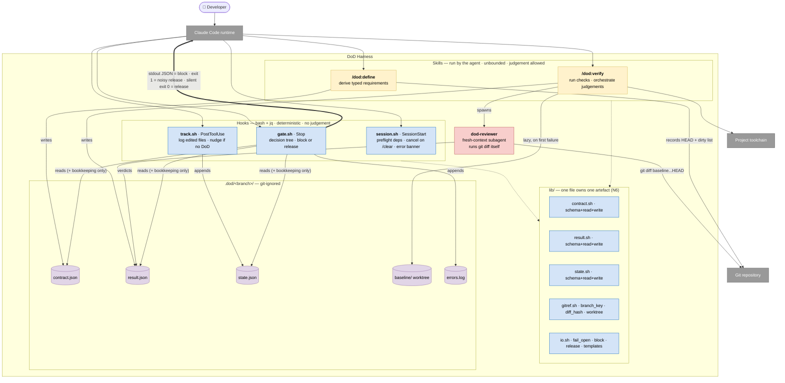
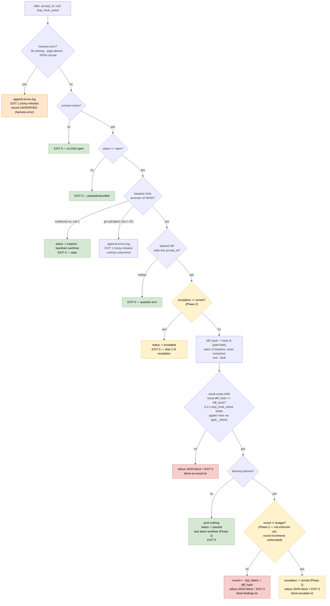

# DoD Harness — Design v2

> **Status:** Phase 1 (walking skeleton, `docs/design-v2.plan.md`) shipped and
> in use — `contract.sh`/`result.sh`/`state.sh`/`gitref.sh`/`io.sh`, `gate.sh`,
> both skills. This document remains the full v2 end-state spec; sections
> below are annotated where Phase 1 diverges or defers to Phase 2.
> **Supersedes:** [`design.md`](design.md) and the pre-v2 `dod/` implementation
> (recoverable at tag `dod-v1-final`).

---

## 1. TL;DR

An AI coding agent anchors on "implementation done" — the code compiles, so it
stops. Tests, app startup, independent review and the task's own stated checks
get silently skipped.

This harness makes the Definition of Done a **structural forcing function**.

```
  /dod:define  ──▶  verification table ──▶ user confirms (D29) ──▶ contract
                                                  │
                                     agent implements, same turn
                                                  │
                                                  ▼
  agent believes it's done ──▶ self-triggers /dod:verify (D28) ──▶ result
                                                  │                   │
                                                  ├── all pass ─────▶ done
                                                  └── failures ─────▶ fix → verify (max 2 rounds, Phase 2)
                                                                        └── exhausted ──▶ escalate to user (Phase 2)

  (Stop GATE is the fallback if the agent skips self-verify — not the
   intended trigger. It blocks on: no contract confirmed / no matching
   result / blocking failures, per §6.2.)
```

Three parts, none sufficient alone:

1. **A dumb gate** — a `Stop` command hook. Pure bash, reads files, decides
   block-or-release. No judgement, no model, no writes beyond bookkeeping.
2. **A smart verifier** — a skill the agent runs. Unbounded time, full tools,
   spawns a fresh-context reviewer.
3. **Branch-keyed state** — a git-ignored `.dod/` directory that survives
   compaction, resume and fork.

The separation is load-bearing. Hooks time out (30–60s for model-backed types);
verification cannot fit inside one. The gate never verifies; the verifier never
decides.

---

## 2. Requirements

### Functional

| # | Requirement |
|---|---|
| F1 | DoD is defined **before** implementation begins, never after. |
| F2 | The agent works the task normally; the harness stays out of the way. |
| F3 | When the agent claims done, verification runs against the collected contract. |
| F4 | Verification is scoped to **changes related to the task**, not the whole repo. |
| F5 | Pass → task declared done. Fail → findings fed back, fix→verify loop. |
| F6 | The loop is bounded; on exhaustion the harness escalates to the user. |

### Non-functional

| # | Requirement | How it is met |
|---|---|---|
| N1 | Does not interfere with non-implementation tasks or conversations | Gate releases immediately on no-DoD / no-claim / no-edits. Cheapest path is the common path. |
| N2 | Fires at the right time | `Stop` hook + explicit claim latch + abandonment guard. |
| N3 | Fast | Gate is file reads only. Baseline worktree and pre-existing-failure resolution are **lazy** — paid only on a failing check. Results cached on `(diff_hash, cmd)`. |
| N4 | Thorough and exhaustive | `/dod:verify` runs in the agent with no timeout; fresh-context reviewer; every requirement checked and recorded. |
| N5 | **Deterministically guides the agent** | Every requirement is typed `check` (command) or `judgement` (fixed prompt + schema). Block messages are interpolated from templates, never composed by a model. The gate is a command hook, never a model-backed hook. |
| N6 | **No read/write drift in JSON artefacts** | Schema, reader and writer for each artefact live in the **same file** and change together. No other file may parse that artefact. |

---

## 3. C4 — Level 1: System context


The harness has **no process of its own**. It exists only as callbacks Claude
Code invokes. Everything it "does" is something the agent was made to do.

---

## 4. C4 — Level 2: Containers



### Trust direction

```
  skills / subagent ──write──▶ STATE ──read-only──▶ gate.sh ──▶ block | release
                                                       ▲
                                         never judges, never rewrites
```

The gate trusts a `result.json` **only** when its `diff_hash` equals the current
diff hash. An agent cannot argue past the gate; it can only produce real
evidence or not.

### Why six hook events collapse into four scripts

Claude Code runs concurrent hooks on the same event **in parallel, last write
wins**. Splitting `SessionStart` (preflight + clear-cancel + error banner) or
`PostToolUse` (edit log + nudge) into separate scripts would race against
itself. One event, one script.

### No preventive container — self-invoke is primary, the human is the fallback

**`guard.sh` does not exist and is not planned.** Live-tested 2026-09-17: a
`PreToolUse` guard was considered twice and rejected both times. First pass:
unenforceable as worded (D12's original text presupposed a "DoD should be
open" signal that D2 explicitly defers). Second pass, after a live test
showed the agent skipping `/dod:define` for an entire task despite `track.sh`'s
nudge (D9) firing correctly: still rejected, because the fix for an agent not
doing its job is not a lock on `Edit`/`Write` — it's the same pattern D28
already uses for `/dod:verify`. **The agent self-invokes `/dod:define` before
its first edit, the moment a task is clear — that is the primary path, same
status as D28's self-triggered `/dod:verify`.** Nothing changes about whose
job it is; what a preventive gate would add is a hard stop on top of an
already-correct expectation, at the cost of blocking every unrelated edit
(docs, scratch files) with no escape hatch. The human running `/dod:define`
themselves, and `track.sh`'s nudge, are the fallback for when the agent
doesn't self-invoke — responsibility passes to the human only once the agent
has already failed to act, not by default. Everything in the diagram above
stays detective (nudge, gate block) rather than preventive.

**Known ceiling, stated plainly:** prose instructions have no structural
floor. The live test that found the skipped-entirely case also proved a
correctly-worded, correctly-delivered nudge (D9) can be silently ignored —
tightening the skill's wording lowers the odds, it does not eliminate the
failure mode the way a hook would. Accepted deliberately (§4's rejection
above), not overlooked.

---

## 5. C4 — Level 3: Components

### 5.1 `gate.sh` — the decision tree

> **Phase status** (`docs/design-v2.plan.md`): this diagram is the **full v2
> end-state**. Shipped: L2, L3, L4, L5, L6, the diff-hash branch, L7, L8, L9
> (both arms — round++ and the budget/no-progress escalation arm). **Not
> shipped:** L1 as a standalone top-level branch (see below).
> `gate.sh`'s own header comment names the shipped branches as
> "0,1,2,3,4,5,6,7,8,9,10" (its own internal numbering, not this diagram's
> L-labels) and says so explicitly. One concrete gap against this diagram:
> - `stop_hook_active` is **not** an early top-level check (L1). It's
>   consulted only inside the block-emitting helper (`gate__block`, the A2
>   category-scoped brake) — after the contract/status/latch checks already
>   passed and a block is about to be issued. A Phase-2 implementer following
>   this diagram literally would put the check in the wrong place.
>
> L9's budget is `DOD_ROUND_BUDGET=2` (D26) — round reaching it, **or** an
> identical `diff_hash` between two failing rounds (no progress since the
> last failure), both arm escalation on the same Stop. Escalation is
> two-step (D21): the Stop that crosses the threshold blocks once with the
> escalate message and sets `state.escalation := armed`; the *next* Stop
> takes L6, sets `contract.status := escalated`, and releases silently —
> it does not block again. `status=escalated` then keeps every later turn
> released via L3 (status != open), same as `passed`/`cancelled`. L4
> (baseline-not-ancestor / expiry) is shipped: it only fires when history is
> rewritten under the baseline (rebase, force-push, `commit --amend`) —
> **not** for a killed/crashed session with untouched history
> (`docs/design-v2.plan.md`), which is a different, still-unaddressed gap.
> L4 also distinguishes a *confirmed* non-ancestor from a failed git call:
> `git merge-base --is-ancestor` exits 1 only when it definitively answers
> "no" — any other non-zero exit (typically 128: unresolvable SHA, a shallow
> clone missing the needed history, a transient git I/O error) means the
> check itself failed, and only that confirmed-1 case expires the contract.
> A failed check instead fail-opens through the same machinery as E0
> (`dod_fail_open` + `EXIT 1`), leaving `contract.json` untouched — a harness
> failure must never be recorded as a definitive terminal status (§7.4).
> `dod/lib/gitref.sh`'s `dod_is_ancestor_status` exposes the raw exit code
> for this; `dod_is_ancestor` itself keeps its collapsed boolean contract for
> callers that don't need the distinction.



**Gate writes only:** `state.round`, `state.last_failed_diff_hash`,
`state.latched` (disarm-only, branch 8 — issue #33), `contract.status`.
Nothing else. It is otherwise read-only.
`state.escalation` is written only once L6/L9's Phase-2 escalation branches
exist — Phase 1 never sets it.

**Why `edits_this_prompt` and not "edits since open":**

| Turn ends… | per-`prompt_id` edits | "since open" |
|---|---|---|
| agent asks the user a question, edited nothing | release ✅ | blocked ❌ (violates N1) |
| agent edited, then stopped without latching | blocked ✅ | released ❌ (silent skip) |

`prompt_id` rather than "turn" is deliberate: a blocked `Stop` starts a **new
turn under the same `prompt_id`**, so edits made before the block still count.
The gate stays engaged until verification actually happens instead of resetting
itself each time it blocks.

### 5.2 `/dod:define` components

```
  ┌─ preflight assert ──── deps present · is a git repo · no open DoD (or amend)
  ├─ task capture ──────── argument if given, else derive from conversation
  │                        record task_source (objection window is the
  │                        confirmation gate below, not a separate print)
  ├─ protocol loader ───── DoD protocol floor + CLAUDE.md chain
  ├─ battery detector ──── package.json / Makefile / cargo / … → check commands
  ├─ requirement synth ─── task-derived requirements + e2e applicability decision
  ├─ waiver extractor ──── free text in the user's prompt → waivers[]
  ├─ schema validator ──── reject malformed · reject vague-without-check
  ├─ confirmation gate ──── print the verification table · BLOCK on yes/adjust/cancel (D29)
  ├─ baseline recorder ─── HEAD sha + dirty file list
  └─ contract_write ────── via lib/contract.sh, then confirm one-line: "open"
```

Ordering matters: **the baseline is recorded last**, immediately before the
contract is written, minimising the window between snapshotting HEAD and
allowing edits — and now **after** the confirmation gate, since a rejected or
adjusted table must not have already snapshotted HEAD for the wrong
requirements.

### 5.3 `/dod:verify` components

```
  ┌─ contract loader ───── assert status=open · load requirements
  ├─ diff hasher ───────── the same lib/gitref.sh function gate.sh uses
  ├─ check runner ──────── cache lookup (diff_hash, cmd) → run → capture evidence
  ├─ baseline resolver ─── ONLY on a failed check:
  │                        create .dod/<branch>/baseline worktree (once per task)
  │                        re-run that one command there → baseline_verdict
  ├─ judgement orchestr. ─ spawn dod-reviewer with fixed prompt + schema
  │                        round 1: full changeset
  │                        round 2: delta + re-confirm round-1 blocking findings
  ├─ finding classifier ── blocking vs advisory
  ├─ result_write ──────── via lib/result.sh · evidence/ files · keyed to diff_hash
  └─ pass table printer ── on all-pass, prints the brief table to the user
```

**The diff hasher is shared.** If the gate and the verifier ever computed the
hash differently, the gate would reject every result. One function, one file.

---

## 6. C4 — Level 4: Code

### 6.1 File layout

```
dod/
├── hooks/
│   ├── session.sh      SessionStart + SessionEnd — preflight · cancel-on-clear · error banner
│   ├── track.sh        PostToolUse   — log edits · nudge
│   └── gate.sh         Stop          — decision tree
├── lib/
│   ├── contract.sh     ▸ SCHEMA + contract_read/write/validate   ← owns contract.json
│   ├── result.sh       ▸ SCHEMA + result_read/write/validate     ← owns result.json
│   ├── state.sh        ▸ SCHEMA + state_read/write + mutators    ← owns state.json
│   ├── gitref.sh       branch_key · diff_hash · baseline worktree
│   └── io.sh           fail_open · block · release · template render
├── templates/
│   ├── block-no-result.txt
│   ├── block-findings.txt
│   └── block-escalate.txt
├── skills/
│   ├── dod-define/SKILL.md
│   └── dod-verify/SKILL.md
└── agents/
    └── dod-reviewer.md
```

**N6 enforcement rule:** nothing outside `lib/contract.sh` may `jq` into
`contract.json`; likewise for `result.sh` and `state.sh`. Checkable by grep in
CI. A consequence: the skills **cannot compose JSON themselves** — `/dod:define`
calls `contract_write`, it does not emit jq from prose. An LLM hand-writing JSON
that the gate parses is precisely where a determinism harness would leak.

### 6.2 `gate.sh` exit contract

> **Amendment A1** (`docs/design-v2.plan.md`): block is JSON on stdout + exit
> 0, not `exit 2`. This matches the repo's existing convention
> (`dod/scripts/dod-gate.sh:145-161` at tag `dod-v1-final`) — `exit 2` renders
> in the transcript as a hook *error*, which is wrong for a deliberate gate
> decision. Harness errors keep `exit 1` so the two stay visibly distinct.

```
stdout {"decision":"block","reason":"…"} + exit 0  → block  (verification failure)
silent + exit 0                                    → release (normal operation)
stderr one line + exit 1                           → release (harness error, noisy)
```

**Phase status:** branches 0, 2, 3, 4, 5, 6, 7, 8, 9, 10 are shipped. Branch 1
is shipped but not as a standalone check — see the A2 note below. Branch 4
covers only a rewritten-history baseline (rebase, force-push, amend) — a
killed/crashed session with untouched history (`docs/design-v2.plan.md`)
is a different, still-unaddressed gap; `status` does not expire for that case.

| # | Branch | exit | stdout/stderr → agent | state writes | shipped? |
|---|---|---|---|---|---|
| 0 | harness error | **1** | stderr, one line: `dod gate error: <cause> — see .dod/errors.log` | — | yes |
| 1 | `stop_hook_active` | 0 | — | — | yes, folded into `gate__block`'s A2 brake, not a standalone check |
| 2 | no contract | 0 | — | — | yes |
| 3 | status ≠ open | 0 | — | — | yes |
| 4 | baseline not ancestor | 0 | — | `status=expired`, worktree torn down | yes |
| 5 | no claim, no edits | 0 | — | — | yes |
| 6 | `escalation=armed` | 0 | — | `status=escalated` | yes |
| 7 | result missing/stale | 0 | stdout JSON: `block-no-result.txt` | — | yes |
| 8 | blocking failures, budget left | 0 | stdout JSON: `block-findings.txt` | `round++`, `last_failed_diff_hash` | yes |
| 9 | budget exhausted or no progress | 0 | stdout JSON: escalate reason | `round++`, `last_failed_diff_hash`, `escalation=armed` | yes |
| 10 | all pass | 0 | — | `status=passed`, worktree torn down | yes |

Branch 9 fires instead of branch 8 the moment either holds: the round about
to be recorded reaches `DOD_ROUND_BUDGET` (2, per D26), or the current
`diff_hash` equals `state.last_failed_diff_hash` from the prior failure (no
progress). Branch 9's stdout is not template-rendered from a file yet — v1
of this phase inlines the message in `gate.sh` itself (`block-escalate.txt`
in §6.6 is the target shape, not yet wired through `io.sh`'s renderer).

> **Amendment A2** (`docs/design-v2.plan.md`): branch 1 (`stop_hook_active`)
> is **category-scoped**, not a blanket release. The gate records the
> *category* of the last block it issued; it releases on `stop_hook_active`
> only when the category is unchanged from last turn. A block for a
> *different* category still blocks even under `stop_hook_active`. Ported
> from `dod-gate.sh:145-163`'s `block()`/`clear_last_block()` at tag
> `dod-v1-final`. Without this, one spurious `stop_hook_active` release would
> defeat the gate entirely.

> **Correction** (found during Phase 1 implementation review): no `set -e`,
> `set -u`, or `pipefail`, and no `ERR` trap — `docs/design-v2.plan.md`'s Bash
> conventions section requires every `git`/`jq` call individually guarded
> instead, so a single bad call degrades to fail-open (branch 0) without an
> interpreter-level trap that could itself misfire under `-u`/pipefail in a
> sourced-into-hooks script. Implemented this way in `dod/hooks/gate.sh`.

Every `git`/`jq` call individually guarded, routing failures to branch 0. A bug
in the harness can never wedge the session.

### 6.3 `contract.json`

Owned by `lib/contract.sh`.

```jsonc
{
  "version": 1,
  "task_key": "feat/invite-flow",          // git branch
  "status": "open",                        // open|passed|cancelled|expired|escalated
  "task": "<task text>",
  "task_source": "argument",               // argument | conversation
  "session_id": "…",                       // metadata only, never a key
  "baseline": { "sha": "a1b2c3", "dirty_files": ["README.md"] },
  "waivers": [ { "id": "lint", "reason": "user: prototype spike" } ],
  "requirements": [
    { "id": "build",  "type": "check", "cmd": "pnpm build",
      "expect_exit": 0, "source": "auto-detected" },
    { "id": "tests",  "type": "check", "cmd": "pnpm test",
      "expect_exit": 0, "source": "protocol" },
    { "id": "e2e",    "type": "check", "cmd": "pnpm e2e --grep invite",
      "expect_exit": 0, "source": "task",
      "applicable": true, "reason": "adds user-facing interaction" },
    { "id": "review", "type": "judgement", "agent": "dod-reviewer",
      "prompt_ref": "review.md", "schema_ref": "review.schema.json",
      "source": "protocol" }
  ]
}
```

**Invariants** — enforced by `contract_validate`, contract rejected otherwise:

- every requirement is `check` **or** `judgement`, never neither;
- every `check` carries `cmd` and `expect_exit`;
- an `e2e` entry **always exists**, either `applicable:true` with a `cmd`, or
  `applicable:false` **with a reason**. Never absent. Enforced by
  `contract__validate_e2e` (`dod/lib/contract.sh`), landed in Phase 2 item 8.

**Cross-artefact side effect:** every `contract_write` call also resets the
sibling `state.json` to defaults (via `state_write`) — a fresh `/dod:define`
and an amend on the same `task_key` both start with `latched:false`. Without
this, a task that already passed once (latch armed, never cleared) would
leave the amended contract's very next question-only turn mistakenly gated,
since the gate can't tell "never claimed" from "claimed in a prior task on
this branch." `contract.sh` still never `jq`s `state.json` directly — it
calls `state_write`, preserving N6.

### 6.4 `result.json`

Owned by `lib/result.sh`.

```jsonc
{
  "diff_hash": "9f8e…",                    // the gate's trust key
  "baseline_sha": "a1b2c3",
  "round": 1,
  "requirements": [
    { "id": "tests", "type": "check", "verdict": "fail",
      "cmd": "pnpm test", "exit": 1,
      "evidence": "evidence/tests-r1.log",
      "baseline_verdict": "pass" },         // lazily resolved, only on failure
    { "id": "lint",  "verdict": "waived", "reason": "user: prototype spike" },
    { "id": "e2e",   "verdict": "n/a",    "reason": "pure refactor" },
    { "id": "review", "type": "judgement", "verdict": "fail",
      "findings": [
        { "id": "f1", "severity": "blocking", "file": "src/a.ts", "line": 42,
          "summary": "null deref when invite expired" },
        { "id": "f2", "severity": "advisory", "file": "src/b.ts",
          "summary": "naming inconsistent with module" }
      ],
      "evidence": "evidence/review-r1.json" }
  ],
  "summary": { "pass": 3, "blocking_fail": 2, "advisory": 1, "waived": 1, "na": 1 }
}
```

**`blocking` vs `advisory`.** Only `blocking` fails the gate. `advisory` never
triggers a fix — it appears in the pass table with a fix/skip recommendation for
the user to decide. This encodes the standing rule that non-blocking review
findings are raised to the user, never silently fixed and never silently
dropped. The threshold is hardcoded in v1; see §9.

### 6.5 `state.json`

Owned by `lib/state.sh`. Phase 1 fields are only `latched`, `round`,
`escalation`, `last_failed_diff_hash` — `edits`/`state`/`cache` (`track.sh`,
`/dod:verify`, `state_cache_get`/`state_cache_set`, all shipped) and
`errors_unacknowledged` (error banner, still to come) land in Phase 2.

**`worktree` — deliberately never a `state.json` field.** The shipped
baseline worktree (`dod_baseline_worktree`, `lib/gitref.sh`) is tracked by
its own presence and HEAD sha on disk at
`.dod/<task_key>/baseline-worktree`, not by a pointer in `state.json` — `git
worktree` is itself the source of truth for whether one exists and at what
sha, so mirroring that into a second, independently-mutable field would be a
cache that can go stale (deleted worktree, `state.json` still claiming it
exists) for no benefit `git worktree list`/a directory check doesn't already
give for free.

```jsonc
{
  "latched": false,
  "round": 0,
  "escalation": "none",                    // none | armed
  "last_failed_diff_hash": null,
  "edits": [ { "prompt_id": "…", "path": "src/a.ts", "ts": "…" } ],
  "state": "idle",                         // idle | verifying
  "cache": { "<diff_hash>:<cmd_hash>": "pass" },
  "worktree": null,
  "errors_unacknowledged": 0
}
```

**`state` is wording-only.** `/dod:verify` sets it `"verifying"` before doing
anything else and back to `"idle"` right after `result_write` succeeds.
`gate.sh`'s branch 7 reads it only to pick which "no result" message to
print — "wait, it's already running" vs. "run /dod:verify" — never to change
the block/release decision, which stays governed entirely by `result.json`'s
existence and diff-hash match. Found live-testing (2026-09-17,
`dod-e2e-test`): the main loop's turn can end (triggering `Stop`) while a
backgrounded `dod-reviewer` it spawned is still running, and the old
one-size-fits-all "run /dod:verify" message misleadingly implied the agent
hadn't started when it had. No TTL/staleness guard on `state` — a crashed
session can leave it stuck `"verifying"`, but the only cost is a
misleading-but-harmless message for at most one turn before the next
`/dod:verify` call resets it fresh; not worth the added complexity (YAGNI).

**Not independently owned end-to-end:** `contract.sh`'s `contract_write`
resets this file to defaults on every open/amend (see §6.3) — `state.json`'s
lifecycle is tied to `contract.json`'s, not purely to the gate's own writes.

### 6.6 Block message templates

Fully interpolated from `result.json`. Zero free text. This is N5's last mile.

**`block-findings.txt`**

```
DOD GATE — BLOCKED  (round {{round}} of 2)

FAILED
{{#checks}}
  [{{id}}] {{title}}
    command  : {{cmd}}
    exit     : {{exit}}  (expected {{expect_exit}})
    baseline : {{baseline_verdict}}
    evidence : {{evidence}}
    output   :
{{tail_20}}
{{/checks}}
{{#review_blocking}}
  [review] {{file}}:{{line}} — {{summary}}
{{/review_blocking}}

REQUIRED NEXT ACTION
  1. Fix every failed requirement listed above.
  2. Run /dod:verify.
  3. Do not stop until it reports all-pass.

PROHIBITED
  - Do not edit .dod/ — contract, requirements, or results.
  - Do not delete, skip, or mark-as-expected any failing test.
  - Do not narrow or weaken a check command to make it pass.
  - Do not claim done without a fresh result matching the current diff.
  - Do not act on advisory findings — those are the user's decision.
```

**`block-no-result.txt`**

```
DOD GATE — BLOCKED

A Definition of Done is open for this task, and there is no verification
result matching the current changes.

REQUIRED NEXT ACTION
  Run /dod:verify.
```

**`block-escalate.txt`**

```
DOD GATE — BUDGET EXHAUSTED after {{round}} rounds.
{{reason}}

REQUIRED NEXT ACTION
  Report the unresolved findings below to the user, then stop.
  Do not attempt another fix.

UNRESOLVED
{{findings_table}}
```

`{{reason}}` is one of exactly two strings: `verification still failing` or
`no progress: diff unchanged between rounds`.

### 6.7 `dod-reviewer`

**Inputs** — passed by `/dod:verify`, never by the implementing agent:

```
baseline_sha   : a1b2c3
mode           : full | delta_reconfirm
delta_from     : <round-1 diff hash>            (delta mode only)
reconfirm      : [ { id, file, line, summary } ] (delta mode only)
task           : <contract.task>
requirements   : <contract.requirements>
```

**Prompt invariants** — fixed text, not composed per run:

- Run `git diff {{baseline_sha}}...HEAD` **yourself**. Do not read any summary
  of the changes produced by another agent.
- Judge against `task` and `requirements` only.
- Classify every finding `blocking` or `advisory`. `blocking` = bug, security
  hole, broken behaviour, spec violation. Everything else is `advisory`.
- In `delta_reconfirm` mode: review the delta **and** separately re-check each
  `reconfirm` entry against current code.
- Do not fix anything. Do not write outside your result.

**Output schema** (`review.schema.json`)

```jsonc
{
  "findings": [
    { "id": "f1", "severity": "blocking|advisory",
      "file": "src/a.ts", "line": 42,
      "summary": "one sentence",
      "failure_scenario": "concrete inputs → wrong output" }
  ],
  "reconfirm": [
    { "id": "f1", "status": "fixed|still_present|unverifiable",
      "evidence": "src/a.ts:42 now guards null" }
  ],
  "verdict": "pass|fail"
}
```

`reconfirm.status != "fixed"` counts as a blocking failure. "I fixed it" is
never accepted as the evidence that it was fixed.

---

## 7. Cross-cutting behaviour

### 7.1 Lifecycle

| Event | Behaviour |
|---|---|
| `/dod:define [task]` | Opens a DoD. Task from the argument, else derived from conversation. |
| `/dod:define` while one is open | **Amends** the open contract, overwriting it for the same `task_key`. |
| `/clear` or session end | DoD cancelled (`SessionStart source=clear`, `SessionEnd`). |
| Pass, then a follow-up request | **New task** — the baseline must move. |
| Baseline SHA no longer an ancestor of HEAD | Expires with a warning; does not gate. |
| Edit with no DoD open | One-line, non-blocking nudge from `track.sh`. |
| Non-git directory | `/dod:define` refuses to open, and says why. |

`session_id` is stable across resume, fork and compaction, and changes on
`/clear` — which is why state is keyed by **branch**, with `session_id` recorded
as metadata only. A `/clear` mid-task does not orphan the contract; it cancels
it, deliberately.

### 7.2 Subagents

Subagents are **not gated**. Their edits are still tracked, because
`PostToolUse` fires inside them. The main loop's `Stop` is the single gate, at
the boundary where work is claimed done. The `dod-reviewer` is therefore exempt
by construction and cannot deadlock the gate.

### 7.3 Speed (N3)

| Cost | When paid |
|---|---|
| Gate evaluation | every turn — file reads only |
| Check battery | only on a done-claim |
| Baseline worktree creation | only on the **first failing check** of a task |
| Baseline re-run | only for the specific check that failed |
| Re-running a passing check | never, while `(diff_hash, cmd)` is unchanged |

Any change to the diff invalidates the whole cache.

**Why a persistent worktree and not `git stash`:**

| | stash | cold worktree | persistent worktree |
|---|---|---|---|
| setup cost | ~0 | full install, per check | full install, **once per task** |
| round-2 cost | ~0 | full install again | ~0 |
| work-loss risk | **real** | none | none |
| concurrent-session safe | no | yes | yes |

`git stash` mutates the real working tree. A crash or interrupt between `stash`
and `stash pop` strands the agent's work in an entry nobody knows about — a
data-loss path in a tool whose whole job is to be trustworthy.

### 7.4 Failure handling

| Failure | Behaviour |
|---|---|
| Verification failure | **fail closed** — block |
| Harness failure (missing dep, corrupt JSON, verifier crash, git error) | **fail open** — exit 1, never "passed" |

A harness failure is recorded as `UNVERIFIED (harness error)`, never as a pass.
Silent degradation is the exact failure mode this harness exists to eliminate.

**Error visibility — three layers:**

| Layer | Mechanism | Guaranteed |
|---|---|---|
| 1 | append to `.dod/errors.log` — timestamp, branch, hook, cause, stdin snapshot | ✅ |
| 2 | `session.sh` prints a banner on next session start if unacknowledged errors exist | ✅ |
| 3 | `exit 1` surfaces a non-blocking error notice in the transcript | ⚠️ see §10 |

Layers 1 and 2 carry the guarantee. Layer 3 only shortens the delay. Because
exit 1 is control-flow-identical to exit 0 on `Stop`, adopting it costs nothing.

### 7.5 Dependency preflight

`session.sh` verifies `git` and `jq`, guarded by a marker file keyed to the
plugin version — current *and* fast, paid once per version. On failure,
`/dod:define` **refuses to open** and names the missing dependency and its
install command. No auto-install: a package manager running behind the user's
back at session start is not acceptable.

### 7.6 The pass table

Printed by `/dod:verify` when it writes an all-pass result; the gate releases
silently. A command hook's stdout on `Stop` reaches the model's context, not the
user's terminal, and the turn is ending so the agent cannot relay it. The
ordering gap is theoretical — anything changing between the write and the gate's
read would alter the diff hash and force re-verification.

The table names **every waiver and every `n/a` exemption**. "Passed" must never
quietly mean "passed the easy ones".

---

## 8. Decision log

| # | Decision | Rejected alternative |
|---|---|---|
| D1 | Task unit = a user-declared task, spanning turns; follow-ups amend | one-prompt-per-task; TodoWrite list |
| D2 | Activation is an explicit `/dod:define`; auto-detection deferred | first-mutating-edit auto-open; prompt classification |
| D3 | Protocol is the floor; only explicit user input waives a gate | task inference; user-input-wins |
| D4 | ~~Collection derives silently and prints; no blocking questions~~ **Reversed, D29** — the printed table now blocks on confirmation | interactive Q&A at task start |
| D5 | Bounded hard block, then escalation | unbounded loop; advisory-only |
| D6 | Changeset-scoped verification | full-repo battery every time |
| D7 | Baseline = HEAD SHA at open, minus pre-existing dirty files; edited-file log as cross-check | SHA only; edited-file log only |
| D8 | Claim = latch armed **or** edits-this-prompt without a latch | latch only; gate every stop |
| D9 | Missing-DoD leak → non-blocking nudge | silence; auto-open |
| D10 | Requirements are typed `check` or `judgement`; untyped is malformed | prose requirements; checks only |
| D11 | Gate reads a result keyed to the diff hash; never re-runs the battery itself | gate re-runs all checks |
| D12 | **Revised — no `guard.sh`.** The agent self-invokes `/dod:define` before its first edit, the moment a task is clear — same status as D28's self-triggered `/dod:verify`, the primary path, not a fallback. The human running it explicitly, and `track.sh`'s nudge (D9), are the fallback for when the agent doesn't self-invoke — responsibility passes to the human only once the agent has already failed to act. Superseded the original "PreToolUse guard denies edits" wording after two live tests (2026-09-17, scratch repo `dod-e2e-test`) showed self-initiation can go wrong — one session opened the contract late, a second never opened it at all despite the nudge firing three times. A `PreToolUse` guard was considered again at that point and rejected on a simpler ground than the first pass (which only found the original wording unenforceable, per D2): the fix for an agent not doing its job is the same pattern already used for `/dod:verify` — expect it, fall back to the human — not a hard lock on `Edit`/`Write` that blocks every unrelated edit with no escape hatch | rely on skill step ordering with no D28-style explicit self-invoke instruction (original v1); unconditional PreToolUse deny on all edits until a contract exists (considered, rejected — no escape hatch, over-blocks doc/scratch edits); a signal-based guard requiring D2's deferred auto-detection first (considered, rejected — same false-positive risk D2 already ruled out); making `/dod:define` human-only with no agent self-invoke path (considered, rejected — inconsistent with D28's proven pattern and removes a working path rather than fixing the failure case) |
| D13 | Auto-detected battery + task-derived requirements | fixed list; derived only |
| D14 | e2e applicability decided at definition time, with a recorded reason | decided at verify time; reviewer-confirmed exemption |
| D15 | Round 2 re-runs all checks, delta-scopes judgements | full re-review; failed-only |
| D16 | Round 2 also re-confirms every round-1 blocking finding | delta only |
| D17 | Infrastructure errors fail open; verification failures fail closed | fail closed throughout; fail open throughout |
| D18 | Pre-existing failures resolved lazily in a persistent worktree | full battery at open; `git stash`; ignore |
| D19 | Cache on `(diff_hash, cmd)` | no caching |
| D20 | State in git-ignored `.dod/`, keyed by branch | external plugin data dir; session-keyed |
| D21 | Two-step escalation: block once ordering a report, then release | `impossible: true`; keep blocking |
| D22 | Gate is a **command** hook, never `prompt` or `agent` | model-backed hook (non-deterministic, 30–60s timeout) |
| D23 | Block text is template-interpolated from the result file | model-composed prose |
| D24 | Brief pass table, printed by `/dod:verify` | one-liner; full evidence dump |
| D25 | Bash + `jq` + `git`; grow dependencies only as needed | Node/Python runtime |
| D26 | Budget = 2 rounds; identical diff hash burns it immediately | 3–5 rounds; no progress guard |
| D27 | Schema + reader + writer of each artefact share one file | central schema dir with separate accessors |
| D28 | `/dod:define` and `/dod:verify` instruct the agent to self-trigger verification the moment it believes a task is done, in the same turn — the gate block is the fallback, not the intended path | rely on the Stop-gate block as the only prompt to verify |
| D29 | **Reverses D4.** `/dod:define`'s verification table blocks on user confirmation (yes/adjust/cancel) before `contract_write` runs, using a fixed template (Verification / Expected Result / Why This Verification per row). The block covers implementation edits too, not just the contract write — no edit toward the task before the user replies. Confirmation is a single gate, not two: "yes" approves the list AND starts implementation in the same turn — the agent does not stop after `contract_write` and wait to be told to begin | keep D4's silent-print; a status label ("Contract Opened") with no content the user has to read; gate only the file write, allow the agent to start coding while the table sits unanswered; treat confirmation and "begin work" as two separate approvals |

---

## 9. Deferred (explicitly not in v1)

| Item | Why deferred | Cost when added |
|---|---|---|
| Auto-detection of implementation work | Wanted real data on how often the command is forgotten; the nudge (D9) collects it | new trigger path in `track.sh` |
| Per-repo config for the blocking/advisory threshold | v1 hardcodes `blocking` fails, `advisory` reports | none — `severity` is already in the schema |
| Extracting the battery detector out of `/dod:define` | YAGNI until a second consumer exists | mechanical move |
| Headless (`claude -p`) operation | An orchestrator script will drive the harness separately | separate entry point |
| `terminalSequence` bell on escalation | Cosmetic | one JSON field |

---

## 10. Unverified assumptions

Both are recorded rather than designed around. Settle empirically before relying
on either.

1. **Exit-1 stderr visibility.** The v2.1.273 docs contradict themselves: the
   general exit-code table and the debug section say a non-blocking error notice
   with the first line of stderr is shown to the user; the `Stop`-specific table
   says debug log only. All three agree exit 1 does **not** block. Cost of being
   wrong: zero — layers 1 and 2 of §7.4 carry the guarantee.

2. **Whether `Stop` fires under `claude -p`.** Inferred not to (the process
   exits after the model turn), not documented. Out of scope for v1 per §9.

3. **`prompt_id` stability across an injected turn (D8, Phase 2 item 1).**
   `track.sh` logs edits keyed by the PostToolUse event's `prompt_id`;
   `gate.sh` branch 5 checks the Stop event's `prompt_id` against that log.
   Live-captured in this repo: within one normal turn (edit → stop, no
   subagent hand-back in between), PostToolUse and Stop carry the **same**
   `prompt_id` — confirmed, not assumed. **Not** confirmed: whether an
   injected/automated turn between the edit and the Stop (a subagent
   hand-back, a background-task notification) carries a **different**
   `prompt_id` than the edit's turn. `dod-v1-final`'s ADR 0003 found exactly
   this pattern for a *different* signal (`UserPromptSubmit` as a latch-disarm
   trigger) — "a distinct `prompt_id` for every injected turn, automated ones
   included" — and it broke that mechanism. D8's exposure is narrower (a
   missed block, not an active disarm the ADR's asymmetry rule forbids), but
   the same class of gap: if it happens here, the abandonment guard silently
   releases instead of blocking on an edit that in fact belongs to the same
   logical turn. Cost of being wrong: D8's core guarantee (§5.1's table, "agent
   edited, then stopped without latching -> blocked") silently degrades to
   Phase 1 behaviour (release) for exactly the turns where a hand-back
   occurred. Settle empirically if this class of turn becomes common; until
   then, the latch path (`/dod:verify` arming it explicitly) is the reliable
   half of D8 and does not depend on `prompt_id` at all.

4. **`PostToolUse`'s agent-visible output channel — RESOLVED, empirically.**
   Not left open; recorded here because it took three wrong guesses first.
   `track.sh`'s D9 nudge needed a channel that reaches the **agent's** own
   context (D9's whole point — the agent notices and self-corrects), not the
   human's terminal. Three attempts, in order: plain stdout to the hook's
   exit-0 (discarded — goes only to the debug log); top-level `systemMessage`
   nested one level too deep inside `hookSpecificOutput` (wrong shape);
   top-level `systemMessage` correctly shaped (right shape, wrong channel —
   `docs/en/hooks.md`'s own field table describes it as user-facing, and the
   `plugin-dev:hook-development` skill's claim that "systemMessage included
   in context" for `PostToolUse` **contradicts that and turned out to be
   wrong**). Settled by a **live capture** in this repo's own dev session:
   two markers emitted side by side in one real `PostToolUse` hook response —
   `systemMessage: "...MARKER-A"` and
   `hookSpecificOutput.additionalContext: "...MARKER-B"` — only MARKER-B
   arrived in the agent's context. `hookSpecificOutput.additionalContext` is
   the confirmed channel; `track.sh` uses it. **Lesson for any future
   agent-visible `PostToolUse` output in this plugin: trust a live capture
   over hook documentation when they conflict** — this repo's own bundled
   skill was wrong on this exact point.

---

## 11. Sources

- Claude Code hooks guide — <https://code.claude.com/docs/en/hooks-guide.md>
- Claude Code hooks reference — <https://code.claude.com/docs/en/hooks.md>
- Environment variables — <https://code.claude.com/docs/en/env-vars.md>
- Sessions — <https://code.claude.com/docs/en/sessions.md>

Facts verified against Claude Code v2.1.273.
