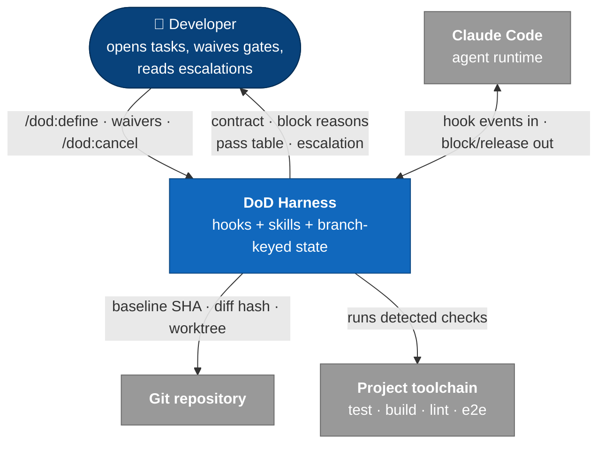
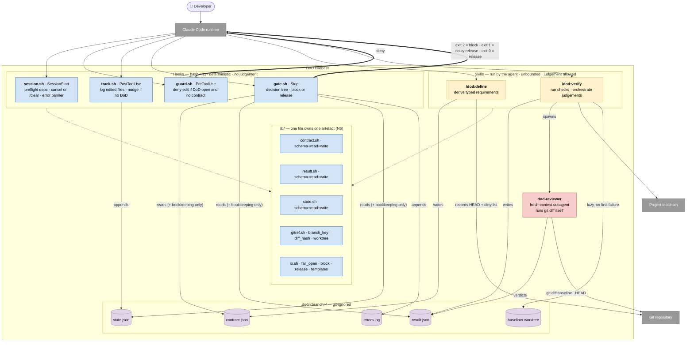
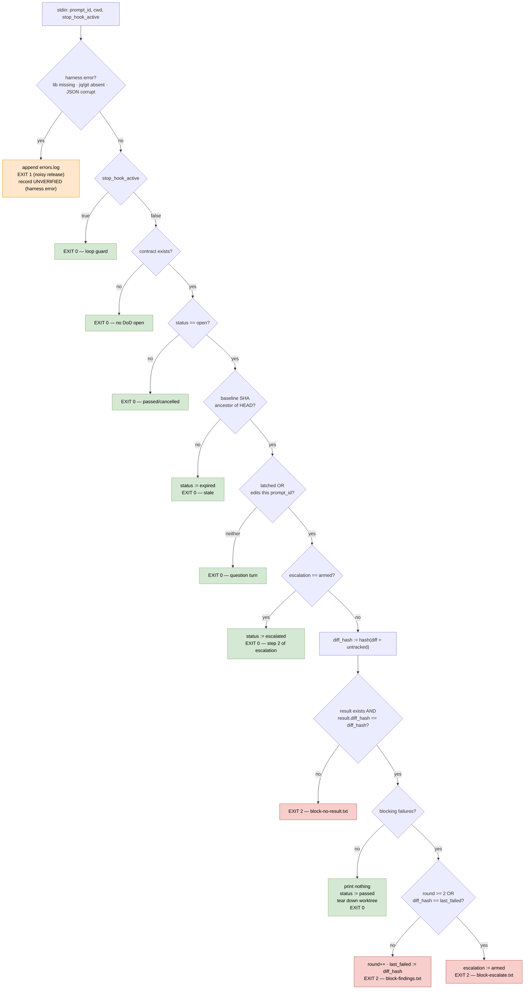

# DoD Harness — Design v2

> **Status:** design agreed, not implemented.
> **Supersedes:** [`design.md`](design.md) and the current `dod/` implementation.
> This document is a clean-sheet redesign. The existing implementation was
> deliberately ignored during design; it is not a constraint on this document.

---

## 1. TL;DR

An AI coding agent anchors on "implementation done" — the code compiles, so it
stops. Tests, app startup, independent review and the task's own stated checks
get silently skipped.

This harness makes the Definition of Done a **structural forcing function**.

```
  /dod:define  ──▶  contract (typed, verifiable requirements)
                          │
       agent implements   │
                          ▼
  agent claims done ──▶ GATE ──▶ /dod:verify ──▶ result
                          │                        │
                          ├── all pass ──────────▶ done
                          └── failures ──────────▶ fix → verify (max 2 rounds)
                                                      └── exhausted ──▶ escalate to user
```

Three parts, none sufficient alone:

1. **A dumb gate** — a `Stop` command hook. Pure bash, reads files, decides
   block-or-release. No judgement, no model, no writes beyond bookkeeping.
2. **A smart verifier** — a skill the agent runs. Unbounded time, full tools,
   spawns a fresh-context reviewer.
3. **Branch-keyed state** — a git-ignored `.dod/` directory that survives
   compaction, resume and fork.

The separation is load-bearing. Hooks time out (30–60s for model-backed types);
verification cannot fit inside one. The gate never verifies; the verifier never
decides.

---

## 2. Requirements

### Functional

| # | Requirement |
|---|---|
| F1 | DoD is defined **before** implementation begins, never after. |
| F2 | The agent works the task normally; the harness stays out of the way. |
| F3 | When the agent claims done, verification runs against the collected contract. |
| F4 | Verification is scoped to **changes related to the task**, not the whole repo. |
| F5 | Pass → task declared done. Fail → findings fed back, fix→verify loop. |
| F6 | The loop is bounded; on exhaustion the harness escalates to the user. |

### Non-functional

| # | Requirement | How it is met |
|---|---|---|
| N1 | Does not interfere with non-implementation tasks or conversations | Gate releases immediately on no-DoD / no-claim / no-edits. Cheapest path is the common path. |
| N2 | Fires at the right time | `Stop` hook + explicit claim latch + abandonment guard. |
| N3 | Fast | Gate is file reads only. Baseline worktree and pre-existing-failure resolution are **lazy** — paid only on a failing check. Results cached on `(diff_hash, cmd)`. |
| N4 | Thorough and exhaustive | `/dod:verify` runs in the agent with no timeout; fresh-context reviewer; every requirement checked and recorded. |
| N5 | **Deterministically guides the agent** | Every requirement is typed `check` (command) or `judgement` (fixed prompt + schema). Block messages are interpolated from templates, never composed by a model. The gate is a command hook, never a model-backed hook. |
| N6 | **No read/write drift in JSON artefacts** | Schema, reader and writer for each artefact live in the **same file** and change together. No other file may parse that artefact. |

---

## 3. C4 — Level 1: System context



The harness has **no process of its own**. It exists only as callbacks Claude
Code invokes. Everything it "does" is something the agent was made to do.

---

## 4. C4 — Level 2: Containers



### Trust direction

```
  skills / subagent ──write──▶ STATE ──read-only──▶ gate.sh ──▶ block | release
                                                       ▲
                                         never judges, never rewrites
```

The gate trusts a `result.json` **only** when its `diff_hash` equals the current
diff hash. An agent cannot argue past the gate; it can only produce real
evidence or not.

### Why six hook events collapse into four scripts

Claude Code runs concurrent hooks on the same event **in parallel, last write
wins**. Splitting `SessionStart` (preflight + clear-cancel + error banner) or
`PostToolUse` (edit log + nudge) into separate scripts would race against
itself. One event, one script.

### The only preventive container

`guard.sh` is the sole container that *prevents*. Everything else is detective —
it catches the problem after the fact and forces a fix. The guard is what makes
"contract exists before the first edit" mechanical instead of aspirational.

---

## 5. C4 — Level 3: Components

### 5.1 `gate.sh` — the decision tree



**Gate writes only:** `state.round`, `state.last_failed_diff_hash`,
`state.escalation`, `contract.status`. Nothing else. It is otherwise read-only.

**Why `edits_this_prompt` and not "edits since open":**

| Turn ends… | per-`prompt_id` edits | "since open" |
|---|---|---|
| agent asks the user a question, edited nothing | release ✅ | blocked ❌ (violates N1) |
| agent edited, then stopped without latching | blocked ✅ | released ❌ (silent skip) |

`prompt_id` rather than "turn" is deliberate: a blocked `Stop` starts a **new
turn under the same `prompt_id`**, so edits made before the block still count.
The gate stays engaged until verification actually happens instead of resetting
itself each time it blocks.

### 5.2 `/dod:define` components

```
  ┌─ preflight assert ──── deps present · is a git repo · no open DoD (or amend)
  ├─ task capture ──────── argument if given, else derive from conversation
  │                        record task_source · print for objection
  ├─ protocol loader ───── DoD protocol floor + CLAUDE.md chain
  ├─ battery detector ──── package.json / Makefile / cargo / … → check commands
  ├─ requirement synth ─── task-derived requirements + e2e applicability decision
  ├─ waiver extractor ──── free text in the user's prompt → waivers[]
  ├─ schema validator ──── reject malformed · reject vague-without-check
  ├─ baseline recorder ─── HEAD sha + dirty file list
  └─ contract_write ────── via lib/contract.sh, then print the contract table
```

Ordering matters: **the baseline is recorded last**, immediately before the
contract is written, minimising the window between snapshotting HEAD and
allowing edits.

### 5.3 `/dod:verify` components

```
  ┌─ contract loader ───── assert status=open · load requirements
  ├─ diff hasher ───────── the same lib/gitref.sh function gate.sh uses
  ├─ check runner ──────── cache lookup (diff_hash, cmd) → run → capture evidence
  ├─ baseline resolver ─── ONLY on a failed check:
  │                        create .dod/<branch>/baseline worktree (once per task)
  │                        re-run that one command there → baseline_verdict
  ├─ judgement orchestr. ─ spawn dod-reviewer with fixed prompt + schema
  │                        round 1: full changeset
  │                        round 2: delta + re-confirm round-1 blocking findings
  ├─ finding classifier ── blocking vs advisory
  ├─ result_write ──────── via lib/result.sh · evidence/ files · keyed to diff_hash
  └─ pass table printer ── on all-pass, prints the brief table to the user
```

**The diff hasher is shared.** If the gate and the verifier ever computed the
hash differently, the gate would reject every result. One function, one file.

---

## 6. C4 — Level 4: Code

### 6.1 File layout

```
dod/
├── hooks/
│   ├── session.sh      SessionStart  — preflight · cancel-on-clear · error banner
│   ├── guard.sh        PreToolUse    — deny edit if no contract
│   ├── track.sh        PostToolUse   — log edits · nudge
│   └── gate.sh         Stop          — decision tree
├── lib/
│   ├── contract.sh     ▸ SCHEMA + contract_read/write/validate   ← owns contract.json
│   ├── result.sh       ▸ SCHEMA + result_read/write/validate     ← owns result.json
│   ├── state.sh        ▸ SCHEMA + state_read/write + mutators    ← owns state.json
│   ├── gitref.sh       branch_key · diff_hash · baseline worktree
│   └── io.sh           fail_open · block · release · template render
├── templates/
│   ├── block-no-result.txt
│   ├── block-findings.txt
│   └── block-escalate.txt
├── skills/
│   ├── dod-define/SKILL.md
│   └── dod-verify/SKILL.md
└── agents/
    └── dod-reviewer.md
```

**N6 enforcement rule:** nothing outside `lib/contract.sh` may `jq` into
`contract.json`; likewise for `result.sh` and `state.sh`. Checkable by grep in
CI. A consequence: the skills **cannot compose JSON themselves** — `/dod:define`
calls `contract_write`, it does not emit jq from prose. An LLM hand-writing JSON
that the gate parses is precisely where a determinism harness would leak.

### 6.2 `gate.sh` exit contract

```
exit 0 → release, silent          (normal operation)
exit 1 → release, NOISY           (harness error — never blocks)
exit 2 → block, stderr = reason   (verification failure)
```

| # | Branch | exit | stderr → agent | state writes |
|---|---|---|---|---|
| 0 | harness error | **1** | one line: `dod gate error: <cause> — see .dod/errors.log` | — |
| 1 | `stop_hook_active` | 0 | — | — |
| 2 | no contract | 0 | — | — |
| 3 | status ≠ open | 0 | — | — |
| 4 | baseline not ancestor | 0 | — | `status=expired` |
| 5 | no claim, no edits | 0 | — | — |
| 6 | `escalation=armed` | 0 | — | `status=escalated` |
| 7 | result missing/stale | **2** | `block-no-result.txt` | — |
| 8 | blocking failures, budget left | **2** | `block-findings.txt` | `round++`, `last_failed_diff_hash` |
| 9 | budget exhausted | **2** | `block-escalate.txt` | `escalation=armed` |
| 10 | all pass | 0 | — | `status=passed`, worktree torn down |

`set -uo pipefail` plus an `ERR` trap routing to branch 0. A bug in the harness
can never wedge the session.

### 6.3 `contract.json`

Owned by `lib/contract.sh`.

```jsonc
{
  "version": 1,
  "task_key": "feat/invite-flow",          // git branch
  "status": "open",                        // open|passed|cancelled|expired|escalated
  "task": "<task text>",
  "task_source": "argument",               // argument | conversation
  "session_id": "…",                       // metadata only, never a key
  "baseline": { "sha": "a1b2c3", "dirty_files": ["README.md"] },
  "waivers": [ { "id": "lint", "reason": "user: prototype spike" } ],
  "requirements": [
    { "id": "build",  "type": "check", "cmd": "pnpm build",
      "expect_exit": 0, "source": "auto-detected" },
    { "id": "tests",  "type": "check", "cmd": "pnpm test",
      "expect_exit": 0, "source": "protocol" },
    { "id": "e2e",    "type": "check", "cmd": "pnpm e2e --grep invite",
      "expect_exit": 0, "source": "task",
      "applicable": true, "reason": "adds user-facing interaction" },
    { "id": "review", "type": "judgement", "agent": "dod-reviewer",
      "prompt_ref": "review.md", "schema_ref": "review.schema.json",
      "source": "protocol" }
  ]
}
```

**Invariants** — enforced by `contract_validate`, contract rejected otherwise:

- every requirement is `check` **or** `judgement`, never neither;
- every `check` carries `cmd` and `expect_exit`;
- an `e2e` entry **always exists**, either `applicable:true` with a `cmd`, or
  `applicable:false` **with a reason**. Never absent.

### 6.4 `result.json`

Owned by `lib/result.sh`.

```jsonc
{
  "diff_hash": "9f8e…",                    // the gate's trust key
  "baseline_sha": "a1b2c3",
  "round": 1,
  "requirements": [
    { "id": "tests", "type": "check", "verdict": "fail",
      "cmd": "pnpm test", "exit": 1,
      "evidence": "evidence/tests-r1.log",
      "baseline_verdict": "pass" },         // lazily resolved, only on failure
    { "id": "lint",  "verdict": "waived", "reason": "user: prototype spike" },
    { "id": "e2e",   "verdict": "n/a",    "reason": "pure refactor" },
    { "id": "review", "type": "judgement", "verdict": "fail",
      "findings": [
        { "id": "f1", "severity": "blocking", "file": "src/a.ts", "line": 42,
          "summary": "null deref when invite expired" },
        { "id": "f2", "severity": "advisory", "file": "src/b.ts",
          "summary": "naming inconsistent with module" }
      ],
      "evidence": "evidence/review-r1.json" }
  ],
  "summary": { "pass": 3, "blocking_fail": 2, "advisory": 1, "waived": 1, "na": 1 }
}
```

**`blocking` vs `advisory`.** Only `blocking` fails the gate. `advisory` never
triggers a fix — it appears in the pass table with a fix/skip recommendation for
the user to decide. This encodes the standing rule that non-blocking review
findings are raised to the user, never silently fixed and never silently
dropped. The threshold is hardcoded in v1; see §9.

### 6.5 `state.json`

Owned by `lib/state.sh`.

```jsonc
{
  "latched": false,
  "round": 0,
  "escalation": "none",                    // none | armed
  "last_failed_diff_hash": null,
  "edits": [ { "prompt_id": "…", "path": "src/a.ts", "ts": "…" } ],
  "cache": { "<diff_hash>:<cmd_hash>": "pass" },
  "worktree": null,
  "errors_unacknowledged": 0
}
```

### 6.6 Block message templates

Fully interpolated from `result.json`. Zero free text. This is N5's last mile.

**`block-findings.txt`**

```
DOD GATE — BLOCKED  (round {{round}} of 2)

FAILED
{{#checks}}
  [{{id}}] {{title}}
    command  : {{cmd}}
    exit     : {{exit}}  (expected {{expect_exit}})
    baseline : {{baseline_verdict}}
    evidence : {{evidence}}
    output   :
{{tail_20}}
{{/checks}}
{{#review_blocking}}
  [review] {{file}}:{{line}} — {{summary}}
{{/review_blocking}}

REQUIRED NEXT ACTION
  1. Fix every failed requirement listed above.
  2. Run /dod:verify.
  3. Do not stop until it reports all-pass.

PROHIBITED
  - Do not edit .dod/ — contract, requirements, or results.
  - Do not delete, skip, or mark-as-expected any failing test.
  - Do not narrow or weaken a check command to make it pass.
  - Do not claim done without a fresh result matching the current diff.
  - Do not act on advisory findings — those are the user's decision.
```

**`block-no-result.txt`**

```
DOD GATE — BLOCKED

A Definition of Done is open for this task, and there is no verification
result matching the current changes.

REQUIRED NEXT ACTION
  Run /dod:verify.
```

**`block-escalate.txt`**

```
DOD GATE — BUDGET EXHAUSTED after {{round}} rounds.
{{reason}}

REQUIRED NEXT ACTION
  Report the unresolved findings below to the user, then stop.
  Do not attempt another fix.

UNRESOLVED
{{findings_table}}
```

`{{reason}}` is one of exactly two strings: `verification still failing` or
`no progress: diff unchanged between rounds`.

### 6.7 `dod-reviewer`

**Inputs** — passed by `/dod:verify`, never by the implementing agent:

```
baseline_sha   : a1b2c3
mode           : full | delta_reconfirm
delta_from     : <round-1 diff hash>            (delta mode only)
reconfirm      : [ { id, file, line, summary } ] (delta mode only)
task           : <contract.task>
requirements   : <contract.requirements>
```

**Prompt invariants** — fixed text, not composed per run:

- Run `git diff {{baseline_sha}}...HEAD` **yourself**. Do not read any summary
  of the changes produced by another agent.
- Judge against `task` and `requirements` only.
- Classify every finding `blocking` or `advisory`. `blocking` = bug, security
  hole, broken behaviour, spec violation. Everything else is `advisory`.
- In `delta_reconfirm` mode: review the delta **and** separately re-check each
  `reconfirm` entry against current code.
- Do not fix anything. Do not write outside your result.

**Output schema** (`review.schema.json`)

```jsonc
{
  "findings": [
    { "id": "f1", "severity": "blocking|advisory",
      "file": "src/a.ts", "line": 42,
      "summary": "one sentence",
      "failure_scenario": "concrete inputs → wrong output" }
  ],
  "reconfirm": [
    { "id": "f1", "status": "fixed|still_present|unverifiable",
      "evidence": "src/a.ts:42 now guards null" }
  ],
  "verdict": "pass|fail"
}
```

`reconfirm.status != "fixed"` counts as a blocking failure. "I fixed it" is
never accepted as the evidence that it was fixed.

---

## 7. Cross-cutting behaviour

### 7.1 Lifecycle

| Event | Behaviour |
|---|---|
| `/dod:define [task]` | Opens a DoD. Task from the argument, else derived from conversation. |
| `/dod:define` while one is open | **Amends** the open contract. `--new` forces a fresh task. |
| `/dod:cancel` | Closes the DoD, tears down the worktree. |
| `/clear` or session end | DoD cancelled (`SessionStart source=clear`, `SessionEnd`). |
| Pass, then a follow-up request | **New task** — the baseline must move. |
| Baseline SHA no longer an ancestor of HEAD | Expires with a warning; does not gate. |
| Edit with no DoD open | One-line, non-blocking nudge from `track.sh`. |
| Non-git directory | `/dod:define` refuses to open, and says why. |

`session_id` is stable across resume, fork and compaction, and changes on
`/clear` — which is why state is keyed by **branch**, with `session_id` recorded
as metadata only. A `/clear` mid-task does not orphan the contract; it cancels
it, deliberately.

### 7.2 Subagents

Subagents are **not gated**. Their edits are still tracked, because
`PostToolUse` fires inside them. The main loop's `Stop` is the single gate, at
the boundary where work is claimed done. The `dod-reviewer` is therefore exempt
by construction and cannot deadlock the gate.

### 7.3 Speed (N3)

| Cost | When paid |
|---|---|
| Gate evaluation | every turn — file reads only |
| Check battery | only on a done-claim |
| Baseline worktree creation | only on the **first failing check** of a task |
| Baseline re-run | only for the specific check that failed |
| Re-running a passing check | never, while `(diff_hash, cmd)` is unchanged |

Any change to the diff invalidates the whole cache.

**Why a persistent worktree and not `git stash`:**

| | stash | cold worktree | persistent worktree |
|---|---|---|---|
| setup cost | ~0 | full install, per check | full install, **once per task** |
| round-2 cost | ~0 | full install again | ~0 |
| work-loss risk | **real** | none | none |
| concurrent-session safe | no | yes | yes |

`git stash` mutates the real working tree. A crash or interrupt between `stash`
and `stash pop` strands the agent's work in an entry nobody knows about — a
data-loss path in a tool whose whole job is to be trustworthy.

### 7.4 Failure handling

| Failure | Behaviour |
|---|---|
| Verification failure | **fail closed** — block |
| Harness failure (missing dep, corrupt JSON, verifier crash, git error) | **fail open** — exit 1, never "passed" |

A harness failure is recorded as `UNVERIFIED (harness error)`, never as a pass.
Silent degradation is the exact failure mode this harness exists to eliminate.

**Error visibility — three layers:**

| Layer | Mechanism | Guaranteed |
|---|---|---|
| 1 | append to `.dod/errors.log` — timestamp, branch, hook, cause, stdin snapshot | ✅ |
| 2 | `session.sh` prints a banner on next session start if unacknowledged errors exist | ✅ |
| 3 | `exit 1` surfaces a non-blocking error notice in the transcript | ⚠️ see §10 |

Layers 1 and 2 carry the guarantee. Layer 3 only shortens the delay. Because
exit 1 is control-flow-identical to exit 0 on `Stop`, adopting it costs nothing.

### 7.5 Dependency preflight

`session.sh` verifies `git` and `jq`, guarded by a marker file keyed to the
plugin version — current *and* fast, paid once per version. On failure,
`/dod:define` **refuses to open** and names the missing dependency and its
install command. No auto-install: a package manager running behind the user's
back at session start is not acceptable.

### 7.6 The pass table

Printed by `/dod:verify` when it writes an all-pass result; the gate releases
silently. A command hook's stdout on `Stop` reaches the model's context, not the
user's terminal, and the turn is ending so the agent cannot relay it. The
ordering gap is theoretical — anything changing between the write and the gate's
read would alter the diff hash and force re-verification.

The table names **every waiver and every `n/a` exemption**. "Passed" must never
quietly mean "passed the easy ones".

---

## 8. Decision log

| # | Decision | Rejected alternative |
|---|---|---|
| D1 | Task unit = a user-declared task, spanning turns; follow-ups amend | one-prompt-per-task; TodoWrite list |
| D2 | Activation is an explicit `/dod:define`; auto-detection deferred | first-mutating-edit auto-open; prompt classification |
| D3 | Protocol is the floor; only explicit user input waives a gate | task inference; user-input-wins |
| D4 | Collection derives silently and prints; no blocking questions | interactive Q&A at task start |
| D5 | Bounded hard block, then escalation | unbounded loop; advisory-only |
| D6 | Changeset-scoped verification | full-repo battery every time |
| D7 | Baseline = HEAD SHA at open, minus pre-existing dirty files; edited-file log as cross-check | SHA only; edited-file log only |
| D8 | Claim = latch armed **or** edits-this-prompt without a latch | latch only; gate every stop |
| D9 | Missing-DoD leak → non-blocking nudge | silence; auto-open |
| D10 | Requirements are typed `check` or `judgement`; untyped is malformed | prose requirements; checks only |
| D11 | Gate reads a result keyed to the diff hash; never re-runs the battery itself | gate re-runs all checks |
| D12 | `PreToolUse` guard denies edits when a DoD is open without a contract | rely on skill step ordering |
| D13 | Auto-detected battery + task-derived requirements | fixed list; derived only |
| D14 | e2e applicability decided at definition time, with a recorded reason | decided at verify time; reviewer-confirmed exemption |
| D15 | Round 2 re-runs all checks, delta-scopes judgements | full re-review; failed-only |
| D16 | Round 2 also re-confirms every round-1 blocking finding | delta only |
| D17 | Infrastructure errors fail open; verification failures fail closed | fail closed throughout; fail open throughout |
| D18 | Pre-existing failures resolved lazily in a persistent worktree | full battery at open; `git stash`; ignore |
| D19 | Cache on `(diff_hash, cmd)` | no caching |
| D20 | State in git-ignored `.dod/`, keyed by branch | external plugin data dir; session-keyed |
| D21 | Two-step escalation: block once ordering a report, then release | `impossible: true`; keep blocking |
| D22 | Gate is a **command** hook, never `prompt` or `agent` | model-backed hook (non-deterministic, 30–60s timeout) |
| D23 | Block text is template-interpolated from the result file | model-composed prose |
| D24 | Brief pass table, printed by `/dod:verify` | one-liner; full evidence dump |
| D25 | Bash + `jq` + `git`; grow dependencies only as needed | Node/Python runtime |
| D26 | Budget = 2 rounds; identical diff hash burns it immediately | 3–5 rounds; no progress guard |
| D27 | Schema + reader + writer of each artefact share one file | central schema dir with separate accessors |

---

## 9. Deferred (explicitly not in v1)

| Item | Why deferred | Cost when added |
|---|---|---|
| Auto-detection of implementation work | Wanted real data on how often the command is forgotten; the nudge (D9) collects it | new trigger path in `track.sh` |
| Per-repo config for the blocking/advisory threshold | v1 hardcodes `blocking` fails, `advisory` reports | none — `severity` is already in the schema |
| Extracting the battery detector out of `/dod:define` | YAGNI until a second consumer exists | mechanical move |
| Headless (`claude -p`) operation | An orchestrator script will drive the harness separately | separate entry point |
| `terminalSequence` bell on escalation | Cosmetic | one JSON field |

---

## 10. Unverified assumptions

Both are recorded rather than designed around. Settle empirically before relying
on either.

1. **Exit-1 stderr visibility.** The v2.1.273 docs contradict themselves: the
   general exit-code table and the debug section say a non-blocking error notice
   with the first line of stderr is shown to the user; the `Stop`-specific table
   says debug log only. All three agree exit 1 does **not** block. Cost of being
   wrong: zero — layers 1 and 2 of §7.4 carry the guarantee.

2. **Whether `Stop` fires under `claude -p`.** Inferred not to (the process
   exits after the model turn), not documented. Out of scope for v1 per §9.

---

## 11. Sources

- Claude Code hooks guide — <https://code.claude.com/docs/en/hooks-guide.md>
- Claude Code hooks reference — <https://code.claude.com/docs/en/hooks.md>
- Environment variables — <https://code.claude.com/docs/en/env-vars.md>
- Sessions — <https://code.claude.com/docs/en/sessions.md>

Facts verified against Claude Code v2.1.273.
