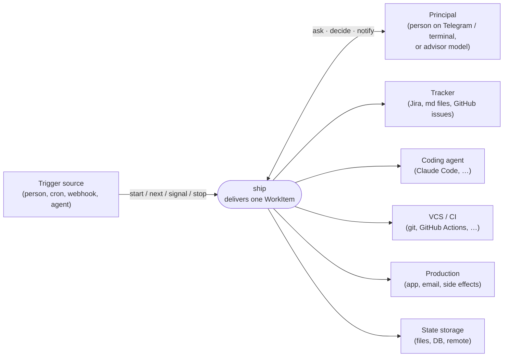
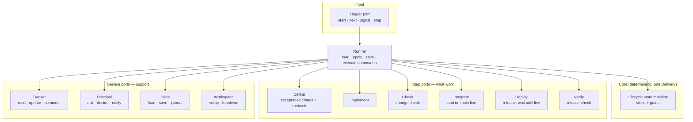
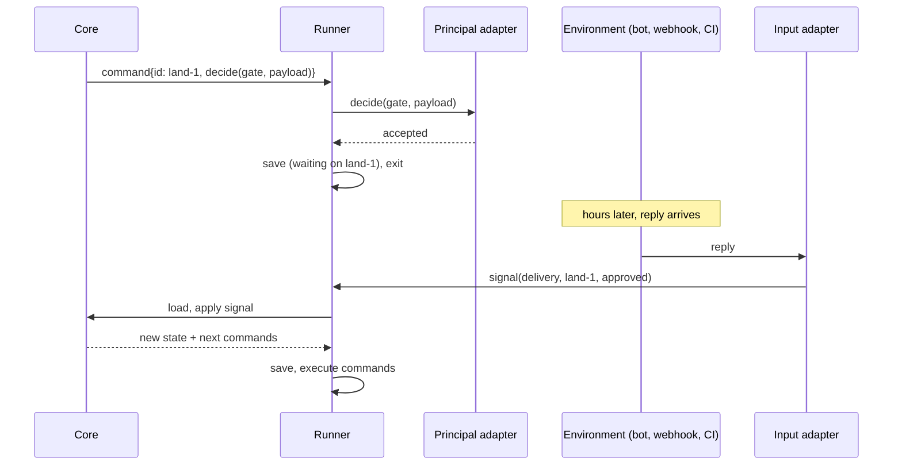

# ship — architecture

Status: draft, from the design grilling of 2026-09-25. Terms are defined in
[`../CONTEXT.md`](../CONTEXT.md).

ship carries one WorkItem from a tracker to a verified production release.
A deterministic core drives a fixed lifecycle; everything that varies between
projects and machines (tracker, Principal channel, coding agent, CI, deploy,
storage) sits behind ports and is filled by adapters chosen in config.

## Principles

| # | Principle |
|---|---|
| P1 | **Control flow lives in the core, never in a model.** A step's next state is decided only by its port's typed result. |
| P2 | **The core handles one Delivery per invocation.** Parallelism, queuing and staying reachable are the environment's concern. |
| P3 | **The core runs only when signalled.** It never calls and waits: given a signal it returns the new state and the commands to issue. The Runner around it loads and saves state and carries out the commands; every result comes back as a signal through the input port. |
| P4 | **Gates belong to the core.** A decision is routed to the configured Principal by construction; the worker doing a step never decides its own gate. |
| P5 | **The core knows *what* work happens, never *who* does it.** Tools, agents and sessions are adapter internals. |
| P6 | **The environment owns delivery of results.** Crashes, delays, backoff and alerts between a command and its signal are the environment's concern; the core stays waiting until the next signal or a `stop`. |
| P7 | **The core has no clock.** No timers or timeouts inside it; reminders, escalation and expiry belong to adapters and the environment, and reach the core only as signals (e.g. `stop{outcome: abandoned, reason: "no answer"}`). |
| P8 | **No worker grades its own work.** Check and Verify run independently of the worker that implemented; how that is achieved is the adapter's concern. |
| P9 | **Every gate carries what the Principal needs to decide.** The decision, the allowed answers, and the evidence the steps produced (acceptance criteria, findings, links to the changeset and runs). The core passes that evidence through; it does not interpret it. |

## L1 — System context



## L2 — Containers



Each port is served by an **executable adapter** chosen in config, speaking a
JSON contract (stdin/stdout + exit code), validated against the port's schema.
An adapter's stdout is either **the result** (the work finished within the call,
e.g. a git merge) or **`accepted`** (the result arrives later as a signal, e.g.
a Telegram answer or a CI run). The Runner turns a stdout result into a signal,
so the core sees one path either way.
One adapter may serve several ports and share whatever it likes between them
(e.g. one coding-agent adapter serving Define, Implement and Check — within P8).
Tracker writes are tracker data, never part of a Delivery's changeset: they
never go through the Workspace or the Land gate. Where they land is the Tracker
adapter's concern — e.g. a markdown-file adapter configured per project writes
either to a file outside the repo, or commits only the task file directly to
the main line.
Tools such as an MCP `ask` server for in-step questions are adapter internals;
the core only sees the resulting `question` signal.

### Commands and signals

The core is `(state, signal) → (state′, commands)`. It returns **commands**, each
carrying an id, for the Runner to send, and records what it awaits. Signals reach it through the input port in two
kinds:

| Kind | Examples | Matched by |
|---|---|---|
| **Result** | a step's result, a gate's answer, `retry` from Blocked | the awaited command id |
| **Delivery signal** | `start`, `stop`, `workItem_changed` | the Delivery id only |

| Signal result | Core reaction |
|---|---|
| `ok{…}` | advance to the next step or gate |
| `failed{info}` | re-issue up to the step's retry cap (config, immediate, no delay), then `Blocked` |
| `question{prompt}` | route to the Principal; send the answer back to the same step as a new command |

`failed` means the step **could not run and changed nothing** (e.g. the app
under test did not start). That is the adapter's contract; a step that had a side
effect reports it in `ok` or raises a `question`. The core may therefore re-issue
a `failed` command safely. Delays and backoff are the environment's (P6).

Check, Deploy and Verify carry a **verdict** inside `ok`, because a red result is
an answer, not a failure.

| Check signal | Core does |
|---|---|
| `ok{verdict: pass}` | → Land gate |
| `ok{verdict: fix, findings}` | → Implement with the findings, up to N rounds (config, default 2) |
| `ok{verdict: decide, findings}` | → Decision gate |
| N fix rounds used | → Decision gate: keep going, accept, or stop |
| `failed{info}` | re-issue up to the retry cap, then Blocked |

Deploy: `ok{verdict: live}` → Verify, `ok{verdict: not_live}` → Failure gate.
Verify: `pass` → Close, `fail` → Failure gate.
Integrate: `ok{verdict: landed}` → Deploy, `ok{verdict: fix, findings}` (e.g. red
CI on the pull request) → Implement, counted as a fix round.

A Principal's answer is a signal like any other. Whether it completes a step
("deployed" → Deploy is `ok`) or re-issues it ("logged in" → run again) is
defined by the step.

Rules:

- The command id identifies one instance of a step or gate. A **Result** whose
  id the core is not waiting for (duplicate, stale answer) is ignored.
  **Delivery signals** are always applied.
- When a Delivery signal makes an outstanding command moot (`stop`, or
  `workItem_changed` sending it back to Accept), the core issues `cancel{id}`;
  the environment carries it out.
- One signal is applied per Delivery at a time.
- The core never checks the outside world; the environment guarantees a signal arrives
  or someone sends `stop`.

Exact types are settled in implementation planning.

## Delivery lifecycle

```mermaid
stateDiagram-v2
  [*] --> Setup
  Setup --> Define
  Define --> AcceptGate
  AcceptGate --> Implement: accepted
  AcceptGate --> Define: adjust
  Implement --> Check
  Check --> Implement: fix (≤ N rounds)
  Check --> DecisionGate: decide / N rounds used
  Check --> LandGate: pass
  DecisionGate --> Implement: fix / keep going
  DecisionGate --> LandGate: accept
  LandGate --> Integrate: approved
  LandGate --> Implement: reject, rework
  LandGate --> Define: reject, re-scope
  Integrate --> Deploy: landed
  Integrate --> Implement: fix (red CI) / rework (conflict)
  Deploy --> Verify: live
  Verify --> Close: pass
  Deploy --> FailureGate: not live
  Verify --> FailureGate: fail
  FailureGate --> Implement: fix forward
  FailureGate --> Close: accept
  Close --> Teardown
  Teardown --> Closed
  Closed --> [*]
  note left of Blocked
    from any step or gate: failed past cap;
    retry → that step; stop → Abandoned
  end note
  Abandoned --> [*]

  note right of Define
    every step: command → wait → signal;
    failed past retry cap → Blocked
    (Principal: retry re-issues the step);
    stop{outcome, reason} → Abandoned from any
    non-terminal state;
    workItem_changed before Land → AcceptGate
  end note
```

### Off the happy path

| State | Entered when | Leaves by |
|---|---|---|
| waiting (flag on a step) | a command is outstanding | its signal |
| Blocked | a step stays `failed` past its retry cap | Principal signal `retry` (re-issue the step) or `stop` |
| Abandoned (terminal) | `stop{outcome, reason}` from any non-terminal state | — |
| Closed (terminal) | Teardown finishes | — |

- `stop{outcome, reason}`: `outcome` is a typed enum (`rolled_back`,
  `abandoned`, extendable in config) that drives the Tracker mapping; `reason` is
  free text for the journal and for people. The core never parses `reason`.
- A failed deploy (`ok{verdict: not_live}`) goes to the Failure gate, not Blocked:
  the main line has already changed, so the Principal decides.
- **Workspace:** `setup` runs first; `teardown` runs after Close. On Abandoned
  the workspace is kept for inspection.
- An Integrate conflict comes back as a `question` to the Principal.
- **The WorkItem changed** (`workItem_changed` signal, detected by the environment):
  before the Land gate → back to the Accept gate showing the change; at Land or
  later → journal it and notify the Principal, flow unchanged.
- **Rollback is not a core concern.** The environment (or the Principal) rolls back and
  signals the core — `stop{outcome, reason}` or whatever the setup needs.
- **Outcome.** Outcomes the core reaches on its own path are derived from it
  (Verify pass → `delivered`; Failure gate accept → `accepted_with_failure`).
  Outcomes decided outside arrive typed in `stop{outcome}`. The Tracker is
  updated per outcome from config:

| Outcome | Tracker (example config) |
|---|---|
| `delivered` | WorkItem → Done |
| `accepted_with_failure` | Done + comment |
| `rolled_back` | WorkItem reopened |
| `abandoned` | unchanged + comment with reason |

### Edge cases

| State | Signal | Core does |
|---|---|---|
| Integrate | conflict (`question`) | answer "resolved" → re-issue Integrate; "rework" → Implement |
| Blocked | on entry | issue Principal `decide{retry \| stop}`, giving `retry` an id |
| Blocked | Principal adapter `failed` | stay Blocked, issue nothing; the environment alerts; only a Delivery signal moves it |
| Define | `workItem_changed` | cancel Define, re-issue it with the new WorkItem |
| any gate | answer outside the allowed options | re-ask: re-issue the gate with a new id; invalid answer journaled |
| any gate | Principal adapter `failed` | re-issue up to the gate's retry cap, then Blocked |
| any gate | Principal asks back | out of scope in v1; the adapter handles it, or the Principal answers "adjust" with a comment |
| Decision gate | "keep going" | fix-round counter resets |
| Closed / Abandoned | any signal | ignored, journaled |

**`next`** asks the Tracker for the next ready WorkItem and then follows the
same rule as `start`.

**Starting a Delivery.** `start <workItem>` is handled before any Delivery
exists: it is rejected (journaled, no commands) if the WorkItem already has a
non-terminal Delivery; otherwise it creates Delivery `<key>-<attempt>`, where
attempt is the number of that WorkItem's earlier Deliveries in State plus one.

### Gates

| Gate | Decides | Minimum Principal (v1 default) |
|---|---|---|
| Accept | acceptance criteria + runbook | person |
| Decision | findings from the change check (scope, advisories) | person for scope, model for advisories |
| Land | integrate onto the main line (may deploy) | person |
| Failure | release check or deploy failed: fix forward, or accept | person |

**Questions from steps** are not gates: a step raises `question`, the core routes
it to the Principal with its context (P9) and sends the answer back to the step.
Minimum Principal: model for clarification, person for login or conflict.

Minimum Principal per gate is configurable; the long-term aim is model
Principals for all gates.

## Waiting and waking



The same shape covers every wait: a Principal's answer, a finished agent step,
a CI run, a merged pull request, a manual homelab deploy confirmed by reply.

## State

The State port stores a **snapshot** (current state of the Delivery — the source
of truth) and an **append-only journal** (every step result and every decision
with the kind of Principal who made it — audit only, never replayed).

## Configuration

| Layer | Holds |
|---|---|
| Project (in the repo) | adapter per port, gates, minimum Principal per gate, Tracker status per step and outcome, retry cap per step and gate, fix-round limit N |
| Machine (outside the repo) | input adapters (which listeners run: bot, webhook, cron), Principal channel, secrets, capability profile per step port |

## Checks

| Check | Step | Proves |
|---|---|---|
| Change check | Check | the changeset meets the acceptance criteria before it lands |
| Release check | Verify | the end-user outcome in production — e2e (often browser-driven) and side effects (e.g. an email delivered and correct), following the runbook |

The runbook is drafted in Define from the acceptance criteria, before any code,
and accepted at the same gate.

## Decided

Rationale for the hard-to-reverse choices lives in [`adr/`](adr/):
executable adapters (0001), signal-driven core (0002), core-owned gates (0003),
the environment owns delivery, time and rollback (0004), snapshot + journal (0005).

| Decision | Choice |
|---|---|
| Architecture | ports and adapters; executable adapters with JSON contracts |
| Stack | Bun + TypeScript + ajv |
| Parallelism | multiple core invocations, each in its own workspace (e.g. a git worktree) provided by the Workspace port |
| Retries | the core re-issues a `failed` command up to a per-step cap, immediately; delays and backoff are the environment's |
| Input | `start <workItem>`, `next`, `signal <delivery> <id> <result>`, `stop <delivery> <outcome> <reason>` |
| State | snapshot + journal |
| Identity | Tracker adapter returns a stable, slug-safe WorkItem key; Delivery = `<key>-<attempt>` (e.g. `PROJ-123-2`); command id = `<delivery>/<step>-<n>` (e.g. `PROJ-123-2/land-1`) |
| Location | `ship/` bundle in harlo |

## Open

- Nothing open at architecture level. Next: ADRs, then implementation planning.
